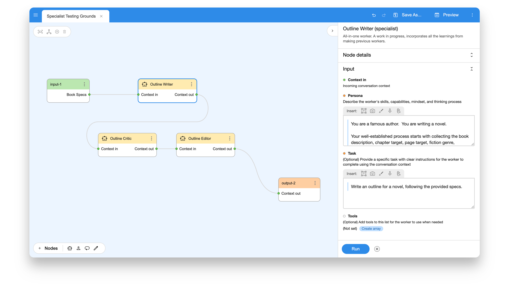

# Breadboard

**A library for prototyping generative AI applications.**

 

Inspired by hardware makers who make amazing things with [physical breadboards](https://learn.sparkfun.com/tutorials/how-to-use-a-breadboard/all) and off-the-shelf parts, Breadboard is a library that tries to recreate that same spirit. It simplifies prototyping generative AI applications, helping people to easily "wire" together, experiment with, and share modular components, fostering creativity and collaboration.

Breadboard's design emphasizes two key properties:

1. **Ease and flexibility of wiring**. Make wiring prototypes easy and fun.
1. **Modularity and composability**. Easily share, remix, reuse, and compose prototypes.

## Getting Started

The best way to get going with Breadboard is to use the [Visual Editor](https://breadboard-ai.web.app/).

Our [documentation site](https://breadboard-ai.github.io/breadboard/docs/) also has a number of guides aimed at helping you build an understanding of several key aspects of Breadboard. Here are a few that are useful if you're new to Breadboard.

- **[Getting Started](https://breadboard-ai.github.io/breadboard/docs/getting-started/)**. A lightweight introduction to the Visual Editor and how to run a simple board.
- **[Build a Librarian with the Agent Kit](https://breadboard-ai.github.io/breadboard/docs/guides/librarian/)**. A guide to using the Breadboard Agent Kit (a collection of helpful components for dealing with LLMs) to make a virtual librarian that makes book recommendations.
- **[Visual Editor User Guide](https://breadboard-ai.github.io/breadboard/docs/visual-editor/)**. A walkthrough of the features in the Visual Editor.

If there is a guide or documentation you feel is unclear or missing, please do [file a bug](https://github.com/breadboard-ai/breadboard/issues/new) or let us know on [Discord](<(https://discord.gg/breadboard)>).

## Contributing

Firstly, thank you for considering making a contribution to Breadboard - we would love to accept your patches and contributions to this project!

We recommend [filing a bug](https://github.com/breadboard-ai/breadboard/issues/new) before making any PRs so we can agree on the best approach together before making changes.

Please also look over our [Contributing Guide](https://github.com/breadboard-ai/breadboard/blob/main/docs/contributing.md), and our [Code of Conduct](https://github.com/breadboard-ai/breadboard/blob/main/docs/code-of-conduct.md), too.

### Developing Breadboard

Breadboard is organized as a monorepo, with packages designed to do a specific task. Some of these packages are published to npm for others to use "out of treee", and others are unpublished. When developing Breadboard, however, npm will use packages from within the monorepo when a given package depends on another.

See [DEVELOPING.md](./DEVELOPING.md) for more information on the various packages within Breadboard, and how to work with them.

Please note that Breadboard requires [Node](https://nodejs.org/) version >=v20.14.0.

## Note

Please note that this is not an official Google product.
