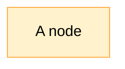
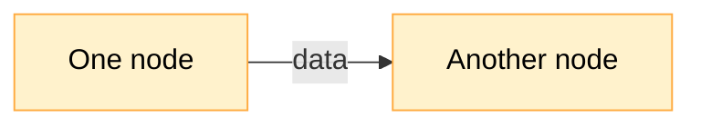
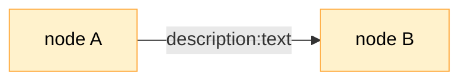
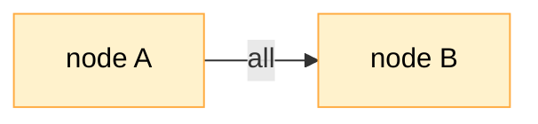
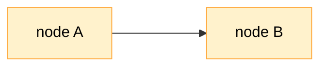
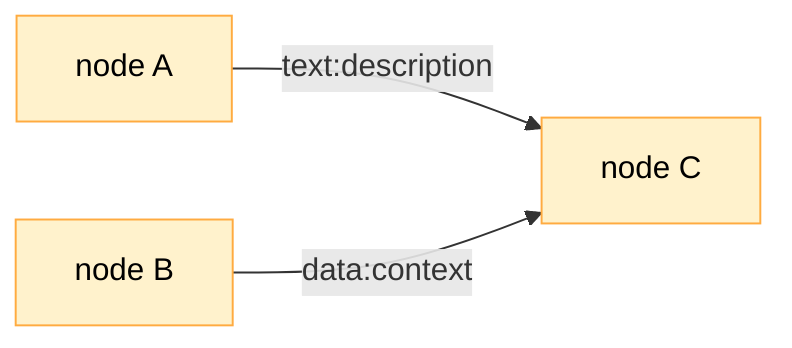
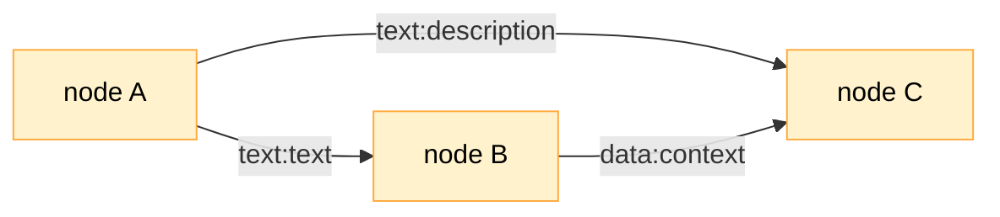
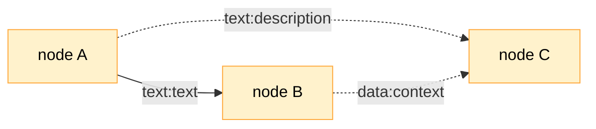
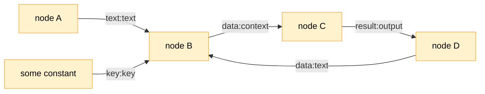
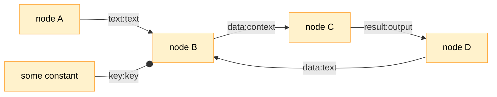

## Nodes and Edges

A graph is nothing without nodes. Graph nodes are also sometimes called vertices, but here, we'll stick with the term 'node'.



In this world, each node is a function. When run, this function takes in a bag of properties (a `Record<string, unknown>` in TypeScript) and returns a bag of properties. The idea behind making nodes functions was that it should be very easy to write one.

```typescript
// This is a node.
const node = async (input: Record<string, unknown>) => {
  // do something with input
  // ...
  const output: Record<string, unknown> = {
    // ...
  };
  return output;
};
```

The whole point of graphs then is about establishing the order in which these functions run and what property bags they take and return. By arranging a small set of functions into various graphs, we can build pretty much anything -- very, very quickly.

To achieve that, we need edges. Edges are also a necessary part of any graph. An edge has a direction, and it connects a node to another node.

The direction of the edge determines the direction of both control and data flow. The function that is the node at the head of the edge will be invoked after the node at the tail of the edge.

As its input, the node at the head of the edge will receive the output of the node at the tail of the edge.



To clearly communicate what data actually flows through this edge, we need to specify which output property connects to which input property. For example, if I want to send the `description` property from the output of `node A` as a property `text` in the input of `node B`, I would mark the edge like this:



The diagram above describes the following sequence:

- run function represented by `node A`
- get its output
- find the `description` property in the output
- pass it as the `text` property to the function represented by `node B`
- run function represented by `node B`

If I want to send all properties from the output of `node A` as properties in the input of `node B`, I would mark the edge like this:



The above basically says:

- run function represented by `node A`
- get its output
- pass all properties from the output as properties to the function represented by `node B`
- run function represented by `node B`

Finally, if I want to send nothing between the two nodes, I would leave the edge unmarked:



In this case, we will have flow of control, but not data, resulting in this sequence:

- run function represented by `node A`
- run function represented by `node B`

## Traversal

Many edges can connect to the same node, and many edges can come out of the same node. This is how we can build complex graphs out of simple nodes.

With so many edges and nodes, it might be tricky to figure out the actual sequence of events.

Figuring this sequence out is the job of the graph traversal machinery. It figures out which nodes to start with and how and when to visit the next ones.

### Entry points

First, the traversal machinery finds the entry points into a graph. These are the nodes that have no incoming edges. In the diagram below, `node A` and `node B` are entry points, and `node C` is not.



### Opportunities

The traversal machinery thinks in terms of opportunities and maintains a list of them. As new opportunities for visiting nodes arise, they are added to the end of the list.

For instance, `node A` and `node B` are the first two opportunities in the diagram above. After visiting `node A`, the traversal machinery will add `node C` as the next opportunity, because there's an edge connecting `node A` to `node C`.

### Required edges

In the last diagram, the order of invoking nodes is pretty easy to figure out: it's either `node A`, `node B`, `node C`, or `node B`, `node A`, `node C`. The structure of the graph tells us that the order of invoking `node A` or `node B` is not important, as long as `node C` goes last. But what if we have a graph like this?



What is the right order of invoking nodes here?

To make sense of this, the traversal machinery looks at the incoming edges (the heads) of every opportunity and determines whether it has collected all properties for each edge. If it has, the machinery deems the opportunity as ready to be visited. If it hasn't, the machinery skips this opportunity.

In the diagram above, `node A` will be the first opportunity (since it's the entry point). After visiting this node, the machinery will uncover two more opportunities: `node C` and `node B`.

Let's suppose it first looks at the heads of the `node C` opportunity. There are two:

1. `description`, supplied by the `text` output property of `node A`, and
2. `context`, supplied by the `data` output property of `node B`.

Since the traversal machinery hasn't visited `node B` yet, the output property `data` hasn't yet been produced, so the corresponding `context` property isn't yet available, either. This means that the `node C` opportunity is not ready to be visited yet. The `node C` opportunity will be skipped, and the machinery will proceed to visit `node B`.

A different way to think of it is that all edges with property names are deemed "required" by default. The traversal machinery will only visit a node if all required incoming edges are satisfied.

### Optional edges

In some cases, we might not want the machinery to presume that the edge is required. In such cases, we can mark an edge as "optional".

Let's take the previous diagram and mark the edges incoming into `node C` as optional:



In this case, the `node C` will be visited twice: once with the `description` property, and once with the `context` property. The sequence of node visits will look like this:

1. `node A`
2. `node C` (with description)
3. `node B`
4. `node C` (with context)

### Constant edges

An interesting property of computing required edges is that the properties that are passed along the edges are being collected for future consumption for every node that could be visited. Once the node is visited, the properties are consumed, and need to be collected all over again for the node to be re-visited.

This is not always desirable. Sometimes, we want to pass the same value of the property to the same node every time the node is visited. In such cases, we can mark the edge as "constant".

Consider this graph:



Here, we have two entry points:

1. `node A`, which provides `text` input to `node B`, and
2. `some constant`, which provides `key` input to `node B`.

There is also a loop that, via `node C` and `node D`, brings the `text` value back to `node B`. Perhaps there's some refinement or accumulation going on along the loop.

Unfortunately, for this loop to actually work, the `some constant` node needs to be revisited as well. If we are sure that the value of `key` will always be the same, we can mark the edge as "constant" as follows:



Once that is done, the `key` property will always be available for consumption, no matter how many iterations of the loop we go through.

The name "constant" hints at the typical application of this flag: use it to represent edges that pass constant values within the graph.

## Graph composition techniques

### Gates

### And/or

### Loops

## Format
