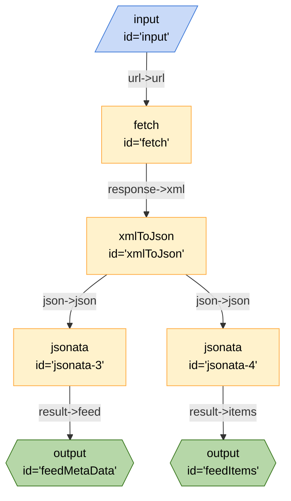

# Fetch ATOM Feed

This board demonstrates how to fetch an ATOM feed return the items and metadata.

## Running the Board

### Inputs

- `url` - The URL of the ATOM feed

### Outputs

- `feedItems` - An array of items from the ATOM feed
- `feedMetaData` - Metadata about the ATOM feed

### From the CLI

```bash
breadboard run boards/components/fetch-atom/index.js --kit @google-labs/llm-starter -i {\"url\":\"https://blog.chromium.org/feeds/posts/default\"}"
```

### From the UI

```bash
breadboard debug boards/components/fetch-atom/index.js
```

## Code


