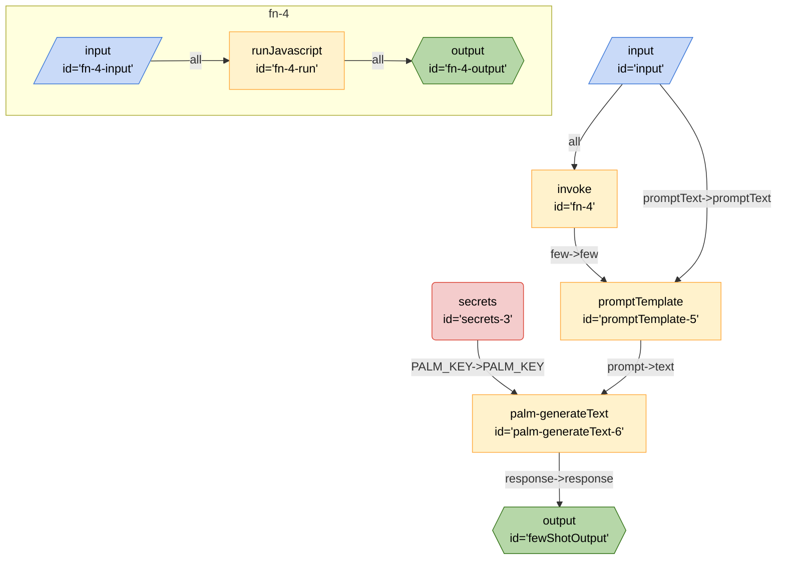

# Few Shot

This board demonstrates how to integrate few shot learning into a Breadboard using the PaLM API. While this can be done easily with a normal prompt, this board has two inputs: `few` and `prompt. This lets you more easily pull the two bits of data from two different sources

## Running the Board

### Inputs

- `few` - An array of strings as examples.
- `promptText` - The prompt to use for the few shot learning.

### Secrets

This board requires the following secrets to be set to be exported as environment variables:

- `PALM_KEY` - The key for the PaLM API.

### Outputs

- `response` - The result from the prompt.

### From the CLI

```bash
breadboard run boards/llm-concepts/few-shot/index.js --kit @google-labs/llm-starter --kit @google-labs/palm-kit -i "{\"few\": [\"Great product, 10/10: positive\", \"Didn't work very well: negative\", \"Super helpful, worth it: positive\"], \"promptText\": \"This is great:\" }" --kit @google-labs/llm-starter --kit @google-labs/core-kit --kit @google-labs/palm-kit
```

### From the UI

```bash
breadboard debug boards/llm-concepts/few-shot/index.js
```

## Code


