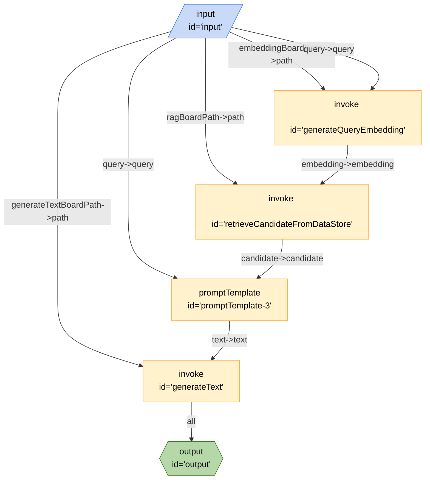

# RAG Query

This board demonstrates how to integrate RAG into a Breadboard application. It doesn't use any specific APIs, rather it orchestrates the data flow between a number of different APIs

## Compiling the board

`breadboard make boards/llm-concepts/rag-query/index.js > boards/llm-concepts/rag-query/index.json`

## Running the Board

### Inputs

- `query` - The query that you want to search for
- `embeddingBoardPath` - the path to a board that accepts a `query` and returns an `embedding`
- `ragBoardPath` - the path to a board that accepts an `embedding` and returns a `candidate`
- `generateTextBoardPath` - the path to a board that accepts `text` and returns `text`

### Secrets

This board may require secrets to be set for the APIs that the embedding, rag, and generateText boards.

### Outputs

- `text` - The output text from the query that was searched for along with the additional context provided by the RAG model

### From the CLI

This board requires a lot of input boards, so it's easier to test from the repository.

```bash
breadboard run boards/llm-concepts/rag-query/index.js --kit @google-labs/llm-starter --kit @google-labs/core-kit -i "{\"query\":\"Testing\"}"
```

### From the UI

```bash
breadboard debug boards/use-case/rag-query/index.js
```

### Testing from the CLI

Because this board requires a lot of input boards, you can test this directly from the repository by running the following commands (note you need to have absolute paths to the boards):

```bash
breadboard run boards/llm-concepts/rag-query/index.js --kit @google-labs/llm-starter --kit @google-labs/core-kit -i "{\"query\":\"Testing\", \"embeddingBoardPath\":\"./test-harness/embedding.json\",\"ragBoardPath\":\"./test-harness/retrieve.json\",\"generateTextBoardPath\":\"./test-harness/generate-text.json\"}"
```

JSON board:

```bash
breadboard run boards/llm-concepts/rag-query/index.json --kit @google-labs/llm-starter --kit @google-labs/core-kit -i "{\"query\":\"Testing\", \"embeddingBoardPath\":\"./test-harness/embedding.json\",\"ragBoardPath\":\"./test-harness/retrieve.json\",\"generateTextBoardPath\":\"./test-harness/generate-text.json\"}"
```

## Code


