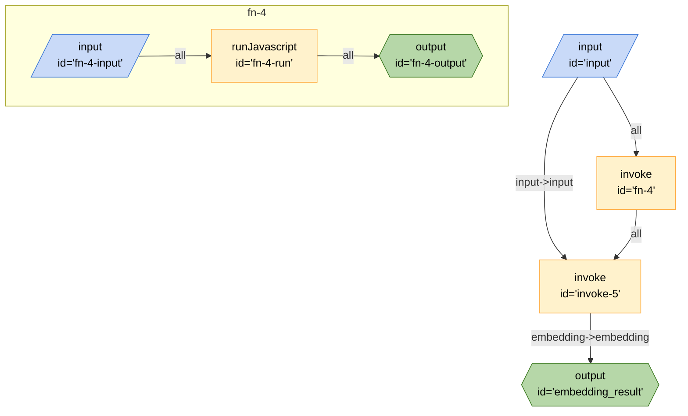

# Generate Embedding

This board demonstrates how to generate an embedding. By default it will use the PaLM API, but you can use any API that takes a prompt and returns a response.

## Running the Board

### Inputs

- `input` - The query that you want to search for
- `provider` [optional] - if this is "." (default) it will use the PaLM API, otherwise it's a path to a graph that will take `input` and return `embedding`

### Secrets

This board requires the following secrets to be set to be exported as environment variables:

- `PALM_KEY` - The key for the PaLM API.

### Outputs

- `embedding_result` - The embedding from either the PaLM API or the graph specified in `provider`

### From the CLI

```bash
breadboard run boards/use-case/generate-embedding/index.js --kit @google-labs/llm-starter --kit @google-labs/core-kit --kit @google-labs/palm-kit -i "{\"input\":\"Testing\"}"
```

### From the UI

```bash
breadboard debug boards/use-case/generate-embedding/index.js
```

## Code


