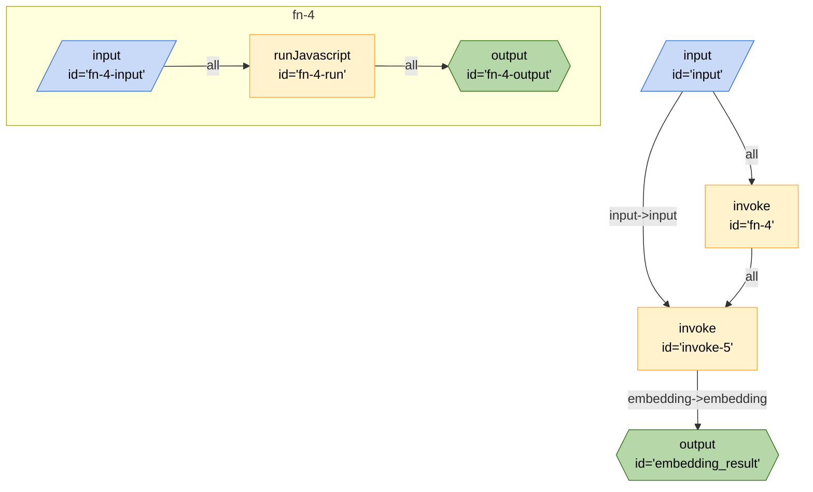

# Generate Text

This board demonstrates how to generate a text based on a prompt.

## Running the Board

### Inputs

- `prompt` - The prompt that you want to generate text from
- `provider` - The path to the board that will provide access to the LLM API that will be used to generate the text.

### Secrets

This board requires will request the secrets based on the board that you are using to talk to the llm. For example, the OpenAI board will require the `OPENAI_API_KEY` secret.

### Outputs

- `text` - The text response from the LLM.

### From the CLI

```bash
breadboard run boards/use-case/generate-text/index.js --kit @google-labs/core-kit --kit --input-file generateTextReqeust.json"
```

### From the UI

```bash
breadboard debug boards/use-case/generate-text/index.js
```

## Code


