# The Logic Experiment

Idea 1 (same as in screens experiment): what if LLM wrote a relatively small,
sandboxed piece that has access to capabilities, loosely following the
[object-capability model](https://en.wikipedia.org/wiki/Object-capability_model).
Could we then implement complex logic based on user's text description?

Idea 2: What if simultaneously with writing code, LLM also wrote a test for this
code, and then tried to run these tests and fix the code based on the errors.

The concept: give LLM a spec to implement an app as a function that is the
invoked inside of a sandbox.

```js
export default async function (inputs, capabilities) {
  const { mcp, generate, console } = capabilities;

  // generated code here
}
```

In this experiment, there are three capabilities:

- `generate` -- provides access to LLM generation
- `mcp` -- the MCP client
- `console` -- the typical console stuff

The code is generated as part of the build loop, which is shown below:

```mermaid
graph TD
    A[Start] --> B["Generate Code and Tests"];
    B --> C["Run Tests"];
    C --> D{Tests Pass?};
    D -- No --> E(Fix Loop);
    subgraph E
        direction TB
        F["Fix Code"] --> G["Run Tests"];
        G --> H{Tests Pass?};
        H -- No --> F;
    end

    D -- Yes --> I[Done ✅];
    H -- Yes --> I;
```



## Experimenting

Create `.env` file with `GEMINI_API_KEY`.

Run

```sh
npm run build
```

Wait for the build iterations to finish and check results in `./out` directory.
