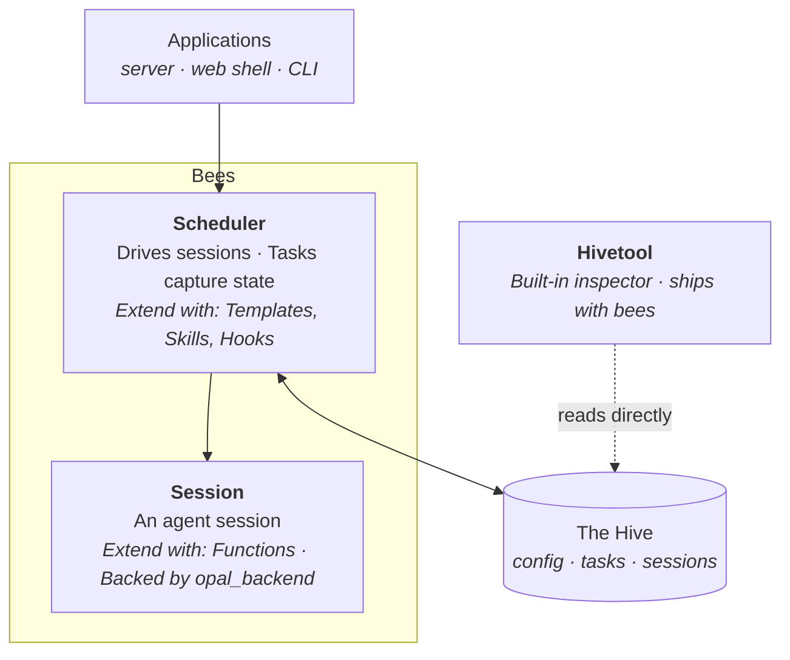
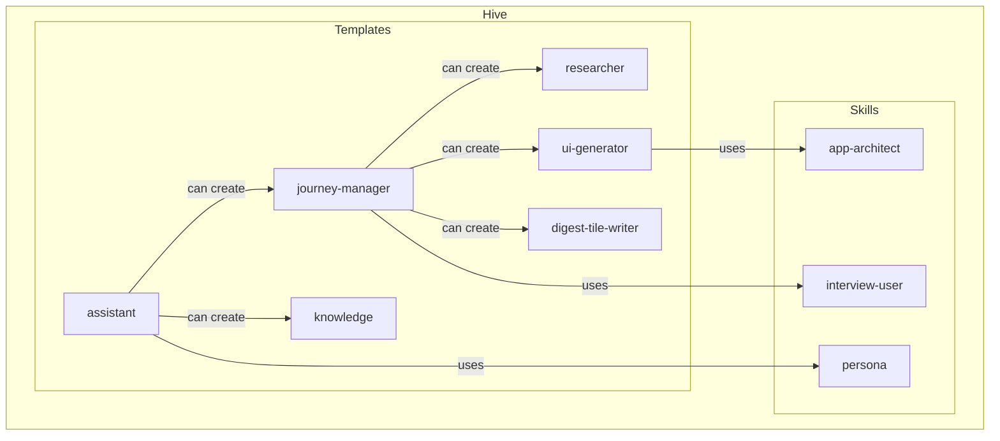

# Bees Architecture

Bees is a library for building agent swarm systems.



There are roughly three layers in bees:

1. **Applications** — built on top of bees. They consume the scheduler's state
   and trigger its actions.
2. **Scheduler** — drives sessions and manages tasks.
3. **Session** — drives individual agent sessions.

The configuration and the state of the agent swarm is stored in the hive.
Currently, the hive is a directory on disk, but it can be abstracted out into
any storage system.

The **hivetool** allows inspecting the hive. It reads the same configuration
files (templates, skills, system config, tasks, session logs) that the scheduler
uses, providing a direct view into the system's data.

---

## The Session Layer

The key responsibility of the session layer is to provide infrastructure to
support robust, fault-tolerant, suspendable and resumable sessions for
LLM-powered agents.

Each individual agent session runs an **agent loop** — the turn-by-turn cycle of
model invocation, tool dispatch, and state management. Internally, an agent
session is structured as a sequence of runs, and each run is a sequence of
turns.

A **turn** is a single LLM call with a response: text input, function calls and
function responses.

A **run** is a sequence of turns. A new run starts at the beginning of the
session. The run concludes when any of these conditions are met:

- The model calls `system.objective_fulfilled` or
  `system.failed_to_fulfill_objective` functions. This terminates the session.
- The model calls `chat.request_user_input`, `chat.present_choices`, or
  `chat.await_context_update` functions. This puts the session in a suspended
  state, waiting for user input or context update.

Once the agent receives the input or update, it resumes the session, creating a
new run.

### What a session manages

- **Context window** — The conversation history fed to the model on each turn:
  system instruction, segments (structured prompt parts), accumulated model/tool
  exchanges, token caching, and context window compaction (future work).
- **Dynamic steering** - The ability for the session consumer to inject segments
  into the session at any time. This allows for a reactive agent system where
  the session can be steered by external events (also known as "mid-stream
  injection").
- **Tool dispatch** — When the model calls a function, the agent loop routes it
  to the correct handler, collects the response, and feeds it back.
- **Suspend/resume** — Handling the session suspension, and resuming the
  session. The session state is persisted so it can be resumed.
- **Pause/Retry** — Transient API errors (e.g., model 503) pause the session
  rather than failing it. The session state is persisted so it can be retried.
- **Logging** — Every session writes a structured log file, capturing turns,
  token usage, and outcomes.

The specifics of persistence of the session is delegated to the layer above (the
scheduler layer), enabling the consumer of the session layer to choose the
persistence mechanism.

### Function Groups

Functions are the extensibility mechanism for this layer. They are structured as
groups. Each **function group** contains:

- a set of function declarations
- their implementation
- a system prompt fragment that gets appended to the system prompt when the
  group is enabled.

There are three kinds of function groups:

- **Built-in functions** — these are considered part of the session layer and
  provide the means for the agent to have some basic utility and to
  suspend/resume as well as terminate the session.

- **Custom functions** — these are provided by the session consumer and are used
  to extend the capabilities of the agent.

- **MCP functions** — external tool servers registered in `SYSTEM.yaml`. Each
  MCP server becomes a function group whose tools agents can call via proxy
  handlers. MCP tools use the same filter mechanism as built-in groups (e.g.,
  `weather.*` includes all tools from the `weather` MCP server). Connections are
  shared across agent sessions. See `bees/functions/mcp_bridge.py`.

The built-in functions are:

| Group          | Filter prefix    | Purpose                                                                                                                                                          |
| -------------- | ---------------- | ---------------------------------------------------------------------------------------------------------------------------------------------------------------- |
| `system`       | `system.*`       | Termination: `system_objective_fulfilled`, `system_failed_to_fulfill_objective`.                                                                                 |
| `chat`         | `chat.*`         | Resume/suspend: `chat_request_user_input`, `chat_present_choices`, `chat_await_context_update`.                                                                  |
| `files` | `files.*` | File I/O: `files_write_file`, `files_list_files`, `files_read_text_from_file`.                                                                        |
| `sandbox`      | `sandbox.*`      | `execute_bash` - Sandboxed bash execution in the task's working directory                                                                                        |
| `generate`     | `generate.*`     | Multimodal content generation and search grounding `generate_text`, `generate_images`, `generate_video`, `generate_speech_from_text`, `generate_music_from_text` |

#### The file system

Each session has its own file system. The `files.*` functions allow the
agent to read and write files in the session's working directory. It is
implemented as a VFS (Virtual File System) that can be backed by different
storage mechanisms. Currently, the file system is backed by the disk, but it can
be abstracted out into any storage system.

#### The sandbox

The sandbox is a restricted execution environment that looks like a bash shell
to the agent. The `execute_bash` function allows the agent to execute bash
commands in the session's working directory. The working directory mirrors the
session's file system.

#### Functions are capabilities

Functions define the capabilities of the agent. By enabling and disabling
functions or function groups, the session consumer can control what the agent
does.

For example, if the configuration does not supply the `system.*` function group,
the agent session becomes infinite: there is no way for it to terminate itself.
This is useful for conversational agents.

Conversely, if the configuration does not supply the `chat.*` function group,
the agent session will never suspend itself, which is useful for agents that are
expected to run to completion without human intervention.

| Configuration                                 | Example                                                                                             |
| --------------------------------------------- | --------------------------------------------------------------------------------------------------- |
| `chat.*`                                      | A typical conversational chat bot with no additional capabilities                                   |
| `system.*`, `files.*`                  | Context window compaction subagent: reads current context logs then summarizes them                 |
| `system.*`, `generate.text`, `files.*` | A researcher that uses search grounding capabilities of `generate_text` functions to write a report |
| `chat.*`, `sandbox.*`, `files.*`       | A conversational coding agent                                                                       |

---

## Scheduler

The scheduler layer coordinates sessions into a swarm. The core idea:

- The work to be done is first formulated as tasks
- Then the scheduler creates agent sessions for each task, and manages their
  lifecycle
- As part of the agent session, the agent can create new tasks, which are then
  picked up by the scheduler.

### Tasks

The **tasks** are analogous to issues in a bug tracker system. Think of the task
system as a bug tracker for agents. The task/session separation is like the
separation between filing a new issue and the individual developer taking the
issue to work on it. It provides a way for the scheduler to reason about the
work to be done and how to allocate the available agent throughput.

The task captures the state of the work as it is being done. It contains:

- The objective (the prompt for the agent)
- The assignee (none, "agent", or "user")
- The current status of the task
- The dependencies of the task
- The outcome and all intermediate artifacts created by the agent working on a
  task.

Tasks are stored in the hive, which is currently backed by disk. However, the
storage layer is abstracted out and can be backed by a database or other storage
mechanism.

### Resilience

Because the scheduler uses tasks and the hive to store the entire state of all
sessions, the system is highly resilient. If the server running the scheduler
crashes, the entire system can be restarted by finding all last successful
session runs and resuming them. Similarly, if a session fails, the scheduler can
either retry the session from the last successful run or re-create it as a new
task. This stateful architecture also opens opportunities for cloning and
forking sessions, to enable parallel evaluations and other advanced use cases.

### Emergent agent swarms

Because the agents can create tasks and coordinate with other agents, bees can
be applied to solve open-ended, complex problems without the need for a central
controller or a predefined structure. The scheduler simply tries to allocate the
tasks to agents in the most effective way it can. The actual structure of the
agents and their relationships -- or "the swarm" -- emerges as the agents
collaborate to fulfill the overall objective.

### Task types and skills

To constrain (or using beekeeper's lingo, "frame") the swarm, the user of bees
can:

- configure the types of tasks that can be created via task templates
- add skills that supply the experise for the agents

**Skills** are markdown documents that use the
[Agent Skills](https://agentskills.io/home) format to describe how a certain
complex task should be performed. Skills may contain scripts, assets, and any
other necessary files that the agent may need to perform the task. Bees uses the
`allowed-tools` property in the skill front matter to specify which function
groups are necessary for the agent to successfully use the skill.

**Task templates** capture the configuration of an agent session. They allow
specifying:

- the initial objective (if needed)
- the skills and function groups that the agent will need
- the kinds of tasks the agent can create
- metadata that allows to distinguish this task type from others

Think of them as pre-configured issue templates in the bug tracker. They help
frame how the swarm grows.

Here's an example:



Notice how the swarm structure emerges from these declarations: `assistant`
delegates to `journey-manager`, which delegates to specialists. No agent knows
about the full tree — each only sees the task types it can create.

Here's the full table of all templates:

| Template             | Skills           | Functions                                             | Can create                                                             | Effect                                                                                                                                                                                                                |
| -------------------- | ---------------- | ----------------------------------------------------- | ---------------------------------------------------------------------- | --------------------------------------------------------------------------------------------------------------------------------------------------------------------------------------------------------------------- |
| `assistant`          | `persona`        | `files.*`, `tasks.*`, `chat.*`                 | `journey-manager`, `knowledge`                                         | A conversational executive assistant. Chats with users, delegates all real work to the `journey-manager` sub-agent. Never does complex work itself to keep the conversation open. Auto-starts a `knowledge` gatherer. |
| `journey-manager`    | `interview-user` | `files.*`, `tasks.*`, `chat.*`                 | `researcher`, `ui-generator`, `journey-designer`, `digest-tile-writer` | A project manager. Interviews the user, then orchestrates a pipeline of research → design → build → iterate. Uses the same "delegate to keep the conversation open" pattern as `assistant`.                           |
| `researcher`         | —                | `system.*`, `files.*`, `generate.text`         | —                                                                      | A headless worker. Uses search grounding to research a topic, writes findings to files, terminates.                                                                                                                   |
| `journey-designer`   | `app-architect`  | `system.*`                                            | —                                                                      | A headless worker. Reads a skill for the spec, produces a `journey.json` blueprint, terminates. No file I/O beyond what the skill provides.                                                                           |
| `ui-generator`       | `ui-generator`   | `sandbox.*`, `files.*`, `events.*`, `system.*` | —                                                                      | A headless worker. Reads journey specs, generates React components, runs a bundler via sandbox, broadcasts an `app_update` event when done.                                                                           |
| `knowledge`          | —                | `chat.await_context_update`, `files.*`         | —                                                                      | An infinite observer. Watches for `digest_ready` events, reads the shared filesystem, synthesizes knowledge files. Never terminates — `chat.await_context_update` without `system.*`.                                 |
| `digest-tile-writer` | —                | `system.*`, `events.*`, `files.*`              | —                                                                      | Fire-and-forget headless worker. Writes a digest JSON, broadcasts `digest_ready`, terminates.                                                                                                                         |

### Scheduler built-in functions

The scheduler layer introduces two extra built-in function groups.

The built-in function groups are:

| Group    | Filter prefix | Purpose                                                                                                                 |
| -------- | ------------- | ----------------------------------------------------------------------------------------------------------------------- |
| `tasks`  | `tasks.*`     | Task management: `tasks_list_types`, `tasks_create_task`, `tasks_check_status`, `tasks_cancel_task`, `tasks_send_event` |
| `events` | `events.*`    | Cross-agent communication: `events_broadcast`, `events_send_to_parent`                                                  |

#### Task trees

The `task.*` function group provides a way for the agent to spawn sub-agents and
manage their lifecycle.

When a new task is created with `tasks_create_task`, it becomes a child task of
the task on which the agent is currently working. The scheduler then picks up
the task and assigns new agent (a sub-agent) to work on it.

As tasks are created by agents, they form a tree. At the root of the tree is the
starting task, which is defined in the scheduler's configuration.

An agent can check the status of the tasks it created with `tasks_check_status`,
and can cancel them with `tasks_cancel_task`.

When an agent completes the task it was assigned, the parent agent is
automatically notified.

An agent can also send events to the subagents it created with the
`tasks_send_event` function. This function utilizes the dynamic steering
capability of the agent session layer. For example, the owning agent, based on
the conversation it is having with the user, can use this function to supply
additional context to a subagent

#### Cross-agent coordination

In addition to the parent-to-child communication, agents have these two
functions for cross-agent coordination:

- `events_broadcast(type, message)` — broadcasts an event to all other agents in
  the swarm. The agent must be subscribed to this event type to receive it. The
  subscription is managed through agent configuration.
- `events_send_to_parent(type, message)` — delivers an event to the parent
  agent. This is the mirror of `tasks_send_event` function.

Both `tasks_send_event` and `events_send_to_parent` rely on the dynamic steering
capability of the agent session layer.

### Scoped file system

When an agent creates a task, the sub-agent working on that task shares the
parent's filesystem rather than getting its own. This enables tasks to share
data via the file system.

Each child task is assigned a **slug** — a short name like `research` or `app`.
The slug becomes the sub-agent's writable subdirectory within the shared
workspace.

Root agents own the entire workspace. Sub-agents are scoped to their slug
directory. Everyone can _read_ anywhere.

A child assigned `research` can only write to `research/` and below. Nested
children compose: a grandchild might have the path `research/deep-dive`.

### Configuration: Templates, Skills, and Hooks

The Scheduler's layer configuration is structured as a set of YAML files.

#### Templates (`{hive_root}/config/TEMPLATES.yaml`)

A template is a blueprint for a task. Each entry defines:

| Field          | Purpose                                                                    |
| -------------- | -------------------------------------------------------------------------- |
| `name`         | Unique identifier, used for delegation                                     |
| `description`  | Description of the template                                                |
| `objective`    | The agent's prompt (supports `{{system.context}}`, `{{system.ticket_id}}`) |
| `functions`    | Filter globs for available tools                                           |
| `skills`       | Skill directories to load                                                  |
| `tags`         | Metadata for UI routing and lifecycle hooks                                |
| `tasks`        | Allowlist of template names this agent can delegate to                     |
| `autostart`    | Templates to stamp as child tasks automatically on creation                |
| `watch_events` | Event subscriptions                                                        |
| `model`        | Model override                                                             |

Templates are the primary way to frame the behavior of agents. Adding a new kind
of agent means adding a template entry.

#### Skills (`{hive_root}/skills/`)

Skills use the [Agent Skills](https://agentskills.io/home) format. Each skill is
a directory containing a `SKILL.md` with YAML frontmatter:

```yaml
---
name: interview-user
title: Interview User
description: Use it to fully understand the user's needs.
allowed-tools:
  - chat.*
---
[Instruction content...]
```

Skills are loaded into the agent's virtual filesystem at
`$HOME/skills/{name}/SKILL.md`. The `allowed-tools` frontmatter automatically
adds the listed function globs to the session's filter.

#### Hooks (`{hive_root}/config/hooks/`)

For behavior that can't be expressed in YAML, templates can have a Python hooks
module at `{hive_root}/config/hooks/{template-name}.py`:

| Hook                                     | When it fires                                     |
| ---------------------------------------- | ------------------------------------------------- |
| `on_ticket_done(ticket)`                 | When a task reaches a terminal state.             |
| `on_event(signal_type, payload, ticket)` | Before event delivery. Can transform or suppress. |

Hooks are the escape hatch — imperative logic when declarative config isn't
enough.

#### The Hive directory

The hive is the physical manifestation of all scheduler-layer configuration:

```
{hive_root}/
  config/
    SYSTEM.yaml        # Boot configuration: title, root template
    TEMPLATES.yaml     # All task templates
    hooks/             # Python hooks per template
  skills/              # Instruction documents
    interview-user/
      SKILL.md
    ui-generator/
      SKILL.md
      tools/           # Companion scripts
  tickets/             # Runtime state (tasks on disk)
  logs/                # Session logs
```

`SYSTEM.yaml` declares the root template that auto-boots at startup. This is the
entry point for the entire system — the scheduler creates a task from this
template if none exists.

## What sits on top

The scheduler exposes methods (`trigger()`, `run_ticket()`,
`recover_stuck_tickets()`) and hooks (`SchedulerHooks`) that applications wire
into. An application can be anything that uses the scheduler layer: a CLI, or an
entire web app, complete with backend and frontend.

### The reference application

The current codebase includes a reference application:

- **`app/server.py`** — A FastAPI server that projects scheduler state as REST
  endpoints and SSE events. Every endpoint is a thin view: `GET /tickets`
  queries the task list, `POST /tickets/{id}/respond` writes a response file and
  triggers the scheduler.
- **`web/`** — A chat-based web shell that connects to the server via SSE.
  Renders agent conversations and iframe-hosted React apps.

This reference application has been extracted from the core `bees` package into `app/`. Bees is designed to be an installable library; application authors will build their own frontends and backends on top of the scheduler.

## Hivetool

Hivetool (name inspired by the
[actual tool](https://en.wikipedia.org/wiki/Hive_tool) the beekeepers use) is
bees' built-in developer workbench. It reads the hive directory directly — the
same files the scheduler operates on — giving a side-channel view into
templates, skills, system config, and task state. Think of it as the framework's
DevTools.

The Hivetool also allows editing the configuration: skills, task templates, and
system config. The tool is hosted at
https://breadboard-ai.github.io/breadboard/hivetool/.
