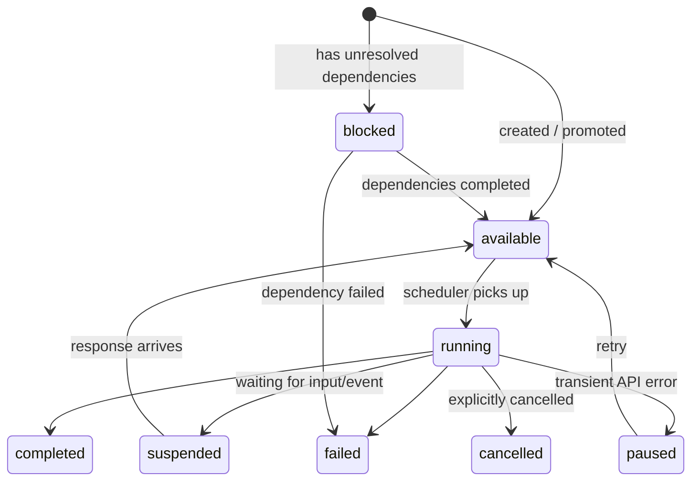

# LEFTOVERS

These are various bits of documentation that haven't yet found a permanent home.

## Session bits

The implementation lives in two places:

- **`opal_backend/sessions/api.py`** — The session lifecycle: `new_session`,
  `start_session`, `resume_session`. Handles the conversation turn loop, model
  invocation, function dispatch, and state persistence.
- **`bees/session.py`** — Bees' wrapper. Assembles function groups, wires up the
  disk-backed file system, manages eval logging, and translates between bees'
  task model and `opal_backend`'s session model.

## Function bits

A function group has three parts:

1. **Declarations** — JSON schemas and markdown instructions in
   `bees/declarations/`. These define what the model sees: function names,
   parameter types, and behavioral guidance.
2. **Handlers** — Python async functions that execute when the model calls a
   tool. Each handler receives `(args, status_callback)` and returns a dict.
3. **Factory** — A `FunctionGroupFactory` that late-binds handlers against
   session-specific context (file system, controller, scope). This is how
   stateless declarations get wired to stateful runtime.

**Where functions come from**: `opal_backend` provides a base inventory of
functions (e.g., `generate.text`). Bees adds its own function groups
(`system.*`, `simple-files.*`, `sandbox.*`, `chat.*`, `events.*`, `tasks.*`,
`skills.*`). Template authors filter the combined inventory using `functions`
globs on the template and `allowed-tools` in skill frontmatter. The filter is
subtractive — an empty filter means all functions are available.

**opal_backend built-in groups** — provided by the base layer. Bees passes these
through; template authors can filter them in:

| Group          | Filter prefix    | Functions                                                                                                                                  |
| -------------- | ---------------- | ------------------------------------------------------------------------------------------------------------------------------------------ |
| `generate`     | `generate.*`     | `generate_text`, `generate_images`, `generate_video`, `generate_speech_from_text`, `generate_music_from_text`, `generate_and_execute_code` |
| `memory`       | `memory.*`       | `memory_create_sheet`, `memory_read_sheet`, `memory_update_sheet`, `memory_delete_sheet`, `memory_get_metadata`                            |
| `google-drive` | `google-drive.*` | `google_drive_upload_file`, `google_drive_create_folder`                                                                                   |
| `notebooklm`   | `notebooklm.*`   | `notebooklm_retrieve_relevant_chunks`, `notebooklm_generate_answer`                                                                        |

**Bees function groups** — defined in `bees/functions/` and
`bees/declarations/`. Some override opal_backend groups (system, chat) with
bees-specific behavior:

| Group          | Filter prefix    | Purpose                                                                                                                                                                   |
| -------------- | ---------------- | ------------------------------------------------------------------------------------------------------------------------------------------------------------------------- |
| `system`       | `system.*`       | Termination: `system_objective_fulfilled`, `system_failed_to_fulfill_objective`. Overrides opal_backend's broader system group.                                           |
| `simple-files` | `simple-files.*` | File I/O: `system_write_file`, `system_list_files`, `system_read_text_from_file`. Split out from opal_backend's system group.                                             |
| `sandbox`      | `sandbox.*`      | Sandboxed bash execution in the task's working directory                                                                                                                  |
| `chat`         | `chat.*`         | User interaction: `chat_request_user_input`, `chat_present_choices`, `chat_await_context_update`. Overrides opal_backend's chat group (adds `chat_await_context_update`). |
| `events`       | `events.*`       | Inter-agent events: `events_broadcast`, `events_send_to_parent`                                                                                                           |
| `tasks`        | `tasks.*`        | Hierarchical delegation: `tasks_list_types`, `tasks_create_task`, `tasks_check_status`, `tasks_cancel_task`, `tasks_send_event`                                           |
| `skills`       | `skills.*`       | Instruction-only: mounts skill files into the agent's VFS. No callable functions.                                                                                         |

#### Adding a function group to a session

To give agents a new capability:

1. Create declarations in `bees/declarations/`:
   - `{name}.functions.json` — tool schemas
   - `{name}.instruction.md` — system instruction
   - `{name}.metadata.json` — group metadata
2. Implement handlers in `bees/functions/{name}.py`.
3. Register the factory in `bees/session.py`'s `extra_groups` list.

This is the right layer when the change is about **what an agent can do during a
single conversation**.

### Key source files

| File                       | Responsibility                                   |
| -------------------------- | ------------------------------------------------ |
| `bees/session.py`          | Session assembly, run/resume, eval collection    |
| `bees/functions/`          | All bees-specific function group implementations |
| `bees/declarations/`       | Function schemas and instructions                |
| `bees/disk_file_system.py` | Disk-backed VFS adapter                          |
| `bees/context_updates.py`  | Event → context parts formatting                 |

### The task lifecycle

### The cycle

The scheduler operates in waves:

1. **Promote** — Check `blocked` tasks. If dependencies are `completed`, promote
   to `available`. If any dependency `failed`, fail the task.
2. **Route** — Process coordination tasks (events). These are lightweight tasks
   that carry no work, only event payloads. Route them to subscribers.
3. **Collect** — Gather runnable work: new `available` tasks plus `suspended`
   tasks that have been responded to.
4. **Execute** — Fire all collected tasks concurrently. Each task starts or
   resumes an agent loop session.
5. **Settle** — Sessions run until they reach a resting state.
6. **Trigger** — If any tasks settled, wake the scheduler for the next cycle. If
   no work remains, go idle (server) or exit (CLI).

## Scheduler bits

### Context delivery

When events or updates need to reach a running or suspended agent, the scheduler
uses three delivery paths (tried in order):

1. **Mid-stream injection** — The agent is running and has a live context queue.
   Push structured parts for injection at the next turn boundary.
2. **Immediate resume** — The agent is suspended and idle. Write `response.json`
   and flip the assignee to trigger resume on the next cycle.
3. **Buffer** — The agent is busy but has no live queue. Append to
   `pending_context_updates` in metadata. These drain on the next suspend →
   resume transition.

This scoping is enforced by `SubagentScope` (a frozen value object in
`bees/subagent_scope.py`) which handles slug composition, path validation, and
generating the sandbox instructions injected into each agent's objective.

### Key source files

| File                     | Responsibility                                                           |
| ------------------------ | ------------------------------------------------------------------------ |
| `bees/scheduler.py`      | Cycle orchestration, context delivery, coordination routing              |
| `bees/ticket.py`         | Task data model and persistence (pending rename to `task.py`)            |
| `bees/playbook.py`       | Template loading, task creation, hooks (pending rename to `template.py`) |
| `bees/subagent_scope.py` | Workspace scoping for hierarchical tasks                                 |
| `bees/config.py`         | Hive directory paths                                                     |

---

---

## Naming Migration

The codebase is undergoing a terminology migration. The docs use the new terms;
the code still uses the old ones in many places.

| Old term          | New term         | Notes                           |
| ----------------- | ---------------- | ------------------------------- |
| ticket            | task             | The core work unit              |
| `Ticket`          | `Task`           | Python class                    |
| `ticket_id`       | `task_id`        | UUID identifier                 |
| playbook          | template         | A blueprint for creating a task |
| `playbook_id`     | `template_id`    | Template name on a task         |
| `playbook_run_id` | `run_id`         | UUID for a specific run         |
| `PLAYBOOK.yaml`   | `TEMPLATES.yaml` | Already migrated (file level)   |

When reading the code, mentally substitute. When writing new code, use the new
terms.

---

## Decision guide

**"I want to give agents a new tool."** → Layer 1. Write a function group in
`bees/functions/`, add declarations in `bees/declarations/`, register in
`bees/session.py`.

**"I want to define a new kind of agent."** → Layer 2. Add a template entry in
`hive/config/TEMPLATES.yaml`.

**"I want to change how agents are briefed."** → Layer 2. Write or modify a
skill in `hive/skills/`.

**"I want side effects when an agent finishes."** → Layer 2. Add a hook in
`hive/config/hooks/`.

**"I want to change the scheduling algorithm."** → Layer 2. Modify
`bees/scheduler.py`.

**"I want to add a REST endpoint or UI view."** → Application layer. Modify
`bees/server.py` or the web shell. Note that this sits outside bees proper and
will eventually be extracted.

**"I want to inspect the hive's config."** → Hivetool. Modify `hivetool/`.
