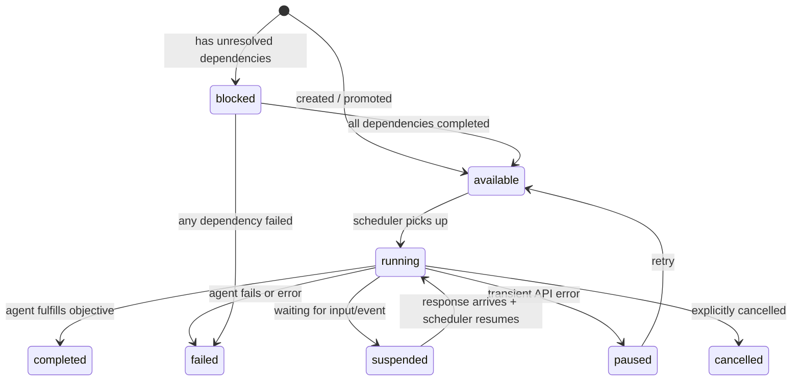

# The Scheduler Layer

The scheduler coordinates sessions into a swarm. It owns the decisions of _what
runs when_ and the bookkeeping around each task's execution. Applications plug
in behavior via `SchedulerHooks`.

This document traces how the scheduler actually works in the code.

## Tasks

Tasks are the scheduler's unit of work — analogous to issues in a bug tracker.
The task/session separation is like the separation between filing a new issue
and a developer picking it up. A task captures intent and state; a session does
the work.

### On-disk format

Each task is a directory under `{hive}/tickets/{uuid}/` containing:

```
{uuid}/
  objective.md          # The prompt text
  metadata.json         # Status, relationships, metrics, outcome
  response.json         # User/system response (written during resume)
  session_state.json    # Persisted session state (written on suspend/pause)
  chat_log.json         # Conversation history for chat-tagged tasks
  filesystem/           # Agent's working directory (for root tasks)
```

The `Ticket` dataclass (`bees/ticket.py`) wraps this directory. The key fields
on `TicketMetadata`:

| Field                     | Purpose                                                           |
| ------------------------- | ----------------------------------------------------------------- |
| `status`                  | The task's lifecycle state (see below).                           |
| `assignee`                | `"user"`, `"agent"`, or `None`.                                   |
| `playbook_id`             | Template name (pending rename to `template_id`).                  |
| `playbook_run_id`         | UUID grouping tasks in the same run (pending rename to `run_id`). |
| `parent_task_id`          | Parent task that created this one.                                |
| `owning_task_id`          | Task whose filesystem this task shares.                           |
| `slug`                    | Writable subdirectory within the shared workspace.                |
| `depends_on`              | List of task IDs that must complete first.                        |
| `functions`               | Filter globs for available tools.                                 |
| `skills`                  | Skill directories to load.                                        |
| `tasks`                   | Allowlist of template names this agent can delegate to.           |
| `watch_events`            | Event subscriptions.                                              |
| `tags`                    | Metadata for UI routing and lifecycle hooks.                      |
| `pending_context_updates` | Buffered updates for later drain.                                 |
| `kind`                    | `"work"` or `"coordination"`.                                     |

### Task lifecycle



**Terminal states**: `completed`, `failed`, `cancelled`.

**Resting states**: `suspended` (waiting for external input), `paused` (waiting
for retry).

## Cycle mechanics

The scheduler operates in waves. A cycle is one sweep through the work queue:

1. **Promote** — `promote_blocked_tickets()` checks all `blocked` tasks. If all
   dependencies are `completed`, promote to `available`. If any dependency
   `failed`, fail the task.
2. **Route** — Process `coordination` kind tasks (events). These carry no work,
   only event payloads. Route them to matching subscribers.
3. **Collect** — Gather runnable work: new `available` tasks plus `suspended`
   tasks that have `assignee == "agent"` (responded to).
4. **Execute** — Fire all collected tasks concurrently. In server mode, each
   task is its own `asyncio.Task`. In batch mode (`run_all_waves`),
   `asyncio.gather` runs them simultaneously.
5. **Settle** — Sessions run until they reach a resting state.
6. **Trigger** — When any task settles, the scheduler wakes for the next cycle.
   If no work remains, it goes idle (server) or exits (CLI).

### Server vs. batch mode

The `Scheduler` class supports two execution modes:

- **`start_loop()`** — Background loop for server mode. Uses an `asyncio.Event`
  trigger. Each ticket runs in its own task, enabling concurrent execution. The
  loop sleeps between cycles and re-evaluates when triggered.
- **`run_all_waves()`** — Synchronous batch mode for the CLI. Runs cycles
  sequentially via `asyncio.gather`, collecting summaries until no work remains.

### Hooks

Applications wire into the scheduler via `SchedulerHooks`:

| Hook                  | When it fires                                                |
| --------------------- | ------------------------------------------------------------ |
| `on_startup`          | After recovery, with the full task list.                     |
| `on_cycle_start`      | Start of each cycle (cycle number, new count, resume count). |
| `on_ticket_event`     | Running session emits an event.                              |
| `on_ticket_start`     | Task transitions to `running`.                               |
| `on_ticket_done`      | Task reaches a resting state.                                |
| `on_events_broadcast` | Agent broadcasts an event mid-session.                       |
| `on_cycle_complete`   | No more work (total cycles count).                           |

The reference application (`app/server.py`) wires these hooks to SSE
broadcasting.

## Context delivery

When events or updates need to reach a running or suspended agent, the scheduler
uses three delivery paths (tried in order):

1. **Mid-stream injection** — Guard: the target ticket has a live context queue
   in `_context_queues`. This means the agent is inside a turn, waiting on a
   model response. Push pre-formatted parts into the queue; the session layer
   injects them at the next turn boundary. This is the scheduler's use of the
   session layer's **dynamic steering** capability.
2. **Immediate resume** — Guard: path 1 failed (no live queue) AND
   `status == "suspended"` AND `assignee == "user"` AND
   `target_id not in _running_tickets`. This means the agent is idle —
   suspended, not being processed. Write `response.json` with `context_updates`
   and flip `assignee` to `"agent"`. The scheduler picks it up on the next
   cycle.
3. **Buffer** — Guard: both path 1 and path 2 failed. This catches every other
   case: the agent is running but between turns (no queue registered yet), or
   the agent is suspended but currently being resumed (still in
   `_running_tickets`), or the agent is in any non-suspended state. Append to
   `pending_context_updates` in metadata. These drain on the next suspend →
   resume transition.

This three-path model ensures updates are never lost, regardless of the target
agent's state.

### Context update format

Context updates are formatted as XML-wrapped text parts:

```
<context_update>Human-readable notification text</context_update>
```

The `bees/context_updates.py` module normalizes different update sources (dicts
like `{"task_id": ..., "outcome": ...}`, raw strings) into this canonical
format.

## Task hierarchy and scoped file system

When an agent creates a task, the child task shares the parent's filesystem
rather than getting its own. This enables data sharing via the file system.

### SubagentScope

`SubagentScope` (`bees/subagent_scope.py`) is a frozen value object that tracks
where an agent sits in the hierarchy:

- **`workspace_root_id`** — The task ID that owns the shared filesystem. For
  root agents, this is their own ID. For subagents, it's the root of the
  workspace chain.
- **`slug_path`** — Full slash-delimited path from the workspace root to this
  agent (e.g. `"research/deep-dive"`). `None` for root agents.

Scopes compose: `SubagentScope("root").child("a").child("b").slug_path` yields
`"a/b"`.

### Write scoping

Root agents can write anywhere. Subagents can only write to paths within their
`slug_path`:

```python
def is_writable(self, path: str) -> bool:
    if self.slug_path is None:
        return True
    return path == self.slug_path or path.startswith(f"{self.slug_path}/")
```

Read access is unrestricted — every agent can read the entire workspace.

### Directory creation

When `stamp_child_ticket` creates a child task, it:

1. Derives a `child_scope` from the parent scope + slug.
2. Creates the task via `run_playbook`.
3. Creates the writable directory on the physical filesystem.
4. Injects `<sandbox_environment>` instructions into the child's objective,
   telling it where it can write.

## Templates, Skills, and Hooks

### Templates (`TEMPLATES.yaml`)

A template is a blueprint for a task. `bees/playbook.py` loads them from
`{hive}/config/TEMPLATES.yaml`.

Key operations:

- **`run_playbook(name)`** — Creates a task from a template. Runs
  `on_run_playbook` hook if present. Stamps child tasks for `autostart` entries.
- **`stamp_child_ticket(name, parent, slug)`** — Creates a child task with
  proper scope composition, sandbox instructions, and `parent_task_id`
  assignment. Shared by both `autostart` and `tasks_create_task`.
- **`boot_root_template(tickets)`** — Reads `root` from `SYSTEM.yaml`. If no
  existing task has a matching `playbook_id`, creates one.

### Skills

Skills are loaded by `scan_skills()` (`bees/functions/skills.py`) at import
time. Each skill directory under `{hive}/skills/` is scanned for a `SKILL.md`
with YAML frontmatter. The frontmatter's `allowed-tools` list is merged into the
session's function filter.

### Hooks

Python modules at `{hive}/config/hooks/{template-name}.py` with optional
functions:

- **`on_run_playbook(context)`** — Runs before task creation. Can return
  enriched context or `None` to abort.
- **`on_ticket_done(ticket)`** — Runs when a task reaches a terminal state.
- **`on_event(signal_type, payload, ticket)`** — Runs before event delivery. Can
  transform or suppress the signal.

## Coordination routing

Cross-agent events (broadcast via `events_broadcast`) are implemented as
**coordination tickets** — lightweight tasks with `kind == "coordination"` that
carry event payloads instead of work.

### How it works

1. `events_broadcast` creates a coordination ticket with `signal_type` and the
   message as `context`.
2. The scheduler's cycle processes coordination tickets before work tickets via
   `_route_coordination_ticket`.
3. For each coordination ticket, the scheduler finds subscribers — tasks with
   matching `watch_events` entries.
4. Delivery is durable: the coordination ticket stays `available` until every
   subscriber receives the event. Busy subscribers are skipped and retried next
   cycle.
5. Before delivery, the template's `on_event` hook can intercept, transform, or
   suppress the signal.
6. `playbook_run_id` scoping: events from a scoped run only reach subscribers in
   that same run.

### Parent-child events

`events_send_to_parent` and `tasks_send_event` use a different mechanism — they
call `_deliver_context_update` directly, bypassing coordination tickets. This
uses the three-path context delivery model described above.

## Resilience

### Recovery

On startup, `recover_stuck_tickets()` flips any `running` or `paused` tasks back
to `available`. Since all session state is persisted on disk, the scheduler can
safely restart and resume from the last checkpoint.

### Sub-agent completion notification

When a child task completes or fails, the `wrap_run`/`wrap_resume` cleanup
delivers a context update to the creator task with the status and outcome. This
wakes the parent agent with:

```
<context_update>Task abc12345 completed: [outcome text]</context_update>
```

### Key source files

| File                      | Responsibility                                              |
| ------------------------- | ----------------------------------------------------------- |
| `bees/scheduler.py`       | Cycle orchestration, context delivery, coordination routing |
| `bees/ticket.py`          | Task data model and persistence                             |
| `bees/playbook.py`        | Template loading, task creation, hooks                      |
| `bees/subagent_scope.py`  | Workspace scoping for hierarchical tasks                    |
| `bees/context_updates.py` | Event → context parts formatting                            |
| `bees/config.py`          | Hive directory paths                                        |

---

## Gaps

Code changes needed to reconcile the scheduler layer with the aspirational
architecture in `docs/architecture/index.md`.

### Coordination tickets should be replaced

Events are currently implemented as coordination tickets — fake tasks that carry
event payloads through the scheduler cycle. This is a hack: events are not
tasks, and routing them through the task lifecycle adds complexity (status
tracking, delivery counters, `kind` field on tickets).

**Gap**: Replace coordination ticket machinery with a purpose-built event
dispatch system. The dispatcher should handle subscriber matching,
`playbook_run_id` scoping, tag filtering, and durable delivery directly, without
creating database records that look like tasks.

### Tag enrichment: remove or design intentionally

When a child task completes, `_enrich_creator_tags` merges the child's tags into
the creator's tags. This was added as a convenience for UI routing but has no
clear design rationale — it's an emergent side effect that may surprise users.

**Gap**: Consider removing tag enrichment entirely. If it serves a real purpose,
design it intentionally and document it. If not, delete the code.

### Naming migration incomplete

The code still uses the old terminology throughout:

| Code term         | Target term   |
| ----------------- | ------------- |
| `Ticket`          | `Task`        |
| `ticket_id`       | `task_id`     |
| `playbook_id`     | `template_id` |
| `playbook_run_id` | `run_id`      |
| `ticket.py`       | `task.py`     |
| `playbook.py`     | `template.py` |
