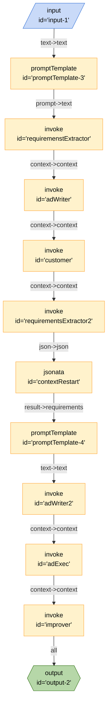

## ad-writer.ts

```mermaid
%%{init: 'themeVariables': { 'fontFamily': 'Fira Code, monospace' }}%%
graph TD;
improver["invoke <br> id='improver'"] -- all --> output2{{"output <br> id='output-2'"}}:::output
adExec["invoke <br> id='adExec'"] -- "context->context" --> improver["invoke <br> id='improver'"]
adWriter2["invoke <br> id='adWriter2'"] -- "context->context" --> adExec["invoke <br> id='adExec'"]
promptTemplate4["promptTemplate <br> id='promptTemplate-4'"] -- "text->text" --> adWriter2["invoke <br> id='adWriter2'"]
contextRestart["jsonata <br> id='contextRestart'"] -- "result->requirements" --> promptTemplate4["promptTemplate <br> id='promptTemplate-4'"]
requirementsExtractor2["invoke <br> id='requirementsExtractor2'"] -- "json->json" --> contextRestart["jsonata <br> id='contextRestart'"]
customer["invoke <br> id='customer'"] -- "context->context" --> requirementsExtractor2["invoke <br> id='requirementsExtractor2'"]
adWriter["invoke <br> id='adWriter'"] -- "context->context" --> customer["invoke <br> id='customer'"]
requiremenstExtractor["invoke <br> id='requiremenstExtractor'"] -- "context->context" --> adWriter["invoke <br> id='adWriter'"]
promptTemplate3["promptTemplate <br> id='promptTemplate-3'"] -- "prompt->text" --> requiremenstExtractor["invoke <br> id='requiremenstExtractor'"]
input1[/"input <br> id='input-1'"/]:::input -- "text->text" --> promptTemplate3["promptTemplate <br> id='promptTemplate-3'"]
classDef default stroke:#ffab40,fill:#fff2ccff,color:#000
classDef input stroke:#3c78d8,fill:#c9daf8ff,color:#000
classDef output stroke:#38761d,fill:#b6d7a8ff,color:#000
classDef passthrough stroke:#a64d79,fill:#ead1dcff,color:#000
classDef slot stroke:#a64d79,fill:#ead1dcff,color:#000
classDef config stroke:#a64d79,fill:#ead1dcff,color:#000
classDef secrets stroke:#db4437,fill:#f4cccc,color:#000
classDef slotted stroke:#a64d79
```