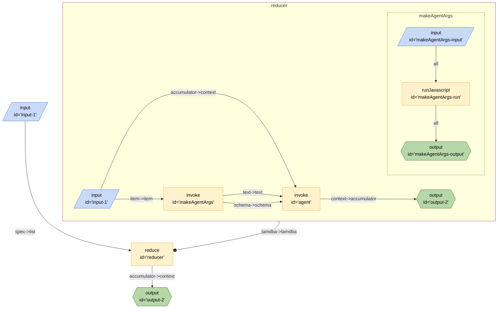

## agent-chain.ts

```mermaid
%%{init: 'themeVariables': { 'fontFamily': 'Fira Code, monospace' }}%%
graph TD;
reducer["reduce <br> id='reducer'"] -- "accumulator->context" --> output2{{"output <br> id='output-2'"}}:::output
subgraph sg_reducer [reducer]
reducer_agent["invoke <br> id='agent'"] -- "context->accumulator" --> reducer_output2{{"output <br> id='output-2'"}}:::output
reducer_input1[/"input <br> id='input-1'"/]:::input -- "item->item" --> reducer_makeAgentArgs["invoke <br> id='makeAgentArgs'"]
reducer_input1[/"input <br> id='input-1'"/]:::input -- "accumulator->context" --> reducer_agent["invoke <br> id='agent'"]
reducer_makeAgentArgs["invoke <br> id='makeAgentArgs'"] -- "text->text" --> reducer_agent["invoke <br> id='agent'"]
reducer_makeAgentArgs["invoke <br> id='makeAgentArgs'"] -- "schema->schema" --> reducer_agent["invoke <br> id='agent'"]

subgraph sg_makeAgentArgs [makeAgentArgs]
makeAgentArgsreducer_makeAgentArgsinput[/"input <br> id='makeAgentArgs-input'"/]:::input -- all --> makeAgentArgsreducer_makeAgentArgsrun["runJavascript <br> id='makeAgentArgs-run'"]
makeAgentArgsreducer_makeAgentArgsrun["runJavascript <br> id='makeAgentArgs-run'"] -- all --> makeAgentArgsreducer_makeAgentArgsoutput{{"output <br> id='makeAgentArgs-output'"}}:::output
end

end
sg_reducer:::slotted -- "lamdba->lamdba" --o reducer

input1[/"input <br> id='input-1'"/]:::input -- "spec->list" --> reducer["reduce <br> id='reducer'"]
classDef default stroke:#ffab40,fill:#fff2ccff,color:#000
classDef input stroke:#3c78d8,fill:#c9daf8ff,color:#000
classDef output stroke:#38761d,fill:#b6d7a8ff,color:#000
classDef passthrough stroke:#a64d79,fill:#ead1dcff,color:#000
classDef slot stroke:#a64d79,fill:#ead1dcff,color:#000
classDef config stroke:#a64d79,fill:#ead1dcff,color:#000
classDef secrets stroke:#db4437,fill:#f4cccc,color:#000
classDef slotted stroke:#a64d79
```