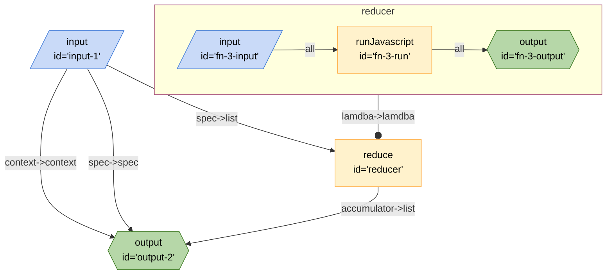

## agent-chain.ts

```mermaid
%%{init: 'themeVariables': { 'fontFamily': 'Fira Code, monospace' }}%%
graph TD;
input1[/"input <br> id='input-1'"/]:::input -- "spec->list" --> reducer["reduce <br> id='reducer'"]
input1[/"input <br> id='input-1'"/]:::input -- "context->context" --> output2{{"output <br> id='output-2'"}}:::output
input1[/"input <br> id='input-1'"/]:::input -- "spec->spec" --> output2{{"output <br> id='output-2'"}}:::output
reducer["reduce <br> id='reducer'"] -- "accumulator->list" --> output2{{"output <br> id='output-2'"}}:::output
subgraph sg_reducer [reducer]
reducer_fn3input[/"input <br> id='fn-3-input'"/]:::input -- all --> reducer_fn3run["runJavascript <br> id='fn-3-run'"]
reducer_fn3run["runJavascript <br> id='fn-3-run'"] -- all --> reducer_fn3output{{"output <br> id='fn-3-output'"}}:::output
end
sg_reducer:::slotted -- "lamdba->lamdba" --o reducer

classDef default stroke:#ffab40,fill:#fff2ccff,color:#000
classDef input stroke:#3c78d8,fill:#c9daf8ff,color:#000
classDef output stroke:#38761d,fill:#b6d7a8ff,color:#000
classDef passthrough stroke:#a64d79,fill:#ead1dcff,color:#000
classDef slot stroke:#a64d79,fill:#ead1dcff,color:#000
classDef config stroke:#a64d79,fill:#ead1dcff,color:#000
classDef secrets stroke:#db4437,fill:#f4cccc,color:#000
classDef slotted stroke:#a64d79
```