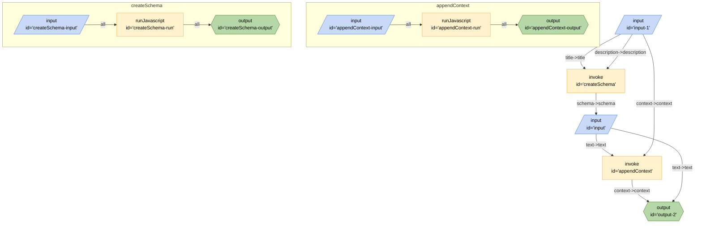

## ask-user.ts

```mermaid
%%{init: 'themeVariables': { 'fontFamily': 'Fira Code, monospace' }}%%
graph TD;
appendContext["invoke <br> id='appendContext'"] -- "context->context" --> output2{{"output <br> id='output-2'"}}:::output
input[/"input <br> id='input'"/]:::input -- "text->text" --> appendContext["invoke <br> id='appendContext'"]
input[/"input <br> id='input'"/]:::input -- "text->text" --> output2{{"output <br> id='output-2'"}}:::output
input1[/"input <br> id='input-1'"/]:::input -- "title->title" --> createSchema["invoke <br> id='createSchema'"]
input1[/"input <br> id='input-1'"/]:::input -- "description->description" --> createSchema["invoke <br> id='createSchema'"]
input1[/"input <br> id='input-1'"/]:::input -- "context->context" --> appendContext["invoke <br> id='appendContext'"]
createSchema["invoke <br> id='createSchema'"] -- "schema->schema" --> input[/"input <br> id='input'"/]:::input

subgraph sg_appendContext [appendContext]
appendContext_appendContextinput[/"input <br> id='appendContext-input'"/]:::input -- all --> appendContext_appendContextrun["runJavascript <br> id='appendContext-run'"]
appendContext_appendContextrun["runJavascript <br> id='appendContext-run'"] -- all --> appendContext_appendContextoutput{{"output <br> id='appendContext-output'"}}:::output
end


subgraph sg_createSchema [createSchema]
createSchema_createSchemainput[/"input <br> id='createSchema-input'"/]:::input -- all --> createSchema_createSchemarun["runJavascript <br> id='createSchema-run'"]
createSchema_createSchemarun["runJavascript <br> id='createSchema-run'"] -- all --> createSchema_createSchemaoutput{{"output <br> id='createSchema-output'"}}:::output
end

classDef default stroke:#ffab40,fill:#fff2ccff,color:#000
classDef input stroke:#3c78d8,fill:#c9daf8ff,color:#000
classDef output stroke:#38761d,fill:#b6d7a8ff,color:#000
classDef passthrough stroke:#a64d79,fill:#ead1dcff,color:#000
classDef slot stroke:#a64d79,fill:#ead1dcff,color:#000
classDef config stroke:#a64d79,fill:#ead1dcff,color:#000
classDef secrets stroke:#db4437,fill:#f4cccc,color:#000
classDef slotted stroke:#a64d79
```