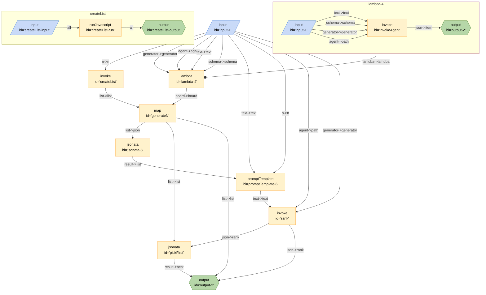

## best-of-n.ts

```mermaid
%%{init: 'themeVariables': { 'fontFamily': 'Fira Code, monospace' }}%%
graph TD;
pickFirst["jsonata <br> id='pickFirst'"] -- "result->best" --> output2{{"output <br> id='output-2'"}}:::output
generateN["map <br> id='generateN'"] -- "list->json" --> jsonata5["jsonata <br> id='jsonata-5'"]
generateN["map <br> id='generateN'"] -- "list->list" --> pickFirst["jsonata <br> id='pickFirst'"]
generateN["map <br> id='generateN'"] -- "list->list" --> output2{{"output <br> id='output-2'"}}:::output
rank["invoke <br> id='rank'"] -- "json->rank" --> pickFirst["jsonata <br> id='pickFirst'"]
rank["invoke <br> id='rank'"] -- "json->rank" --> output2{{"output <br> id='output-2'"}}:::output
lambda4["lambda <br> id='lambda-4'"] -- "board->board" --> generateN["map <br> id='generateN'"]
subgraph sg_lambda4 [lambda-4]
lambda4_invokeAgent["invoke <br> id='invokeAgent'"] -- "json->item" --> lambda4_output2{{"output <br> id='output-2'"}}:::output
lambda4_input1[/"input <br> id='input-1'"/]:::input -- "text->text" --> lambda4_invokeAgent["invoke <br> id='invokeAgent'"]
lambda4_input1[/"input <br> id='input-1'"/]:::input -- "schema->schema" --> lambda4_invokeAgent["invoke <br> id='invokeAgent'"]
lambda4_input1[/"input <br> id='input-1'"/]:::input -- "generator->generator" --> lambda4_invokeAgent["invoke <br> id='invokeAgent'"]
lambda4_input1[/"input <br> id='input-1'"/]:::input -- "agent->path" --> lambda4_invokeAgent["invoke <br> id='invokeAgent'"]
end
sg_lambda4:::slotted -- "lamdba->lamdba" --o lambda4

createList["invoke <br> id='createList'"] -- "list->list" --> generateN["map <br> id='generateN'"]
jsonata5["jsonata <br> id='jsonata-5'"] -- "result->list" --> promptTemplate6["promptTemplate <br> id='promptTemplate-6'"]
input1[/"input <br> id='input-1'"/]:::input -- "n->n" --> createList["invoke <br> id='createList'"]
input1[/"input <br> id='input-1'"/]:::input -- "generator->generator" --> lambda4["lambda <br> id='lambda-4'"]
input1[/"input <br> id='input-1'"/]:::input -- "agent->agent" --> lambda4["lambda <br> id='lambda-4'"]
input1[/"input <br> id='input-1'"/]:::input -- "text->text" --> lambda4["lambda <br> id='lambda-4'"]
input1[/"input <br> id='input-1'"/]:::input -- "schema->schema" --> lambda4["lambda <br> id='lambda-4'"]
input1[/"input <br> id='input-1'"/]:::input -- "text->text" --> promptTemplate6["promptTemplate <br> id='promptTemplate-6'"]
input1[/"input <br> id='input-1'"/]:::input -- "n->n" --> promptTemplate6["promptTemplate <br> id='promptTemplate-6'"]
input1[/"input <br> id='input-1'"/]:::input -- "agent->path" --> rank["invoke <br> id='rank'"]
input1[/"input <br> id='input-1'"/]:::input -- "generator->generator" --> rank["invoke <br> id='rank'"]
promptTemplate6["promptTemplate <br> id='promptTemplate-6'"] -- "text->text" --> rank["invoke <br> id='rank'"]

subgraph sg_createList [createList]
createList_createListinput[/"input <br> id='createList-input'"/]:::input -- all --> createList_createListrun["runJavascript <br> id='createList-run'"]
createList_createListrun["runJavascript <br> id='createList-run'"] -- all --> createList_createListoutput{{"output <br> id='createList-output'"}}:::output
end

classDef default stroke:#ffab40,fill:#fff2ccff,color:#000
classDef input stroke:#3c78d8,fill:#c9daf8ff,color:#000
classDef output stroke:#38761d,fill:#b6d7a8ff,color:#000
classDef passthrough stroke:#a64d79,fill:#ead1dcff,color:#000
classDef slot stroke:#a64d79,fill:#ead1dcff,color:#000
classDef config stroke:#a64d79,fill:#ead1dcff,color:#000
classDef secrets stroke:#db4437,fill:#f4cccc,color:#000
classDef slotted stroke:#a64d79
```