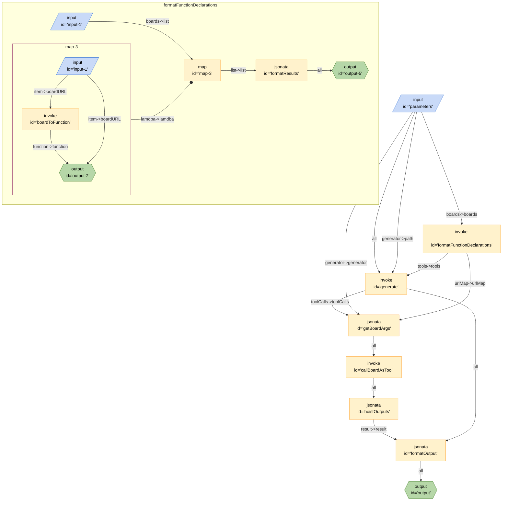

## board-caller.ts

```mermaid
%%{init: 'themeVariables': { 'fontFamily': 'Fira Code, monospace' }}%%
graph TD;
formatOutput["jsonata <br> id='formatOutput'"] -- all --> output{{"output <br> id='output'"}}:::output
hoistOutputs["jsonata <br> id='hoistOutputs'"] -- "result->result" --> formatOutput["jsonata <br> id='formatOutput'"]
generate["invoke <br> id='generate'"] -- "toolCalls->toolCalls" --> getBoardArgs["jsonata <br> id='getBoardArgs'"]
generate["invoke <br> id='generate'"] -- all --> formatOutput["jsonata <br> id='formatOutput'"]
callBoardAsTool["invoke <br> id='callBoardAsTool'"] -- all --> hoistOutputs["jsonata <br> id='hoistOutputs'"]
parameters[/"input <br> id='parameters'"/]:::input -- "boards->boards" --> formatFunctionDeclarations["invoke <br> id='formatFunctionDeclarations'"]
parameters[/"input <br> id='parameters'"/]:::input -- all --> generate["invoke <br> id='generate'"]
parameters[/"input <br> id='parameters'"/]:::input -- "generator->path" --> generate["invoke <br> id='generate'"]
parameters[/"input <br> id='parameters'"/]:::input -- "generator->generator" --> getBoardArgs["jsonata <br> id='getBoardArgs'"]
formatFunctionDeclarations["invoke <br> id='formatFunctionDeclarations'"] -- "tools->tools" --> generate["invoke <br> id='generate'"]
formatFunctionDeclarations["invoke <br> id='formatFunctionDeclarations'"] -- "urlMap->urlMap" --> getBoardArgs["jsonata <br> id='getBoardArgs'"]
getBoardArgs["jsonata <br> id='getBoardArgs'"] -- all --> callBoardAsTool["invoke <br> id='callBoardAsTool'"]

subgraph sg_formatFunctionDeclarations [formatFunctionDeclarations]
formatFunctionDeclarations_formatResults["jsonata <br> id='formatResults'"] -- all --> formatFunctionDeclarations_output5{{"output <br> id='output-5'"}}:::output
formatFunctionDeclarations_map3["map <br> id='map-3'"] -- "list->list" --> formatFunctionDeclarations_formatResults["jsonata <br> id='formatResults'"]
subgraph sg_map3 [map-3]
formatFunctionDeclarations_map3_boardToFunction["invoke <br> id='boardToFunction'"] -- "function->function" --> formatFunctionDeclarations_map3_output2{{"output <br> id='output-2'"}}:::output
formatFunctionDeclarations_map3_input1[/"input <br> id='input-1'"/]:::input -- "item->boardURL" --> formatFunctionDeclarations_map3_boardToFunction["invoke <br> id='boardToFunction'"]
formatFunctionDeclarations_map3_input1[/"input <br> id='input-1'"/]:::input -- "item->boardURL" --> formatFunctionDeclarations_map3_output2{{"output <br> id='output-2'"}}:::output
end
sg_map3:::slotted -- "lamdba->lamdba" --o formatFunctionDeclarations_map3

formatFunctionDeclarations_input1[/"input <br> id='input-1'"/]:::input -- "boards->list" --> formatFunctionDeclarations_map3["map <br> id='map-3'"]
end

classDef default stroke:#ffab40,fill:#fff2ccff,color:#000
classDef input stroke:#3c78d8,fill:#c9daf8ff,color:#000
classDef output stroke:#38761d,fill:#b6d7a8ff,color:#000
classDef passthrough stroke:#a64d79,fill:#ead1dcff,color:#000
classDef slot stroke:#a64d79,fill:#ead1dcff,color:#000
classDef config stroke:#a64d79,fill:#ead1dcff,color:#000
classDef secrets stroke:#db4437,fill:#f4cccc,color:#000
classDef slotted stroke:#a64d79
```