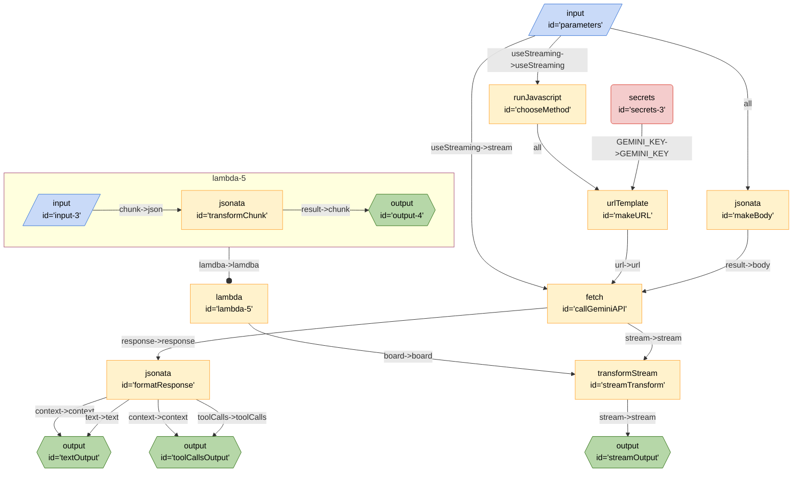

## gemini-generator.ts

```mermaid
%%{init: 'themeVariables': { 'fontFamily': 'Fira Code, monospace' }}%%
graph TD;
streamTransform["transformStream <br> id='streamTransform'"] -- "stream->stream" --> streamOutput{{"output <br> id='streamOutput'"}}:::output
lambda5["lambda <br> id='lambda-5'"] -- "board->board" --> streamTransform["transformStream <br> id='streamTransform'"]
subgraph sg_lambda5 [lambda-5]
lambda5_transformChunk["jsonata <br> id='transformChunk'"] -- "result->chunk" --> lambda5_output4{{"output <br> id='output-4'"}}:::output
lambda5_input3[/"input <br> id='input-3'"/]:::input -- "chunk->json" --> lambda5_transformChunk["jsonata <br> id='transformChunk'"]
end
sg_lambda5:::slotted -- "lamdba->lamdba" --o lambda5

callGeminiAPI["fetch <br> id='callGeminiAPI'"] -- "response->response" --> formatResponse["jsonata <br> id='formatResponse'"]
callGeminiAPI["fetch <br> id='callGeminiAPI'"] -- "stream->stream" --> streamTransform["transformStream <br> id='streamTransform'"]
parameters[/"input <br> id='parameters'"/]:::input -- "useStreaming->useStreaming" --> chooseMethod["runJavascript <br> id='chooseMethod'"]
parameters[/"input <br> id='parameters'"/]:::input -- all --> makeBody["jsonata <br> id='makeBody'"]
parameters[/"input <br> id='parameters'"/]:::input -- "useStreaming->stream" --> callGeminiAPI["fetch <br> id='callGeminiAPI'"]
makeURL["urlTemplate <br> id='makeURL'"] -- "url->url" --> callGeminiAPI["fetch <br> id='callGeminiAPI'"]
makeBody["jsonata <br> id='makeBody'"] -- "result->body" --> callGeminiAPI["fetch <br> id='callGeminiAPI'"]
formatResponse["jsonata <br> id='formatResponse'"] -- "context->context" --> textOutput{{"output <br> id='textOutput'"}}:::output
formatResponse["jsonata <br> id='formatResponse'"] -- "text->text" --> textOutput{{"output <br> id='textOutput'"}}:::output
formatResponse["jsonata <br> id='formatResponse'"] -- "context->context" --> toolCallsOutput{{"output <br> id='toolCallsOutput'"}}:::output
formatResponse["jsonata <br> id='formatResponse'"] -- "toolCalls->toolCalls" --> toolCallsOutput{{"output <br> id='toolCallsOutput'"}}:::output
chooseMethod["runJavascript <br> id='chooseMethod'"] -- all --> makeURL["urlTemplate <br> id='makeURL'"]
secrets3("secrets <br> id='secrets-3'"):::secrets -- "GEMINI_KEY->GEMINI_KEY" --> makeURL["urlTemplate <br> id='makeURL'"]
classDef default stroke:#ffab40,fill:#fff2ccff,color:#000
classDef input stroke:#3c78d8,fill:#c9daf8ff,color:#000
classDef output stroke:#38761d,fill:#b6d7a8ff,color:#000
classDef passthrough stroke:#a64d79,fill:#ead1dcff,color:#000
classDef slot stroke:#a64d79,fill:#ead1dcff,color:#000
classDef config stroke:#a64d79,fill:#ead1dcff,color:#000
classDef secrets stroke:#db4437,fill:#f4cccc,color:#000
classDef slotted stroke:#a64d79
```