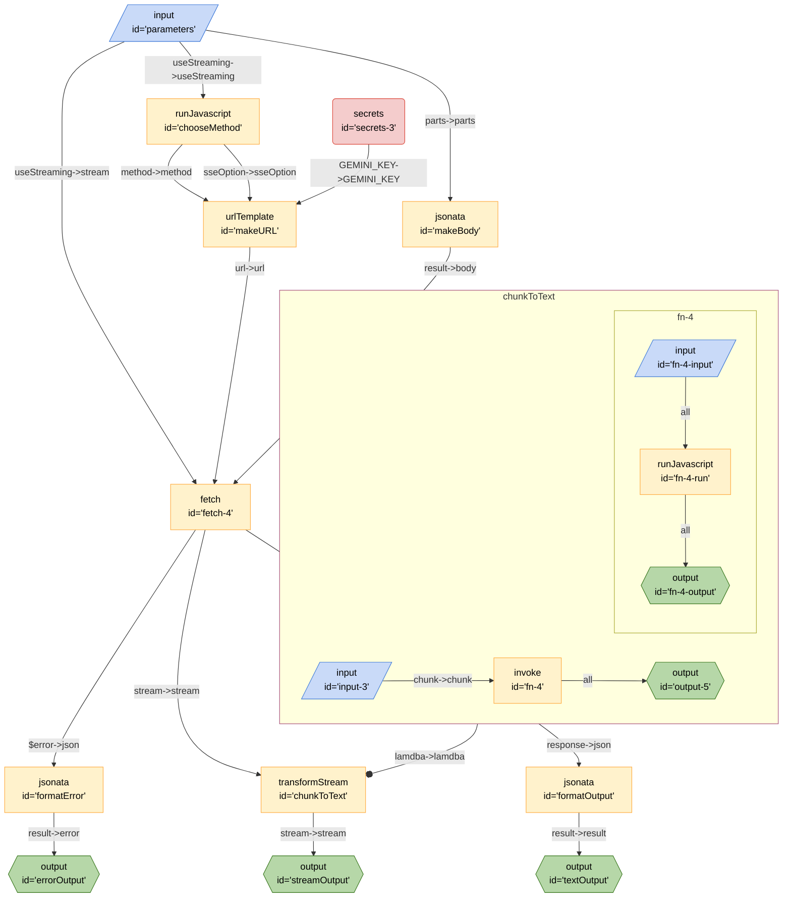

## gemini-pro-vision.ts

```mermaid
%%{init: 'themeVariables': { 'fontFamily': 'Fira Code, monospace' }}%%
graph TD;
formatOutput["jsonata <br> id='formatOutput'"] -- "result->result" --> textOutput{{"output <br> id='textOutput'"}}:::output
fetch4["fetch <br> id='fetch-4'"] -- "$error->json" --> formatError["jsonata <br> id='formatError'"]
fetch4["fetch <br> id='fetch-4'"] -- "stream->stream" --> chunkToText["transformStream <br> id='chunkToText'"]
fetch4["fetch <br> id='fetch-4'"] -- "response->json" --> formatOutput["jsonata <br> id='formatOutput'"]
parameters[/"input <br> id='parameters'"/]:::input -- "parts->parts" --> makeBody["jsonata <br> id='makeBody'"]
parameters[/"input <br> id='parameters'"/]:::input -- "useStreaming->useStreaming" --> chooseMethod["runJavascript <br> id='chooseMethod'"]
parameters[/"input <br> id='parameters'"/]:::input -- "useStreaming->stream" --> fetch4["fetch <br> id='fetch-4'"]
makeURL["urlTemplate <br> id='makeURL'"] -- "url->url" --> fetch4["fetch <br> id='fetch-4'"]
makeBody["jsonata <br> id='makeBody'"] -- "result->body" --> fetch4["fetch <br> id='fetch-4'"]
formatError["jsonata <br> id='formatError'"] -- "result->error" --> errorOutput{{"output <br> id='errorOutput'"}}:::output
chunkToText["transformStream <br> id='chunkToText'"] -- "stream->stream" --> streamOutput{{"output <br> id='streamOutput'"}}:::output
subgraph sg_chunkToText [chunkToText]
chunkToText_fn4["invoke <br> id='fn-4'"] -- all --> chunkToText_output5{{"output <br> id='output-5'"}}:::output
chunkToText_input3[/"input <br> id='input-3'"/]:::input -- "chunk->chunk" --> chunkToText_fn4["invoke <br> id='fn-4'"]

subgraph sg_fn4 [fn-4]
fn4chunkToText_fn4input[/"input <br> id='fn-4-input'"/]:::input -- all --> fn4chunkToText_fn4run["runJavascript <br> id='fn-4-run'"]
fn4chunkToText_fn4run["runJavascript <br> id='fn-4-run'"] -- all --> fn4chunkToText_fn4output{{"output <br> id='fn-4-output'"}}:::output
end

end
sg_chunkToText:::slotted -- "lamdba->lamdba" --o chunkToText

chooseMethod["runJavascript <br> id='chooseMethod'"] -- "method->method" --> makeURL["urlTemplate <br> id='makeURL'"]
chooseMethod["runJavascript <br> id='chooseMethod'"] -- "sseOption->sseOption" --> makeURL["urlTemplate <br> id='makeURL'"]
secrets3("secrets <br> id='secrets-3'"):::secrets -- "GEMINI_KEY->GEMINI_KEY" --> makeURL["urlTemplate <br> id='makeURL'"]
classDef default stroke:#ffab40,fill:#fff2ccff,color:#000
classDef input stroke:#3c78d8,fill:#c9daf8ff,color:#000
classDef output stroke:#38761d,fill:#b6d7a8ff,color:#000
classDef passthrough stroke:#a64d79,fill:#ead1dcff,color:#000
classDef slot stroke:#a64d79,fill:#ead1dcff,color:#000
classDef config stroke:#a64d79,fill:#ead1dcff,color:#000
classDef secrets stroke:#db4437,fill:#f4cccc,color:#000
classDef slotted stroke:#a64d79
```