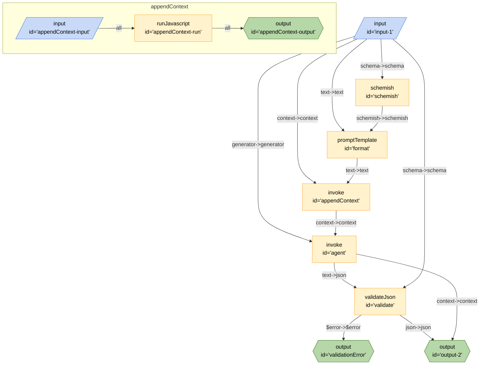

## json-agent.ts

```mermaid
%%{init: 'themeVariables': { 'fontFamily': 'Fira Code, monospace' }}%%
graph TD;
validate["validateJson <br> id='validate'"] -- "$error->$error" --> validationError{{"output <br> id='validationError'"}}:::output
validate["validateJson <br> id='validate'"] -- "json->json" --> output2{{"output <br> id='output-2'"}}:::output
agent["invoke <br> id='agent'"] -- "text->json" --> validate["validateJson <br> id='validate'"]
agent["invoke <br> id='agent'"] -- "context->context" --> output2{{"output <br> id='output-2'"}}:::output
input1[/"input <br> id='input-1'"/]:::input -- "schema->schema" --> schemish["schemish <br> id='schemish'"]
input1[/"input <br> id='input-1'"/]:::input -- "text->text" --> format["promptTemplate <br> id='format'"]
input1[/"input <br> id='input-1'"/]:::input -- "context->context" --> appendContext["invoke <br> id='appendContext'"]
input1[/"input <br> id='input-1'"/]:::input -- "generator->generator" --> agent["invoke <br> id='agent'"]
input1[/"input <br> id='input-1'"/]:::input -- "schema->schema" --> validate["validateJson <br> id='validate'"]
appendContext["invoke <br> id='appendContext'"] -- "context->context" --> agent["invoke <br> id='agent'"]
schemish["schemish <br> id='schemish'"] -- "schemish->schemish" --> format["promptTemplate <br> id='format'"]
format["promptTemplate <br> id='format'"] -- "text->text" --> appendContext["invoke <br> id='appendContext'"]

subgraph sg_appendContext [appendContext]
appendContext_appendContextinput[/"input <br> id='appendContext-input'"/]:::input -- all --> appendContext_appendContextrun["runJavascript <br> id='appendContext-run'"]
appendContext_appendContextrun["runJavascript <br> id='appendContext-run'"] -- all --> appendContext_appendContextoutput{{"output <br> id='appendContext-output'"}}:::output
end

classDef default stroke:#ffab40,fill:#fff2ccff,color:#000
classDef input stroke:#3c78d8,fill:#c9daf8ff,color:#000
classDef output stroke:#38761d,fill:#b6d7a8ff,color:#000
classDef passthrough stroke:#a64d79,fill:#ead1dcff,color:#000
classDef slot stroke:#a64d79,fill:#ead1dcff,color:#000
classDef config stroke:#a64d79,fill:#ead1dcff,color:#000
classDef secrets stroke:#db4437,fill:#f4cccc,color:#000
classDef slotted stroke:#a64d79
```