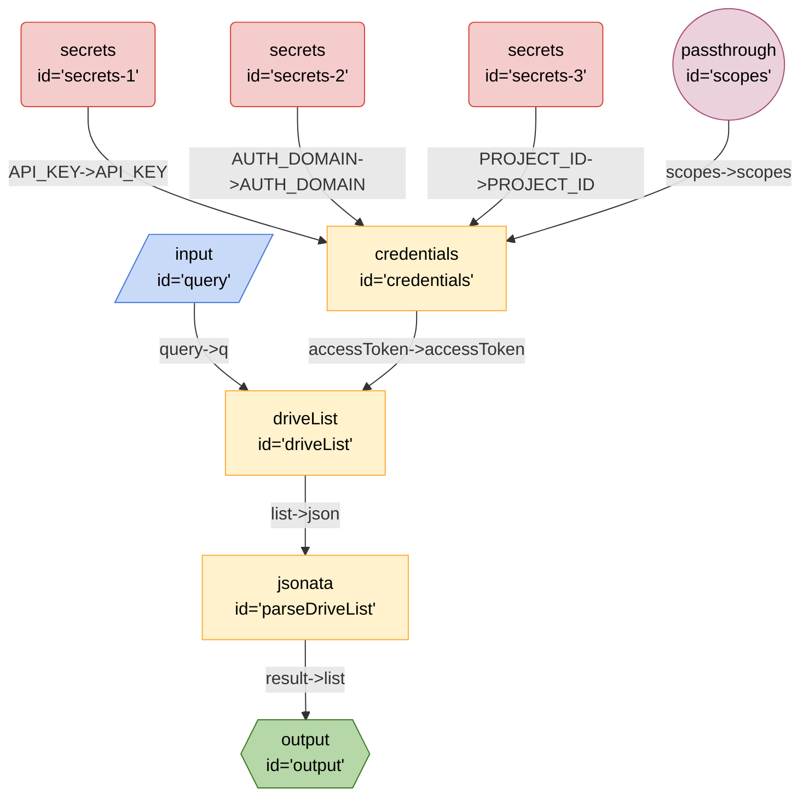

## list-files.ts

```mermaid
%%{init: 'themeVariables': { 'fontFamily': 'Fira Code, monospace' }}%%
graph TD;
secrets1("secrets <br> id='secrets-1'"):::secrets -- "API_KEY->API_KEY" --> credentials["credentials <br> id='credentials'"]
secrets2("secrets <br> id='secrets-2'"):::secrets -- "AUTH_DOMAIN->AUTH_DOMAIN" --> credentials["credentials <br> id='credentials'"]
secrets3("secrets <br> id='secrets-3'"):::secrets -- "PROJECT_ID->PROJECT_ID" --> credentials["credentials <br> id='credentials'"]
scopes(("passthrough <br> id='scopes'")):::passthrough -- "scopes->scopes" --> credentials["credentials <br> id='credentials'"]
query[/"input <br> id='query'"/]:::input -- "query->q" --> driveList["driveList <br> id='driveList'"]
parseDriveList["jsonata <br> id='parseDriveList'"] -- "result->list" --> output{{"output <br> id='output'"}}:::output
driveList["driveList <br> id='driveList'"] -- "list->json" --> parseDriveList["jsonata <br> id='parseDriveList'"]
credentials["credentials <br> id='credentials'"] -- "accessToken->accessToken" --> driveList["driveList <br> id='driveList'"]
classDef default stroke:#ffab40,fill:#fff2ccff,color:#000
classDef input stroke:#3c78d8,fill:#c9daf8ff,color:#000
classDef output stroke:#38761d,fill:#b6d7a8ff,color:#000
classDef passthrough stroke:#a64d79,fill:#ead1dcff,color:#000
classDef slot stroke:#a64d79,fill:#ead1dcff,color:#000
classDef config stroke:#a64d79,fill:#ead1dcff,color:#000
classDef secrets stroke:#db4437,fill:#f4cccc,color:#000
classDef slotted stroke:#a64d79
```