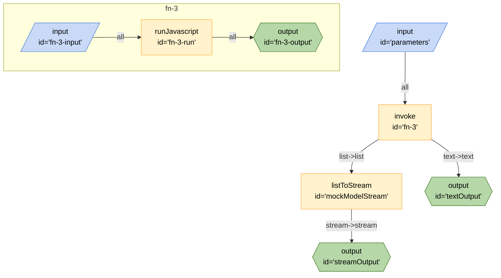

## mock-text-generator.ts

```mermaid
%%{init: 'themeVariables': { 'fontFamily': 'Fira Code, monospace' }}%%
graph TD;
fn3["invoke <br> id='fn-3'"] -- "list->list" --> mockModelStream["listToStream <br> id='mockModelStream'"]
fn3["invoke <br> id='fn-3'"] -- "text->text" --> textOutput{{"output <br> id='textOutput'"}}:::output
parameters[/"input <br> id='parameters'"/]:::input -- all --> fn3["invoke <br> id='fn-3'"]
mockModelStream["listToStream <br> id='mockModelStream'"] -- "stream->stream" --> streamOutput{{"output <br> id='streamOutput'"}}:::output

subgraph sg_fn3 [fn-3]
fn3_fn3input[/"input <br> id='fn-3-input'"/]:::input -- all --> fn3_fn3run["runJavascript <br> id='fn-3-run'"]
fn3_fn3run["runJavascript <br> id='fn-3-run'"] -- all --> fn3_fn3output{{"output <br> id='fn-3-output'"}}:::output
end

classDef default stroke:#ffab40,fill:#fff2ccff,color:#000
classDef input stroke:#3c78d8,fill:#c9daf8ff,color:#000
classDef output stroke:#38761d,fill:#b6d7a8ff,color:#000
classDef passthrough stroke:#a64d79,fill:#ead1dcff,color:#000
classDef slot stroke:#a64d79,fill:#ead1dcff,color:#000
classDef config stroke:#a64d79,fill:#ead1dcff,color:#000
classDef secrets stroke:#db4437,fill:#f4cccc,color:#000
classDef slotted stroke:#a64d79
```