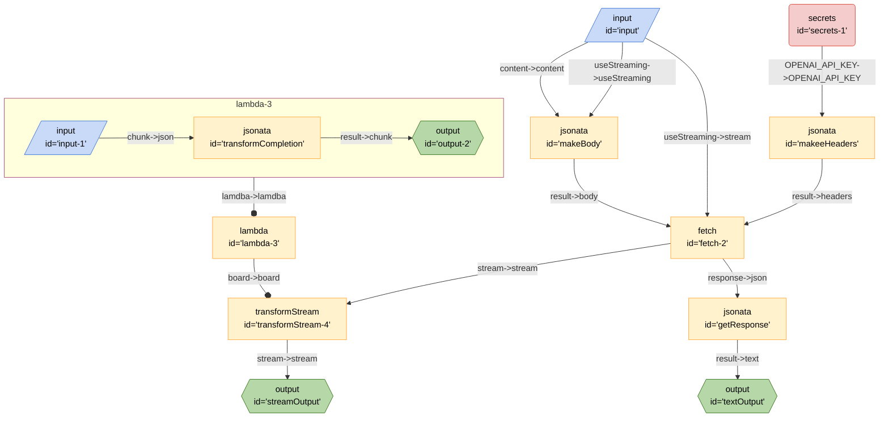

## openai-gpt-4-vision.ts

```mermaid
%%{init: 'themeVariables': { 'fontFamily': 'Fira Code, monospace' }}%%
graph TD;
secrets1("secrets <br> id='secrets-1'"):::secrets -- "OPENAI_API_KEY->OPENAI_API_KEY" --> makeeHeaders["jsonata <br> id='makeeHeaders'"]
input[/"input <br> id='input'"/]:::input -- "useStreaming->stream" --> fetch2["fetch <br> id='fetch-2'"]
makeeHeaders["jsonata <br> id='makeeHeaders'"] -- "result->headers" --> fetch2["fetch <br> id='fetch-2'"]
lambda3["lambda <br> id='lambda-3'"] -- "board->board" --o transformStream4["transformStream <br> id='transformStream-4'"]
subgraph sg_lambda3 [lambda-3]
lambda3_transformCompletion["jsonata <br> id='transformCompletion'"] -- "result->chunk" --> lambda3_output2{{"output <br> id='output-2'"}}:::output
lambda3_input1[/"input <br> id='input-1'"/]:::input -- "chunk->json" --> lambda3_transformCompletion["jsonata <br> id='transformCompletion'"]
end
sg_lambda3:::slotted -- "lamdba->lamdba" --o lambda3

input[/"input <br> id='input'"/]:::input -- "useStreaming->useStreaming" --> makeBody["jsonata <br> id='makeBody'"]
getResponse["jsonata <br> id='getResponse'"] -- "result->text" --> textOutput{{"output <br> id='textOutput'"}}:::output
fetch2["fetch <br> id='fetch-2'"] -- "response->json" --> getResponse["jsonata <br> id='getResponse'"]
transformStream4["transformStream <br> id='transformStream-4'"] -- "stream->stream" --> streamOutput{{"output <br> id='streamOutput'"}}:::output
fetch2["fetch <br> id='fetch-2'"] -- "stream->stream" --> transformStream4["transformStream <br> id='transformStream-4'"]
makeBody["jsonata <br> id='makeBody'"] -- "result->body" --> fetch2["fetch <br> id='fetch-2'"]
input[/"input <br> id='input'"/]:::input -- "content->content" --> makeBody["jsonata <br> id='makeBody'"]
classDef default stroke:#ffab40,fill:#fff2ccff,color:#000
classDef input stroke:#3c78d8,fill:#c9daf8ff,color:#000
classDef output stroke:#38761d,fill:#b6d7a8ff,color:#000
classDef passthrough stroke:#a64d79,fill:#ead1dcff,color:#000
classDef slot stroke:#a64d79,fill:#ead1dcff,color:#000
classDef config stroke:#a64d79,fill:#ead1dcff,color:#000
classDef secrets stroke:#db4437,fill:#f4cccc,color:#000
classDef slotted stroke:#a64d79
```