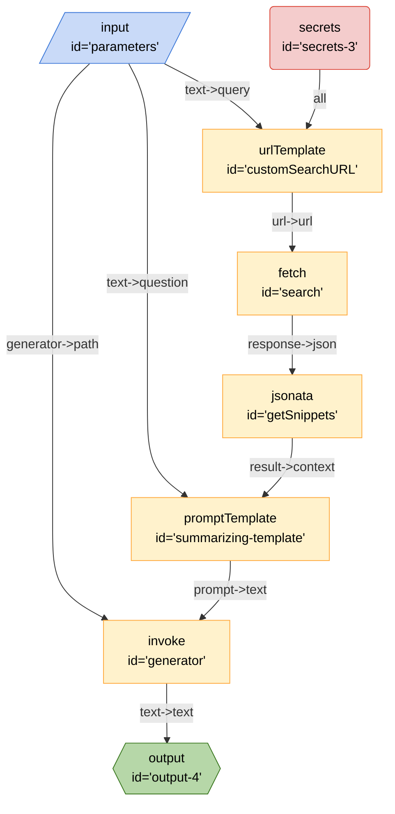

## search-summarize.ts

```mermaid
%%{init: 'themeVariables': { 'fontFamily': 'Fira Code, monospace' }}%%
graph TD;
generator["invoke <br> id='generator'"] -- "text->text" --> output4{{"output <br> id='output-4'"}}:::output
parameters[/"input <br> id='parameters'"/]:::input -- "text->query" --> customSearchURL["urlTemplate <br> id='customSearchURL'"]
parameters[/"input <br> id='parameters'"/]:::input -- "text->question" --> summarizingtemplate["promptTemplate <br> id='summarizing-template'"]
parameters[/"input <br> id='parameters'"/]:::input -- "generator->path" --> generator["invoke <br> id='generator'"]
summarizingtemplate["promptTemplate <br> id='summarizing-template'"] -- "prompt->text" --> generator["invoke <br> id='generator'"]
customSearchURL["urlTemplate <br> id='customSearchURL'"] -- "url->url" --> search["fetch <br> id='search'"]
getSnippets["jsonata <br> id='getSnippets'"] -- "result->context" --> summarizingtemplate["promptTemplate <br> id='summarizing-template'"]
secrets3("secrets <br> id='secrets-3'"):::secrets -- all --> customSearchURL["urlTemplate <br> id='customSearchURL'"]
search["fetch <br> id='search'"] -- "response->json" --> getSnippets["jsonata <br> id='getSnippets'"]
classDef default stroke:#ffab40,fill:#fff2ccff,color:#000
classDef input stroke:#3c78d8,fill:#c9daf8ff,color:#000
classDef output stroke:#38761d,fill:#b6d7a8ff,color:#000
classDef passthrough stroke:#a64d79,fill:#ead1dcff,color:#000
classDef slot stroke:#a64d79,fill:#ead1dcff,color:#000
classDef config stroke:#a64d79,fill:#ead1dcff,color:#000
classDef secrets stroke:#db4437,fill:#f4cccc,color:#000
classDef slotted stroke:#a64d79
```