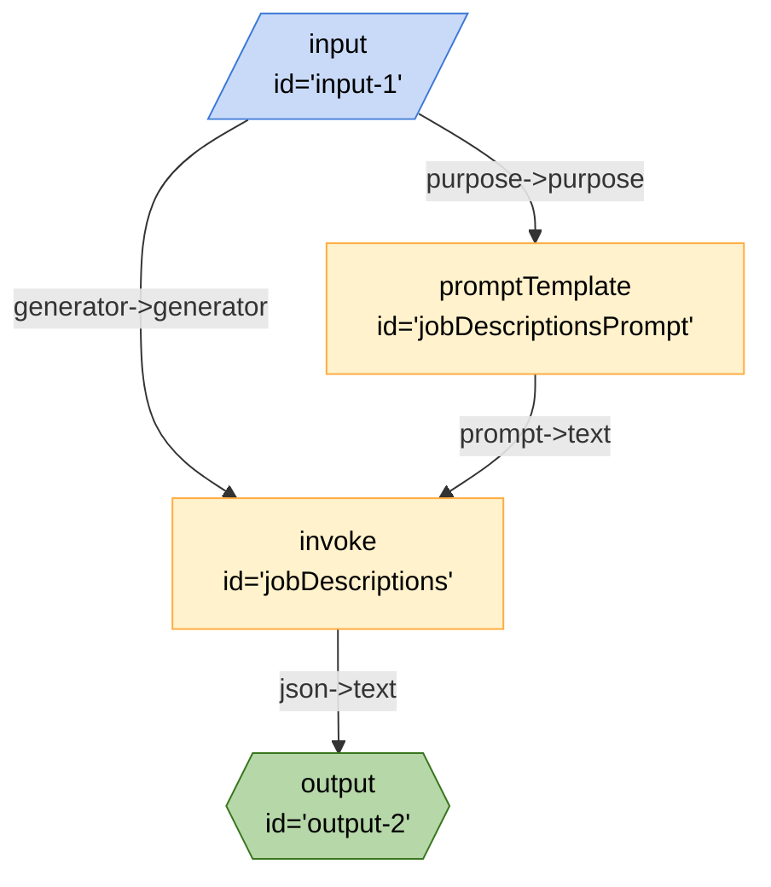

## team-builder.ts

```mermaid
%%{init: 'themeVariables': { 'fontFamily': 'Fira Code, monospace' }}%%
graph TD;
jobDescriptions["invoke <br> id='jobDescriptions'"] -- "json->text" --> output2{{"output <br> id='output-2'"}}:::output
input1[/"input <br> id='input-1'"/]:::input -- "purpose->purpose" --> jobDescriptionsPrompt["promptTemplate <br> id='jobDescriptionsPrompt'"]
input1[/"input <br> id='input-1'"/]:::input -- "generator->generator" --> jobDescriptions["invoke <br> id='jobDescriptions'"]
jobDescriptionsPrompt["promptTemplate <br> id='jobDescriptionsPrompt'"] -- "prompt->text" --> jobDescriptions["invoke <br> id='jobDescriptions'"]
classDef default stroke:#ffab40,fill:#fff2ccff,color:#000
classDef input stroke:#3c78d8,fill:#c9daf8ff,color:#000
classDef output stroke:#38761d,fill:#b6d7a8ff,color:#000
classDef passthrough stroke:#a64d79,fill:#ead1dcff,color:#000
classDef slot stroke:#a64d79,fill:#ead1dcff,color:#000
classDef config stroke:#a64d79,fill:#ead1dcff,color:#000
classDef secrets stroke:#db4437,fill:#f4cccc,color:#000
classDef slotted stroke:#a64d79
```