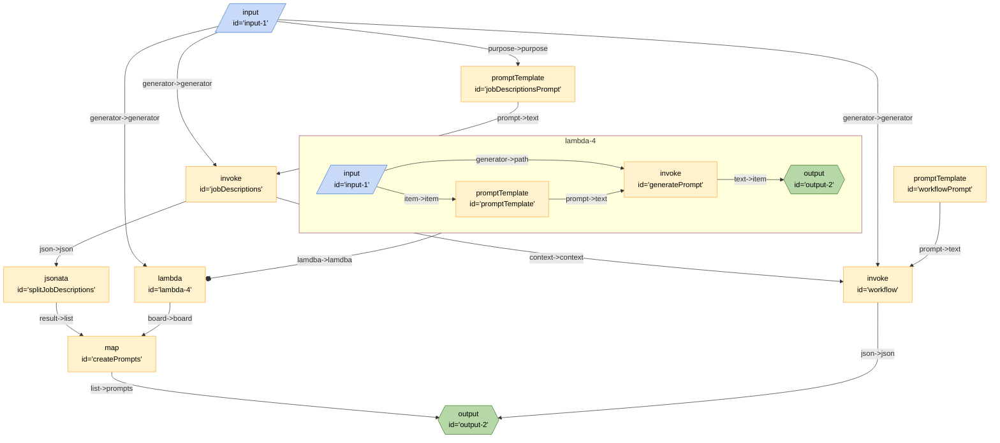

## team-builder.ts

```mermaid
%%{init: 'themeVariables': { 'fontFamily': 'Fira Code, monospace' }}%%
graph TD;
createPrompts["map <br> id='createPrompts'"] -- "list->prompts" --> output2{{"output <br> id='output-2'"}}:::output
workflow["invoke <br> id='workflow'"] -- "json->json" --> output2{{"output <br> id='output-2'"}}:::output
splitJobDescriptions["jsonata <br> id='splitJobDescriptions'"] -- "result->list" --> createPrompts["map <br> id='createPrompts'"]
lambda4["lambda <br> id='lambda-4'"] -- "board->board" --> createPrompts["map <br> id='createPrompts'"]
subgraph sg_lambda4 [lambda-4]
lambda4_generatePrompt["invoke <br> id='generatePrompt'"] -- "text->item" --> lambda4_output2{{"output <br> id='output-2'"}}:::output
lambda4_input1[/"input <br> id='input-1'"/]:::input -- "item->item" --> lambda4_promptTemplate["promptTemplate <br> id='promptTemplate'"]
lambda4_input1[/"input <br> id='input-1'"/]:::input -- "generator->path" --> lambda4_generatePrompt["invoke <br> id='generatePrompt'"]
lambda4_promptTemplate["promptTemplate <br> id='promptTemplate'"] -- "prompt->text" --> lambda4_generatePrompt["invoke <br> id='generatePrompt'"]
end
sg_lambda4:::slotted -- "lamdba->lamdba" --o lambda4

jobDescriptions["invoke <br> id='jobDescriptions'"] -- "context->context" --> workflow["invoke <br> id='workflow'"]
jobDescriptions["invoke <br> id='jobDescriptions'"] -- "json->json" --> splitJobDescriptions["jsonata <br> id='splitJobDescriptions'"]
input1[/"input <br> id='input-1'"/]:::input -- "purpose->purpose" --> jobDescriptionsPrompt["promptTemplate <br> id='jobDescriptionsPrompt'"]
input1[/"input <br> id='input-1'"/]:::input -- "generator->generator" --> jobDescriptions["invoke <br> id='jobDescriptions'"]
input1[/"input <br> id='input-1'"/]:::input -- "generator->generator" --> workflow["invoke <br> id='workflow'"]
input1[/"input <br> id='input-1'"/]:::input -- "generator->generator" --> lambda4["lambda <br> id='lambda-4'"]
workflowPrompt["promptTemplate <br> id='workflowPrompt'"] -- "prompt->text" --> workflow["invoke <br> id='workflow'"]
jobDescriptionsPrompt["promptTemplate <br> id='jobDescriptionsPrompt'"] -- "prompt->text" --> jobDescriptions["invoke <br> id='jobDescriptions'"]
classDef default stroke:#ffab40,fill:#fff2ccff,color:#000
classDef input stroke:#3c78d8,fill:#c9daf8ff,color:#000
classDef output stroke:#38761d,fill:#b6d7a8ff,color:#000
classDef passthrough stroke:#a64d79,fill:#ead1dcff,color:#000
classDef slot stroke:#a64d79,fill:#ead1dcff,color:#000
classDef config stroke:#a64d79,fill:#ead1dcff,color:#000
classDef secrets stroke:#db4437,fill:#f4cccc,color:#000
classDef slotted stroke:#a64d79
```