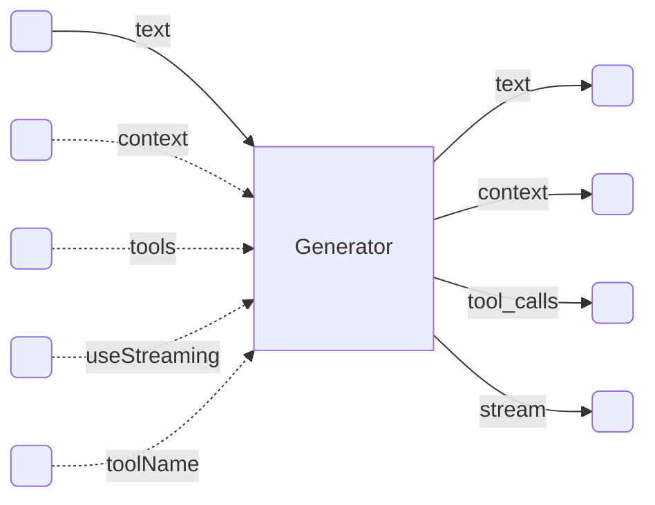

# Notes on Recipes

It looks like recipes (nee boards) need some way to express their interface.

One area where this is fairly self-evident is the genrator recipes. A generator recipe encapsulates an LLM invocation. There's one for GPT 3.5 Turbo, one for GPT 4 Vision, a mock one, and even the omnibus one that asks you to select a model from a variety of choices.

Generator recipes are typcially passed as parameters to other recipes, so that the choices of the LLM and the specifics of invoking it can be made at the time of the call, rather than at the time of the recipe definition.

The key quality of a generator recipe is that it needs to work interchangeably with other generator recipes. Put differently, I should be able to switch models.

This brings us to the idea that all generator recipes should have the same interface.

Which in itself is a new thing for Breadboard, since we haven't considered the concept of the interfaces yet.

## The Generator Interface

Any switchable generator recipe needs to be able to handle this configuration of inputs and outputs:

Inputs:

- `text` -- the text on which to base the generation (commonly called 'prompt'). This is the only required input.
- `context` -- the context on which to base the generation. the context is an array of previous messages in the conversation. By default, it's an empty array.
- `tools` -- the tools to use in the generation. It's an array of structured objects that describe each tool that could be used in the generation. Also an empty array by default.
- `useStreaming` -- a boolean that indicates whether the generatr should stream its output or not. By default, it's false.
- `toolName` -- the name of the tool that was used. When this value is set, the generator will treat the `text` input as the tool result.

Outputs:

- `text` -- the generated text, a result of running the generator. This output only has a value if `useStreaming` is false and the generator did not produce a tool call.
- `context` -- the context of the conversation, with the results of the generation appended to it.
- `tool_calls` -- an array of structured objects that express the tool calls that were made during the generation. This output only has value when `tools` is not empty and the generator produced a tool call.
- `stream` -- a stream of the generated text, if `useStreaming` was set to true.

A generator may also take in other properties, but they are not part of the generator interface and will vary from generator to generator. We could also grow the interface to include some of these properties. For example, the `temperature` property might be a useful addition, since it's a common property of all generators.
