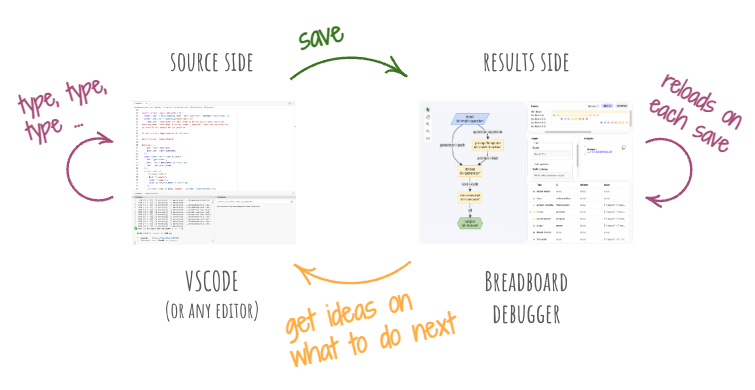

# Breadboard Developer Happy Path

If you're eager to start making boards with Breadboard as quickly as possible, here's a yellow brick road that will take you there. It's not quite a tutorial, but more like a step-by-step onboarding guide with the best practices baked in.

## Getting started

There are two ways to get started with Breadboard: fork a Replit project or install Breadboard locally.

### Fork a Replit project

Go to Breadboard Replit Project (TOOD: URL) and click "Fork". This will create roughly the setup that you'll have if you install Breadboard locally.

### Install locally

1. Install [Node.js >=v19](https://nodejs.org/en). If you already have an earlier version of Node installed, you can use [nvm](https://github.com/nvm-sh/nvm) to get to the version that Breadboard needs.

2. Run `npm init @google-labs/breadboard` to set up the project. (TODO: make sure this works)

This will create a simple starter project that contains most of the bits you need to build AI recipes.

### Set up the developer environment

To start developing, run:

```bash
npm run dev
```

This will start the Breadboard debugger and give you a link to open it in the browser.

Breadboard relies on the "hot reload" developer experience pattern to make it easy to iterate and learn-by-playing. You are going to have the best experience with "hot reload" when you use position your editor window side-by-side with the Breadboard debugger window:



When you save your board file in the editor, the debugger will automatically reload and let you interact with the board.

Once you have both windows situated side-by-side, we are ready to start building.

## Building a board

Every board has a bit of a boilerplate, and your starter project contains a blank board that's basically just boilerplate. Let's start with that.

Open `src/boards/blank.ts` in your editor window and navigate to the "Blank" board in the debugger.

The blank board will look something like this:

```ts
import { recipe } from "@google-labs/breadboard";

export default await recipe(({ text }) => {
  return { text };
}).serialize({
  title: "Blank board",
  description: "A blank board. Use it to start a new board",
  version: "0.0.1",
});
```

### What's going on here?

It might be worth going over this code to orient ourselves a little bit:

- the `recipe` function is how we create a new board. It takes a function as an argument. This is where we describe the board -- let's call it a "board function".

- The board function takes a single argument (let's call it "inputs") and returns a single argument ("outputs"). These arguments are objects that describe the inputs and outputs of the board.

- Both input and output are of the same shape: they are property bags that contain named properties. For example, the blank board has a single input called `text` and a single output called `text` -- and that input is passed through to the output.

- The `serialize` function is then called on the result of the `recipe`. This serializes the board into Breadboard Graph Language (BGL), which is the common format that Breadboard uses to represent boards.

- The `serialize` function also takes as an argument an object that describes the board. This is where we can set the title, description, and version of the board. Since we'll be (here's hoping!) making many boards in the future, it's a good practice to give meaningful values to these properties.

Behind the scenes, debugger scans for all the files in `src/boards`, looks for the `default` export in each file, serializes it as BGL, and renders the BGL in the debugger. This is why we see the "Blank" board in the debugger window.

In the debugger window, we can see that the board asks for the `text` input. If we enter something there, and hit "Run", we'll see that what we entered gets passed through to the output.

> [!TIP]
> This "bags of named inputs and outputs" pattern is very common in Breadboard. Within a board, passing data means connecting named properties from outputs to the properties in inputs.

### Play with inputs and outputs

To get a better sense of how debugger and code editor interact, let's play with the board a little bit to get a feel for it.

Let's add another input to the board by appending a property named `number` to the `inputs` object:

```diff
- export default await recipe(({ text }) => {
+ export default await recipe(({ text, number }) => {
```

When we save the file, we'll see that the debugger automatically reloads... yet there's no `number` input in the debugger. What gives?

The reason is that this input, though it exists in the code, is not connected to anything. As a result, it gets optimized out during the serialization.

Let's connect it to the output by appending a property named `number` to the `outputs` object:

```diff
- return { text };
+ return { text, number };
```

Now, saving the file pops up a new input field! And when we enter the values, the result appears in the output. Wahoo!

Please treat the immediacy of "hot reload" in the debugger as an invitation to play and experiment with the board. Change things, see what happens. It's easy to hit "undo" in the editor and get back to the previous state.

Let's try one more thing: give the inputs and outputs nice names and descriptions. We can do that by adding a `title` and `description` property to each input and output:

```diff
export default await recipe(({ text, number }) => {
+ text.title("Text").description("A description of the text");
+ number.title("Number").description("A description of the number");
```

When we save the file, we'll see that the debugger now shows our titles and descriptions for the input fields.

We can do the same thing with the outputs:

```diff
+ text.title("Text Output");
+ number.title("Number Output");
return { text, number };
```

A handy trick is to use the `examples` method to provide an example value for the input. This is especially useful for quick debugging of boards, since it fills in the input fields. No need to type, just hit "run".

```diff
- text.title("Text").description("A description of the text");
+ text.title("Text").description("A description of the text").examples("Hello, world!");
```

> [!TIP]
> The `title`, `description`, and `example` methods are just a few ways to describe inputs and outputs. We'll see more of them later. The thing to know now is that when serialized to BGL, these descriptions are preserved as [JSON Schema](https://json-schema.org/).

TODO: Show how to describe outputs using this pattern (adapt examples to the flow of this guide):

```ts
// declare inputs in the recipe function
export default await recipe(({ text, generator, context, stopSequences }) => {
  // describe inputs like so:
  text.title("Text").examples(`example goes here`).format("multiline");
  generator.title("Generator").examples("gemini-generator.json");
  context.title("Context").isArray().examples("[]");
  stopSequences.title("Stop Sequences").isArray().optional().default("[]");
  // rest of the board goes here
  // ...
```

TODO: Show how to describe outputs using this pattern:

```ts
// ...
// at the end of the board, describe outputs ...
result
  .title("Context")
  .isObject()
  .description("Agent context after generation");
output.title("Output").isString().description("Agent's output");

// ... and return them
return { result, output };
```

TODO: Throughout this chapter, show how input and output descriptions are reflected in the debugger.

### Make it do something useful

TODO: Introduce the `code` function. Lead with that, rather than nodes. Make a simple board that uses `code` to generate a random number or reverse a string.

Use [code as nodes](https://github.com/breadboard-ai/breadboard/blob/main/packages/breadboard/docs/grammar/4-code-as-nodes.md) to build out this chapter.

At the end of this chapter, we should have a running board that reverses a string.

Victory dance.

### Use kits

TODO: Introduce kits. Show how to import a kit and use it in a board.

TODO: Introduce the concept of a node as a thing that's part of a kit.

Use [nodes and recipes](https://github.com/breadboard-ai/breadboard/blob/main/packages/breadboard/docs/grammar/2-nodes-and-recipes.md) to build out this chapter.

TODO: Brief overview of useful kits and nodes:

- `core` kit
  - `invoke` node
  - `map` node
  - `fetch` node
  - `secrets` node
- `starter` kit
  - `promptTemplate` node
  - `urlTemplate` node
- `json` kit
  - `schemish` node
  - `validateJson` node
  - `jsonata` node
  - `xmlToJson` node

TODO: Guide the reader to build a board that uses promptTemplate to embed reversed string into a template.

Important pattern: treat inputs and outputs as property bags.
Explain destructuring and spread of properties.

```ts
// ...

const { prompt } = starter.promptTemplate({
  template: "Hello, {{name}}!",
  name: reversed,
});
```

TODO: Encourage using `$id` that describes the purpose of the node.

### Reuse boards

TODO: Use `gemini` board that is included (TODO: gemini board is added automatically to the initial setup) in the recipe.

## Remix boards

TODO: Copy a board in the workspace and see how it immediately appears in the debugger. Make changes to it, then invoke it from the other board.

## Publish boards

TODO: Publish a board JSON to a gist and use it in another board.
Discussion of versioning, all the standard release practices, etc.
