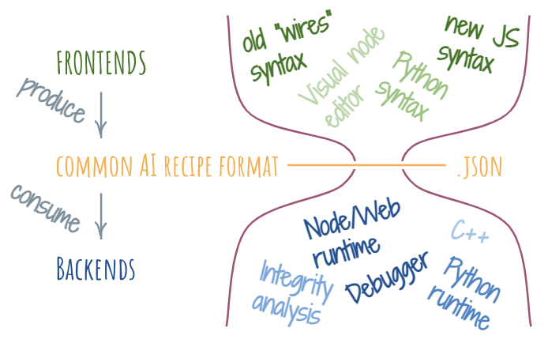

# Breadboard Hourglass Model

The layering in the Breadboard project is organized around the concept of an hourglass: lots of producers at the top layers, single protocol in the middle (the waist), and lots of consumers at the bottom layers.

The items in top layers are called the "frontends", to borrow from [compiler lingo](https://en.wikipedia.org/wiki/Compiler#Front_end). The waist is represented by the common format that connects top and bottom layers. Items in the bottom layers are called the "backends".

## The frontends

Because they all output to the same common format, there can be a great variety of frontends. For example, we currently have two different syntaxes for writing AI boards in TypeScript and JavaScript. One can imagine a designer tool that allows creating AI boards visually, or a Python frontend that allows writing AI boards in Python.

Nothing stops someone from building a Python or Go or Kotlin or any other kind of frontend. As long as it generates the common format as its output, it’s part of the Breadboard hourglass stack.

## The common format

At the waist of the hourglass, there's a common format that we use to represent any AI board. It's a JSON object whose structure is defined by the [GraphDescriptor](https://github.com/breadboard-ai/breadboard/blob/fba76cfcdf90699bb81c41f0136aedce14e1ee1d/packages/breadboard/src/types.ts) type. Very loosely, it contains the metadata for the board (title, description, etc.) a list of nodes that make up the board, and a list of edges that connect the nodes together. The name `GraphDescriptor` hints at the fact that the common format is a representation of a directed graph, with nodes as vertices. In Breadboard, this graph can contain cycles, so it's not a [DAG](https://en.wikipedia.org/wiki/Directed_acyclic_graph), but rather a DGC (Directed Graph with Cycles).

## The backends

The backends, are typically runtimes: they take the board, expressed in the common format and run it. At this moment, there’s a Javascript runtime that runs in both Node and Web environments. We hope that the number of runtimes expands. For instance, wouldn’t it be cool to load a Breadboard board within a colab? Or maybe run it in C++? Breadboard strives for all of these options to be feasible.

Runtimes aren’t the only kinds of backends. For instance, there may be an analysis backend, which studies the topography of the board and makes some judgments about its integrity or other kinds of properties. What sorts of inputs does this board take? What are its outputs? What are the runtime characteristics of this board?

## Mixing and matching

Because the backends and frontends are separated from each other by the common protocol,
we can mix and match them in Breadboard. For example, we can write a board in Python and debug it in the browser with JavaScript runtime. Or we could write a board in JavaScript and run it in a C++ runtime. The possibilities are only limited by the number of combinations of frontends and backends.

## The hourglass principle

Sometimes, it can be difficult to separate out the frontend and the backend. For example,
imagine a visual designer that allows you to edit, debug, and run the graph. Where do frontends begin and end there?

Or as another example, we could easily just stitch nodes together and run them in JavaScript, without ever having to serialize the logic into the common format. In this case, the backend and the frontend become impossible to separate.

Sometimes this is the right solution, but to ensure that the hourglass model retains its power of flexibility, we should apply the "hourglass principle": prefer and encourage separation of the backend and the frontend in both UX and developer experience. Ideally, frontends only produce the common format, and backends only consume it.
