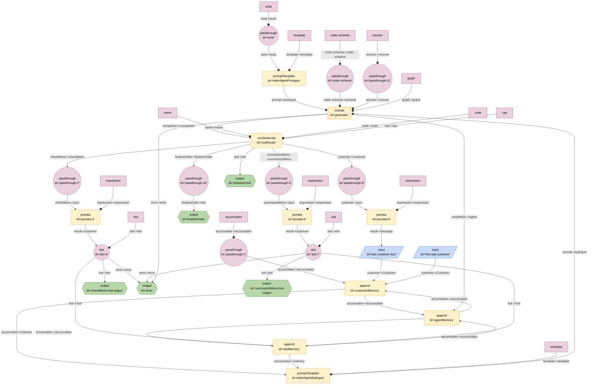

# Coffee Bot graph for order-agent.json

```mermaid
%%{init: 'themeVariables': { 'fontFamily': 'Fira Code, monospace' }}%%
graph TD;
tools(("passthrough <br> id='tools'")):::passthrough -- "tools->tools" --o orderAgentPrologue["promptTemplate <br> id='orderAgentPrologue'"]
passthrough1(("passthrough <br> id='passthrough-1'")):::passthrough -- "accumulator->accumulator" --> customerMemory["append <br> id='customerMemory'"]
customerMemory["append <br> id='customerMemory'"] -- "accumulator->accumulator" --> agentMemory["append <br> id='agentMemory'"]
agentMemory["append <br> id='agentMemory'"] -- "accumulator->accumulator" --> toolMemory["append <br> id='toolMemory'"]
agentMemory["append <br> id='agentMemory'"] -- "accumulator->accumulator" --> customerMemory["append <br> id='customerMemory'"]
toolMemory["append <br> id='toolMemory'"] -- "accumulator->accumulator" --> agentMemory["append <br> id='agentMemory'"]
customerMemory["append <br> id='customerMemory'"] -- "accumulator->memory" --> orderAgentEpilogue["promptTemplate <br> id='orderAgentEpilogue'"]
toolMemory["append <br> id='toolMemory'"] -- "accumulator->memory" --> orderAgentEpilogue["promptTemplate <br> id='orderAgentEpilogue'"]
slot4(("slot <br> id='slot-4'")):::slot -- "bot->Tool" --> toolMemory["append <br> id='toolMemory'"]
slot4(("slot <br> id='slot-4'")):::slot -- "bot->bot" --> checkMenutooloutput{{"output <br> id='checkMenu-tool-output'"}}:::output
slot4(("slot <br> id='slot-4'")):::slot -- "error->error" --> error{{"output <br> id='error'"}}:::output
jsonata3["jsonata <br> id='jsonata-3'"] -- "result->customer" --> slot4(("slot <br> id='slot-4'")):::slot
passthrough2(("passthrough <br> id='passthrough-2'")):::passthrough -- "checkMenu->json" --> jsonata3["jsonata <br> id='jsonata-3'"]
slot7(("slot <br> id='slot-7'")):::slot -- "bot->Tool" --> toolMemory["append <br> id='toolMemory'"]
slot7(("slot <br> id='slot-7'")):::slot -- "bot->bot" --> summarizeMenutooloutput{{"output <br> id='summarizeMenu-tool-output'"}}:::output
slot7(("slot <br> id='slot-7'")):::slot -- "error->error" --> error{{"output <br> id='error'"}}:::output
jsonata6["jsonata <br> id='jsonata-6'"] -- "result->customer" --> slot7(("slot <br> id='slot-7'")):::slot
passthrough5(("passthrough <br> id='passthrough-5'")):::passthrough -- "summarizeMenu->json" --> jsonata6["jsonata <br> id='jsonata-6'"]
askcustomertool[/"input <br> id='ask-customer-tool'"/]:::input -- "customer->Customer" --> customerMemory["append <br> id='customerMemory'"]
jsonata9["jsonata <br> id='jsonata-9'"] -- "result->message" --> askcustomertool[/"input <br> id='ask-customer-tool'"/]:::input
passthrough8(("passthrough <br> id='passthrough-8'")):::passthrough -- "customer->json" --> jsonata9["jsonata <br> id='jsonata-9'"]
passthrough10(("passthrough <br> id='passthrough-10'")):::passthrough -- "finalizeOrder->bot" --> finalizeOrder{{"output <br> id='finalizeOrder'"}}:::output
toolRouter["runJavascript <br> id='toolRouter'"] -- "tool->bot" --> selectedtool{{"output <br> id='selected-tool'"}}:::output
toolRouter["runJavascript <br> id='toolRouter'"] -- "customer->customer" --> passthrough8(("passthrough <br> id='passthrough-8'")):::passthrough
toolRouter["runJavascript <br> id='toolRouter'"] -- "checkMenu->checkMenu" --> passthrough2(("passthrough <br> id='passthrough-2'")):::passthrough
toolRouter["runJavascript <br> id='toolRouter'"] -- "summarizeMenu->summarizeMenu" --> passthrough5(("passthrough <br> id='passthrough-5'")):::passthrough
toolRouter["runJavascript <br> id='toolRouter'"] -- "finalizeOrder->finalizeOrder" --> passthrough10(("passthrough <br> id='passthrough-10'")):::passthrough
firstaskcustomer[/"input <br> id='first-ask-customer'"/]:::input -- "customer->Customer" --> customerMemory["append <br> id='customerMemory'"]
orderAgentPrologue["promptTemplate <br> id='orderAgentPrologue'"] -- "prompt->prologue" --o generator[["include <br> id='generator'"]]:::include
orderAgentEpilogue["promptTemplate <br> id='orderAgentEpilogue'"] -- "prompt->epilogue" --o generator[["include <br> id='generator'"]]:::include
orderschema(("passthrough <br> id='order-schema'")):::passthrough -- "order-schema->schema" --o generator[["include <br> id='generator'"]]:::include
passthrough11(("passthrough <br> id='passthrough-11'")):::passthrough -- "recover->recover" --o generator[["include <br> id='generator'"]]:::include
generator[["include <br> id='generator'"]]:::include -- "completion->completion" --> toolRouter["runJavascript <br> id='toolRouter'"]
generator[["include <br> id='generator'"]]:::include -- "completion->Agent" --> agentMemory["append <br> id='agentMemory'"]
generator[["include <br> id='generator'"]]:::include -- "error->error" --> error{{"output <br> id='error'"}}:::output
templateorderAgentPrologue[template]:::config -- "template->template" --o orderAgentPrologue
toolstools[tools]:::config -- "tools->tools" --o tools
orderschemaorderschema[order-schema]:::config -- "order-schema->order-schema" --o orderschema
templateorderAgentEpilogue[template]:::config -- "template->template" --o orderAgentEpilogue
accumulatorpassthrough1[accumulator]:::config -- "accumulator->accumulator" --o passthrough1
expressionjsonata3[expression]:::config -- "expression->expression" --o jsonata3
slotslot4[slot]:::config -- "slot->slot" --o slot4
expressionjsonata6[expression]:::config -- "expression->expression" --o jsonata6
slotslot7[slot]:::config -- "slot->slot" --o slot7
expressionjsonata9[expression]:::config -- "expression->expression" --o jsonata9
nametoolRouter[name]:::config -- "name->name" --o toolRouter
codetoolRouter[code]:::config -- "code->code" --o toolRouter
rawtoolRouter[raw]:::config -- "raw->raw" --o toolRouter
graphgenerator[graph]:::config -- "graph->graph" --o generator
recoverpassthrough11[recover]:::config -- "recover->recover" --o passthrough11
classDef default stroke:#ffab40,fill:#fff2ccff,color:#000
classDef input stroke:#3c78d8,fill:#c9daf8ff,color:#000
classDef output stroke:#38761d,fill:#b6d7a8ff,color:#000
classDef passthrough stroke:#a64d79,fill:#ead1dcff,color:#000
classDef slot stroke:#a64d79,fill:#ead1dcff,color:#000
classDef config stroke:#a64d79,fill:#ead1dcff,color:#000
classDef secrets stroke:#db4437,fill:#f4cccc,color:#000
classDef slotted stroke:#a64d79
```