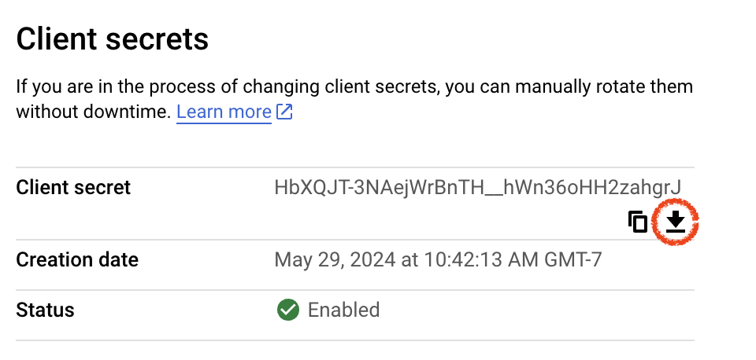

# Breadboard Connection Server

A stateless service for coordinating authenticated connections between
Breadboard end-user clients and third-party apps/services using OAuth.

## Contents

- [Background](#background)
- [APIs](#apis)
  - [GET list/](#get-list)
  - [GET grant/](#get-grant)
  - [GET refresh/](#get-refresh)
- [Configuring Connections](#configuring-connections)
  - [Configuring Google Cloud Connections](#configuring-google-cloud-connections)
- [Local development](#local-development)
- [Production deployment](#production-deployment)

## Background

This README assumes knowledge of terms and concepts from [RFC 6749: The OAuth
2.0 Authorization Framework ](https://datatracker.ietf.org/doc/html/rfc6749),
especially:

- [_authorization endpoint_](https://datatracker.ietf.org/doc/html/rfc6749#section-3.1)
- [_authorization code_](https://datatracker.ietf.org/doc/html/rfc6749#section-1.3.1)
- [_access token_](https://datatracker.ietf.org/doc/html/rfc6749#section-1.4)
- [_access token scope_](https://datatracker.ietf.org/doc/html/rfc6749#section-3.3)
- [_refresh token_](https://datatracker.ietf.org/doc/html/rfc6749#section-1.5)

Note the term _connection_ is not a standard OAuth term. We adopt this term to
refer to the high level process of an end-user "connecting" their client to a
third-party app/service.

## APIs

### `GET list/`

List the available connections.

Returns a list of all possible third-party apps/services that the end-user could
connect their Breadboard client to. See [Configuration Connections](#configuring-connections) for where this list comes from.

Each connection includes an ID (allowing us to distinguish between the various
available connections), a display name and description, and a third-party
[authorization
endpoint](https://datatracker.ietf.org/doc/html/rfc6749#section-3.1) URL.

<!-- To initiate a connection, the end-user shall be navigated to the authorization
endpoint URL. The authorization endpoint URL is operated by the particular
app/service (so, it's not something we deal with directly in this server), and
is responsible for authenticating, prompting for permission, and (if permission
is granted) generating an authorization code. -->

### `GET grant/`

Perform first-time authorization for a connection.

Takes a connection ID and a temporary [authorization
code](https://datatracker.ietf.org/doc/html/rfc6749#section-1.3.1) (generated by
the third-party authorization endpoint and returned to the end-user via a
redirect).

Returns an [access
token](https://datatracker.ietf.org/doc/html/rfc6749#section-1.4) which can be
used to access third-party resources, an expiry duration for that access token,
and a long-term [refresh
token](https://datatracker.ietf.org/doc/html/rfc6749#section-1.5) which can be
used to automatically acquire new access tokens without user interaction.

### `GET refresh/`

Get a new authorization token for when an earlier one has expired.

Takes a connection ID and a refresh token. Returns a new access token and expiry
duration.

## Configuring Connections

> [!NOTE]
> In the future, connections will also be configurable via the Google Cloud
> [Secret Manager](https://cloud.google.com/secret-manager/docs).

Connections are configured by placing JSON files in this package's `secrets/`
folder. Each available connection should have one `.json` file. The name of the
file (without the `.json` extension) is used as the connection ID. The format of
the file is:

```json
{
  "web": {
    "client_id": "<client id>",
    "auth_uri": "<auth uri>",
    "token_uri": "<token uri>",
    "client_secret": "<secret>",
    "redirect_uris": ["<redirect uri>"]
  },
  "__metadata": {
    "title": "<short display name>",
    "description": "<longer description>",
    "icon": "data:image/png;base64,<optional image data>",
    "scopes": ["<access token scope>"]
  }
}
```

> [!IMPORTANT]
> Connection configuration files should never be checked into GitHub or any
> other insecure location.
>
> This is because the `client_secret` field is highly sensitive. It allows any
> party to impersonate the application it belongs to and intercept user access
> tokens. The Breadboard Connection Server never reveals this secret over its
> APIs, and protecting these secrets is the primary reason this server exists.

The `web` section of this file is based on the Google Cloud _client secret JSON
file_ format. This format was chosen for the Breadboard Connection Server simply
in lieu of anything better or standardized.

The `__metadata` section of this file is custom to the Breadboard Connection
Server. It contains descriptive metadata to help the user understand what the
connection is. The `scopes` field lists the [access token
scopes](https://datatracker.ietf.org/doc/html/rfc6749#section-3.3) that should
be requested when making this connection.

### Configuring Google Cloud Connections

To configure a connection for a Google Cloud project:

1. Follow the documentation at [Google Identity > OpenID
   Connect](https://developers.google.com/identity/openid-connect/openid-connect)
   to create and configure an OAuth 2.0 client.

2. Download the OAuth 2.0 client's JSON configuration with the button shown
   here:

   

3. Place the file in this package's `secrets/` folder.

4. Rename the JSON file to something concise and descriptive (e.g.
   `cool-api.json`). The filename determines the connection ID.

5. Add the `__metadata` section to the file, because only the `web` section will
   be pre-populated by Google Cloud.

## Local development

```sh
cd breadboard/packages/connection-server
npm run dev
```

This will start the server on `localhost:5555`. Set the `HOST` and/or `PORT`
environment variables to customize the address. The server will automatically
restart if its implementation or connection configuration files are modified.

## Production deployment

_This server is not yet production ready, check back later!_
