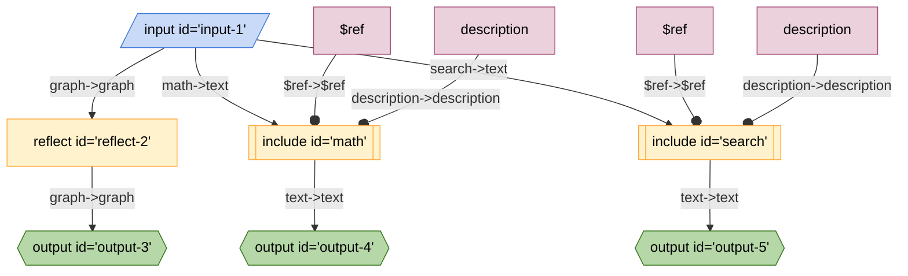

# Tools Diagram

```mermaid
%%{init: 'themeVariables': { 'fontFamily': 'Fira Code, monospace' }}%%
graph TD;
reflect2["reflect id='reflect-2'"] -- "graph->graph" --> output3{{"output id='output-3'"}}:::output
input1[/"input id='input-1'"/]:::input -- "graph->graph" --> reflect2["reflect id='reflect-2'"]
math[["include id='math'"]]:::include -- "text->text" --> output4{{"output id='output-4'"}}:::output
input1[/"input id='input-1'"/]:::input -- "math->text" --> math[["include id='math'"]]:::include
search[["include id='search'"]]:::include -- "text->text" --> output5{{"output id='output-5'"}}:::output
input1[/"input id='input-1'"/]:::input -- "search->text" --> search[["include id='search'"]]:::include
$refsearch[$ref]:::config -- "$ref->$ref" --o search
descriptionsearch[description]:::config -- "description->description" --o search
$refmath[$ref]:::config -- "$ref->$ref" --o math
descriptionmath[description]:::config -- "description->description" --o math
classDef default stroke:#ffab40,fill:#fff2ccff,color:#000
classDef input stroke:#3c78d8,fill:#c9daf8ff,color:#000
classDef output stroke:#38761d,fill:#b6d7a8ff,color:#000
classDef passthrough stroke:#a64d79,fill:#ead1dcff,color:#000
classDef slot stroke:#a64d79,fill:#ead1dcff,color:#000
classDef config stroke:#a64d79,fill:#ead1dcff,color:#000
classDef secrets stroke:#db4437,fill:#f4cccc,color:#000
classDef slotted stroke:#a64d79
```