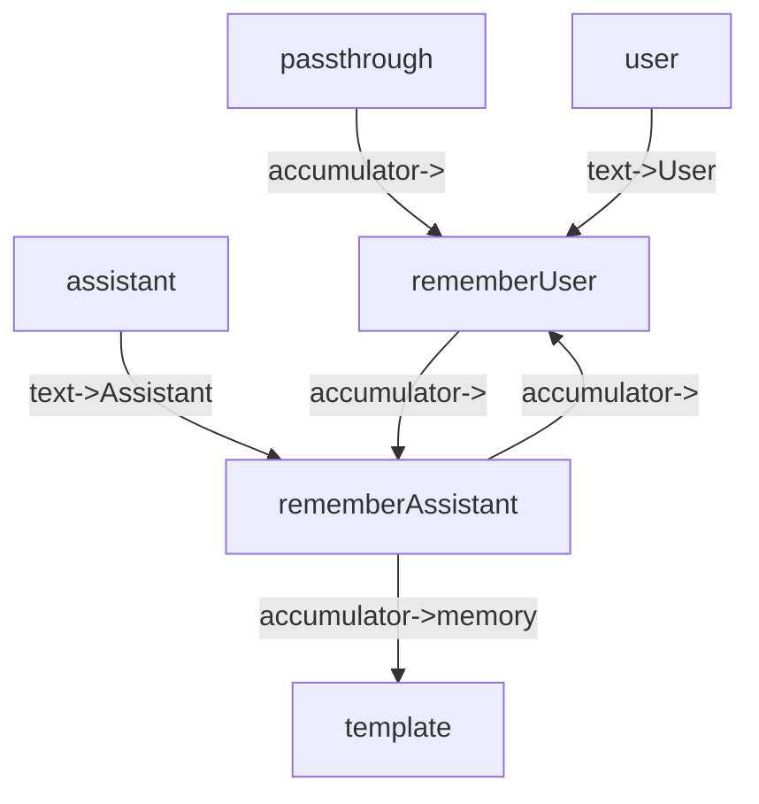
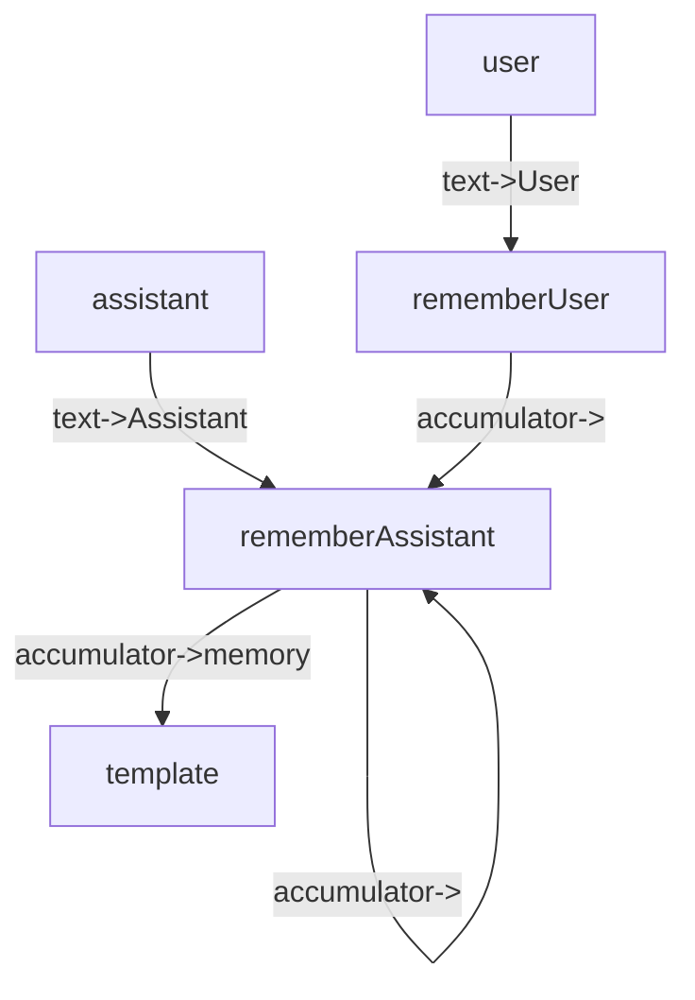
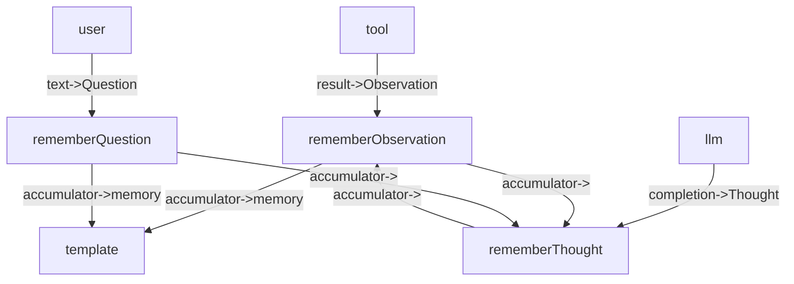

## Assistant many, user many, one output

## Assistant many, user once, one output

This is a pattern where the accumulator is initialized by user query.

- Two actors: assistant and user
- One output (template)

## MemoryPatternOne

