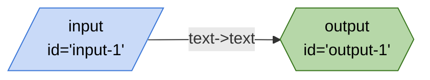
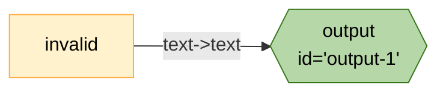
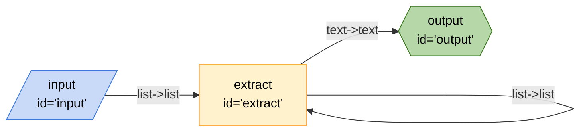
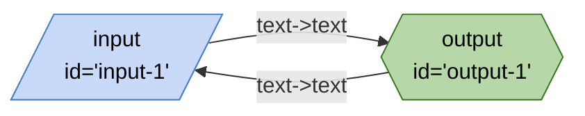
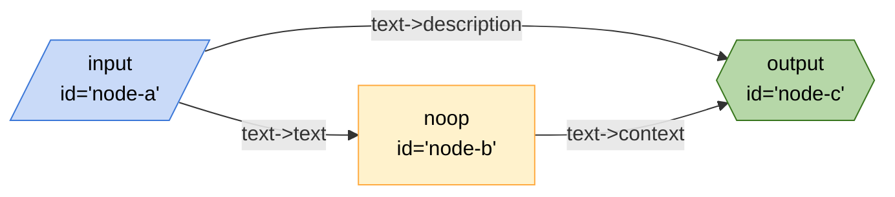
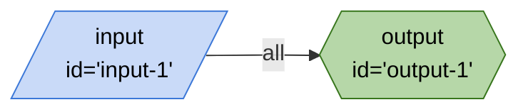
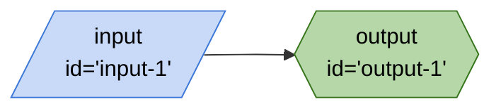
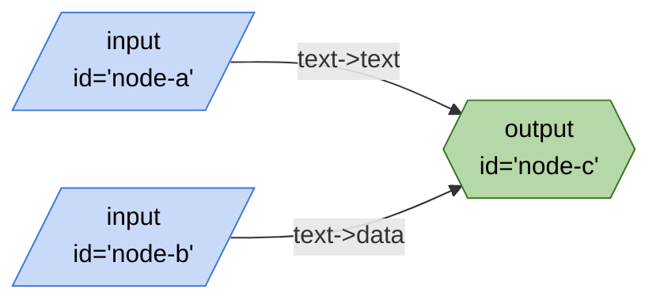

# tests/data

## empty-string.json

## invalid-node.json

## loop.json

## no-entry.json

## one-entry.json

## optional-edges-2.json

## optional-edges.json

## passing-all.json

## passing-none.json

## simple.json

## two-entries.json

