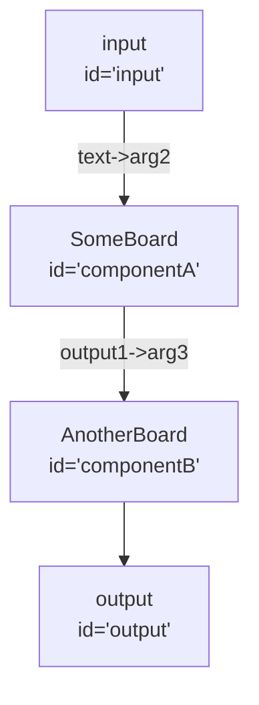

Breadboard-python is a library that allows developers to define Breadboards with
Python.

Each Breadboard can be serialized into a JSON graph. An executor can take this
graph and run it.

# Installation

Install with pip:

```
pip install breadboard_python
```

# Getting started

1. Define a Board in a python file
2. Save the Board to packages/breadboard-web/src/boards/ directory.
3. `cd packages/breadboard-web`
4. `npm i`
5. `npm run build`
6. `npm run dev`
7. Access web portal on localhost:5173

# Usage

Here's a very trivial Board:

```python
from breadboard_python.main import Board, Field, SchemaObject

class InputSchema(SchemaObject):
  input1: str = Field(description="This is a description of input1.", required=True)

class OutputSchema(SchemaObject):
  output1: str = Field(description="This is a description of output1.)


class Echo(Board[InputSchema, OutputSchema]):
  title = "Echo"
  description = "A trivial Board that takes text as input, and outputs back the same text."
  version = "1.0.0"

  def describe(self, input, output) -> None:
    output(output1=input.input1)
```

There are 4 steps to do when defining a Board:

1. Define input and output schemas by inheriting SchemaObject.
2. Creating a child class of Board, passing in the input and output schema
   classes
3. Populating the metadata fields: "title", "description", and "version".
4. Implementing the `describe(self, input, output)` method, which defines
   sub-Boards and describes how they wire into each other.

## Defining Input and Output Schemas

Input and Output schemas should inherit from the SchemaObject class, which is a
wrapper around Pydantic. Field metadata can be populated in the Field
constructor.

Example:

```python
class InputSchema(SchemaObject):
  input1: str = Field(description="This is a description of input1.", required=True)
  # By default, required is False.
  input2: List[int] = Field([], description="Another description.")
```

If an InputSchema or OutputSchema is not provided, they will default to Any. In
this example, the Board input/output signature simply defaults ot Any, Any

```python
class ExampleBoard(Board):
  description = "This Board has a signature of [Any, Any]."
```

## Defining a Board

The Input and Output schemas should be passed into the generic Board arguments
when inheriting from Board.

```python
class ExampleBoard(Board[SomeInputSchema, SomeOutputSchema]):
  title = "ExampleBoard"
  description = "Some description of what the Board does."
  version = "0.0.1"
```

## Implementing describe

The describe function has two parameters: input and output, which represent the
input and output nodes.

Here, component Boards are defined, and they are wired to and from each other.
Wiring is one-directional, and is done by making a call to the component. For
instance, in this example:

```python
class ExampleBoard(Board):
  def describe(self, input, output):
    self.componentA = SomeBoard(arg1="blar", arg2=input.text)
    self.componentB = AnotherBoard(arg3=self.componentA.output1)
    output(self.componentB)
```

The "text" field from the input is fed into componentA's "arg2" input field. The
"output1" output field from componentA is fed into componentB's "arg3" input
field. Finally, all of componentB's output fields are fed into output under the
same names.



## Importing functions from Javascript

Javascript kits are each a collection of handlers and are published to npm.
Javascript handlers can be thought of as Boards. To utilize Javascript kits, you
can import them with breadboard_python.import_nodes.require.

For instance:

```python
from breadboard_python.import_nodes import require
Templates = require("@google-labs/template-kit")

class ExampleBoard(Board):
  def describe(self, input, output) -> None:
    self.template = Templates.promptTemplate(template="Input1: {{input1}}", input1=input.input1)
    output(text=self.template.prompt)
```

## Defining functions in Python

TBD!
