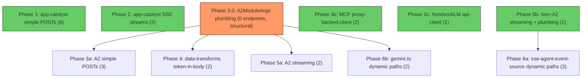

# ENABLE_BACKEND_CLIENT Migration

Gate every remaining `fetchWithCreds` call to the Opal backend behind
`ENABLE_BACKEND_CLIENT`, using the `OpalBackendClient` path when the flag is on
and falling back to `fetchWithCreds` when off.

**23 endpoints** across **11 files** remain unmigrated. The work is broken into
**11 independent work items** grouped into 6 logical phases. Most work items
have no dependencies on each other and can be executed in any order. The one
critical-path item is the `A2ModuleArgs` plumbing change (Phase 3.0), which
unblocks 7 downstream items.

## Verification Invariants

Every change must satisfy two conditions:

1. **Flag off (production):** zero change to application behavior.
2. **Flag on (dev):** no user-visible change to application behavior.

This application runs in production and must remain stable. Each phase must be
verified against both invariants before merging.

## Key References

Before working on any phase, read these documents:

- **Skill reference:**
  [`.agent/skills/opal-backend-api/SKILL.md`](../../.agent/skills/opal-backend-api/SKILL.md)
  — full context on the host/guest architecture, `fetchWithCreds`, and the
  `OpalBackendClient` migration pattern.
- **Endpoint catalog:**
  [`docs/dev/backend_reference.md`](../../docs/dev/backend_reference.md) — every
  RPC method, its call location, and its migration status. Update this doc (flip
  ❌ → ✅) whenever you migrate an endpoint.
- **Flag definition (3 locations, keep in sync):**
  - [`packages/types/src/deployment-configuration.ts`](../../packages/types/src/deployment-configuration.ts)
  - `packages/unified-server/src/flags.ts`
  - `packages/unified-server/src/config.ts`
- **Client interface:**
  [`packages/types/src/opal-backend-client.ts`](../../packages/types/src/opal-backend-client.ts)
  — `OpalBackendClient` interface with `sendHttpRequest(methodName, options)`.
- **Client implementation:**
  [`packages/visual-editor/src/ui/utils/http-backend-client.ts`](../../packages/visual-editor/src/ui/utils/http-backend-client.ts)
  — `HttpBackendClient`, wraps `fetchWithCreds`.
- **Existing test examples:**
  [`packages/visual-editor/tests/app-catalyst.test.ts`](../../packages/visual-editor/tests/app-catalyst.test.ts)
  — tests for both `ENABLE_BACKEND_CLIENT = true` and `= false` paths.

---

## Migration Pattern

Every migrated endpoint follows the same shape:

```ts
let response: Response;
if (CLIENT_DEPLOYMENT_CONFIG.ENABLE_BACKEND_CLIENT) {
  const client = await this.#backendClientPromise;
  response = await client.sendHttpRequest("methodName", {
    method: "POST",
    body: bodyObject, // object, NOT pre-stringified — HttpBackendClient handles JSON.stringify
  });
} else {
  // existing fetchWithCreds code, unchanged
  response = await this.#fetchWithCreds(
    new URL(`v1beta1/methodName`, this.#apiBaseUrl),
    { method: "POST", body: JSON.stringify(bodyObject) }
  );
}
// shared post-processing after the if/else
const result = await response.json();
```

**Key details:**

- **Client injection:** Accept `Promise<OpalBackendClient>` as a constructor
  param (classes) or function param (standalone functions).
- **Flag check:** `if (CLIENT_DEPLOYMENT_CONFIG.ENABLE_BACKEND_CLIENT)`
- **New path:** `backendClient.sendHttpRequest("methodName", { method, body })`
  — only the RPC method name; the client handles URL construction.
- **Fallback path:** Existing `fetchWithCreds` code, unchanged.
- **SSE streaming:** Use `query: { alt: "sse" }` in the options, not embedded in
  the method name.
- **Body:** Pass as an object (not pre-stringified). `HttpBackendClient` handles
  `JSON.stringify` and sets `Content-Type: application/json`.
- **Response variable:** Declare `let response: Response` before the `if/else`
  so both branches assign to it and post-processing is shared.

### Test pattern

```ts
// Save and override the flag
const saved = CLIENT_DEPLOYMENT_CONFIG.ENABLE_BACKEND_CLIENT;
CLIENT_DEPLOYMENT_CONFIG.ENABLE_BACKEND_CLIENT = true; // or false

// Create mocks
const fetchMock = mock.fn(async () => new Response(JSON.stringify({...})));
const backendClientMock = {
  sendHttpRequest: mock.fn(async () => new Response(JSON.stringify({...}))),
};

// Act & Assert which mock was called
// Restore flag in afterEach
CLIENT_DEPLOYMENT_CONFIG.ENABLE_BACKEND_CLIENT = saved;
```

---

## Dependency Graph

Most work items are **independent**. The only structural bottleneck is **Phase
3.0** (adding `backendClient` to `A2ModuleArgs`), which unblocks all A2-file
migrations. Non-A2 files do their own plumbing and have no upstream dependency.



**Legend:** 🟢 Green = no dependencies, can start immediately. 🟠 Orange =
critical path.

| Work Item | Depends On | Can Start Immediately? |
| --------- | ---------- | ---------------------- |
| Phase 1   | —          | ✅                     |
| Phase 2   | —          | ✅                     |
| Phase 3.0 | —          | ✅                     |
| Phase 3a  | 3.0        | after 3.0              |
| Phase 3b  | —          | ✅                     |
| Phase 3c  | —          | ✅                     |
| Phase 4   | 3.0        | after 3.0              |
| Phase 5a  | 3.0        | after 3.0              |
| Phase 5b  | —          | ✅                     |
| Phase 6a  | 5b         | after 5b               |
| Phase 6b  | 3.0        | after 3.0              |

> **Recommended first commits:** Phase 1 and Phase 3.0 are the highest-value
> starting points. Phase 1 builds muscle memory on the migration pattern with
> zero plumbing risk. Phase 3.0 unblocks the largest number of downstream items.

---

## Phase 1 — app-catalyst.ts: Simple POST endpoints

**Depends on:** nothing

`backendClient` is already plumbed into the `AppCatalystApiClient` constructor.
No new wiring needed.

**File:**
[`packages/visual-editor/src/ui/flow-gen/app-catalyst.ts`](../../packages/visual-editor/src/ui/flow-gen/app-catalyst.ts)

| Endpoint                  | Method |
| ------------------------- | ------ |
| `getG1SubscriptionStatus` | POST   |
| `getG1Credits`            | POST   |
| `chatGenerateApp`         | POST   |
| `acceptToS`               | POST   |
| `getEmailPreferences`     | POST   |
| `setEmailPreferences`     | POST   |

**What to do:**

- Add the
  `if (ENABLE_BACKEND_CLIENT) { sendHttpRequest } else { fetchWithCreds }`
  branch to each of the 6 methods.
- Add tests for both paths in
  [`packages/visual-editor/tests/app-catalyst.test.ts`](../../packages/visual-editor/tests/app-catalyst.test.ts)
  (follow the existing `checkAppAccess` test pattern).
- Update `backend_reference.md`.

**Endpoints migrated after this phase:** 6

### Existing Test Coverage

Test file: `packages/visual-editor/tests/app-catalyst.test.ts`

- `checkTos` — 4 tests covering both flag paths (canonical pattern for all
  migrations).
- `getG1SubscriptionStatus` — tested for URL construction, headers, method, body
  (flag-off path only).
- `getG1Credits` — tested for URL construction, headers, method, body (flag-off
  path only).
- NOT tested: `chat` (`chatGenerateApp`), `acceptTos`, `fetchEmailPreferences`,
  `setEmailPreferences`.

Assessment: 🟡 3 of 7 methods tested, but only `checkTos` has
ENABLE_BACKEND_CLIENT coverage. Adding flag-on tests for
`getG1SubscriptionStatus` and `getG1Credits` is low effort. The remaining 4
methods need tests from scratch.

### Manual Verification

| Endpoint                  | Trigger               | How to Verify                                                                                                                                            |
| ------------------------- | --------------------- | -------------------------------------------------------------------------------------------------------------------------------------------------------- |
| `getG1SubscriptionStatus` | Page load (automatic) | Sign in → page loads → fires automatically if `googleOne` flag enabled. Called from `MainBase` constructor.                                              |
| `getG1Credits`            | Explicit user action  | Sign in as G1 subscriber → open account dropdown → click credit refresh button.                                                                          |
| `chatGenerateApp`         | Explicit user action  | Open an Opal → click FlowGen "improve this step" on a specific step → enter instruction. Non-streaming path, only used with EDIT_STEP_CONFIG constraint. |
| `acceptToS`               | Explicit user action  | Sign in as user who hasn't accepted ToS → dialog appears → click "Continue".                                                                             |
| `getEmailPreferences`     | Page load (automatic) | Sign in → page loads → fires from `MainBase` constructor → `emailPrefsManager.refreshPrefs()`.                                                           |
| `setEmailPreferences`     | Explicit user action  | Open Settings (kebab menu → Settings) → Email tab → toggle preference. Also from WarmWelcome modal.                                                      |

---

## Phase 2 — app-catalyst.ts: SSE streaming endpoints

**Depends on:** nothing

Same file, but these endpoints use `?alt=sse` and stream the response body.
`sendHttpRequest` returns a `Response` whose `.body` can be read as an SSE
stream identically to the `fetchWithCreds` path.

**File:**
[`packages/visual-editor/src/ui/flow-gen/app-catalyst.ts`](../../packages/visual-editor/src/ui/flow-gen/app-catalyst.ts)

| Endpoint                  | Notes              |
| ------------------------- | ------------------ |
| `generateOpalStream`      | SSE streaming POST |
| `editOpalStream`          | SSE streaming POST |
| `rewriteOpalPromptStream` | SSE streaming POST |

**What to do:**

- Use the `query` field in `OpalBackendRequestOptions` for the SSE query param:
  ```ts
  backendClient.sendHttpRequest("generateOpalStream", {
    method: "POST",
    body: bodyObject,
    query: { alt: "sse" },
  });
  ```
  The `OpalBackendRequestOptions` interface already supports
  `query?: Record<string, string>`, and `HttpBackendClient` appends them as
  `URLSearchParams`. No interface changes needed.
- Note that the `chatStream` method dynamically selects from 3 endpoint names
  (`generateOpalStream`, `editOpalStream`, `rewriteOpalPromptStream`) based on
  whether it's a new generation or an edit. The method name passed to
  `sendHttpRequest` will be the same dynamic string.
- Add the flag gate to the `chatStream` method (single call site covers all 3).
- Add tests for both paths.
- Update `backend_reference.md`.

**Endpoints migrated after this phase:** 9 (cumulative)

### Existing Test Coverage

Same test file — no tests for `chatStream` or any SSE streaming behavior.

Assessment: 🔴 No coverage. SSE streaming is the highest-risk aspect. Tests
should verify that `Response.body` from `sendHttpRequest` is consumed as an SSE
stream identically to the `fetchWithCreds` path.

### Manual Verification

All three endpoints reached through `chatStream` which selects dynamically.

| Endpoint                  | Trigger              | How to Verify                                                                                          |
| ------------------------- | -------------------- | ------------------------------------------------------------------------------------------------------ |
| `generateOpalStream`      | Explicit user action | Type prompt in FlowGen input bar → submit. Used for new Opals (empty graph). Also from homepage panel. |
| `editOpalStream`          | Explicit user action | Open existing Opal with nodes → type prompt in FlowGen input bar → submit.                             |
| `rewriteOpalPromptStream` | Explicit user action | In Opal creation flow → request a prompt rewrite.                                                      |

Verify: streaming output appears incrementally (not all at once), generation can
be interrupted, error states handled correctly.

---

## Phase 3 — Simple POST files that need client plumbing

### Phase 3.0 — A2ModuleArgs plumbing (structural prerequisite)

**Depends on:** nothing

Add `backendClient: Promise<OpalBackendClient>` to `A2ModuleArgs` and
`A2ModuleFactoryArgs`, and thread it from the host shell. This is a pure
structural change — no flag gates, no endpoint migrations. It unblocks Phases
3a, 4, 5a, 6b.

8 of the 12 unmigrated files receive `fetchWithCreds` through `A2ModuleArgs` /
`A2ModuleFactoryArgs`. Adding `backendClient` to those args types is a single
structural change that unblocks most of the remaining work. The remaining files
(`sse-agent-event-source.ts`, `stream-run-agent-event-source.ts`,
`proxy-backed-client.ts`, `notebooklm-api-client.ts`) receive `fetchWithCreds`
as direct constructor params and need individual plumbing.

No test coverage or manual verification needed — pure structural change.

### Phase 3a — A2 simple POSTs

**Depends on:** Phase 3.0

These files will receive `backendClient` via `A2ModuleArgs` after 3.0.

#### [`step-executor.ts`](../../packages/visual-editor/src/a2/a2/step-executor.ts)

| Endpoint      | Notes       |
| ------------- | ----------- |
| `executeStep` | Simple POST |

#### [`cached-content.ts`](../../packages/visual-editor/src/a2/a2/cached-content.ts)

| Endpoint              | Notes       |
| --------------------- | ----------- |
| `createCachedContent` | Simple POST |

#### [`singleton-cache.ts`](../../packages/visual-editor/src/a2/a2/singleton-cache.ts)

| Endpoint                  | Notes       |
| ------------------------- | ----------- |
| `getSingletonPrefixCache` | Simple POST |

#### Existing Test Coverage

- `step-executor.ts`: Has `tests/a2/step-executor.test.ts` but only tests
  `parseExecutionOutput()` helper. The main `executeStep()` function that calls
  `fetchWithCreds` is NOT tested.
- `cached-content.ts`: No test file.
- `singleton-cache.ts`: No test file.

Assessment: 🔴 No coverage of `fetchWithCreds`-using functions. All files use
`A2ModuleArgs` pattern.

#### Manual Verification

| Endpoint                  | Trigger                    | How to Verify                                                                                                   |
| ------------------------- | -------------------------- | --------------------------------------------------------------------------------------------------------------- |
| `executeStep`             | Opal execution             | Click Run on Opal with image/audio/music/video generation steps. Core execution endpoint for media generation.  |
| `createCachedContent`     | Opal execution (automatic) | Click Run on Opal with agent step that has enough context to trigger caching. Called from agent loop.           |
| `getSingletonPrefixCache` | Opal execution (automatic) | Click Run on any Opal with agent step. Called during agent setup when Memory/Drive/NotebookLM features enabled. |

### Phase 3b — MCP (individual plumbing)

**Depends on:** nothing

#### [`proxy-backed-client.ts`](../../packages/visual-editor/src/mcp/proxy-backed-client.ts)

| Endpoint       | Notes                                 |
| -------------- | ------------------------------------- |
| `callMcpTool`  | Simple POST via shared `#call` helper |
| `listMcpTools` | Simple POST via shared `#call` helper |

#### Existing Test Coverage

No test file exists. Assessment: 🔴 No coverage. The `#call` helper serves both
endpoints, so testing it once effectively covers both.

#### Manual Verification

| Endpoint       | Trigger        | How to Verify                                             |
| -------------- | -------------- | --------------------------------------------------------- |
| `listMcpTools` | Opal execution | Open Opal with MCP server configured → tool list fetched. |
| `callMcpTool`  | Opal execution | Click Run on Opal with MCP tool steps.                    |

### Phase 3c — NotebookLM (individual plumbing)

**Depends on:** nothing

#### [`notebooklm-api-client.ts`](../../packages/visual-editor/src/sca/services/notebooklm-api-client.ts)

| Endpoint                    | Notes                                                                                                                                 |
| --------------------------- | ------------------------------------------------------------------------------------------------------------------------------------- |
| `nlmRetrieveRelevantChunks` | Simple POST (only 1 of 6 calls in this file hits the Opal backend — the others go to the NotebookLM Partner API and are out of scope) |

#### Existing Test Coverage

No direct test file. Has `FakeNotebookLmApiClient` (173 lines) used by
action/controller tests, but it doesn't exercise `fetchWithCreds` at all.
Assessment: 🔴 No coverage of actual HTTP layer.

#### Manual Verification

| Endpoint                    | Trigger                    | How to Verify                                                                                                                                       |
| --------------------------- | -------------------------- | --------------------------------------------------------------------------------------------------------------------------------------------------- |
| `nlmRetrieveRelevantChunks` | Opal execution (automatic) | Click Run on Opal with NotebookLM notebook reference → content agent calls `notebooklm_retrieve_relevant_chunks`. Requires `enableNotebookLm` flag. |

**What to do per sub-phase:**

- **3.0:** Add `backendClient` to `A2ModuleArgs` / `A2ModuleFactoryArgs` and
  thread it from the host shell. Pure structural change.
- **3a:** Add the flag gate to the 3 A2 simple POST endpoints.
- **3b:** Plumb `backendClient` into `proxy-backed-client.ts` and migrate its
  shared `#call` helper — covers both `callMcpTool` and `listMcpTools`.
- **3c:** Plumb `backendClient` into `notebooklm-api-client.ts` and migrate
  `nlmRetrieveRelevantChunks` only.
- Write tests for each, update the reference doc.

**Endpoints migrated after this phase:** 15 (cumulative)

---

## Phase 4 — Endpoints with access token in body (non-streaming)

**Depends on:** Phase 3.0 (A2ModuleArgs plumbing)

**Caution:** These endpoints require the access token injected into the JSON
body (not just the `Authorization` header). Currently
`shouldAddAccessTokenToJsonBody` in `fetch-allowlist.ts` handles this for the
`fetchWithCreds` path. Need to verify that `OpalBackendClient.sendHttpRequest`
(via `HttpBackendClient` → `fetchWithCreds`) still triggers this injection,
since the URL origin will be `BACKEND_API_ENDPOINT` not the canonical prefix.

#### [`data-transforms.ts`](../../packages/visual-editor/src/a2/a2/data-transforms.ts)

| Endpoint           | Notes               |
| ------------------ | ------------------- |
| `uploadGeminiFile` | POST, token in body |
| `uploadBlobFile`   | POST, token in body |

**What to do:**

- Plumb `backendClient` into the relevant functions.
- Verify token-in-body behavior works through the `OpalBackendClient` path
  (since `HttpBackendClient` wraps `fetchWithCreds`, the allowlist should still
  fire — but confirm).
- Add the flag gate, write tests, update the reference doc.

**Endpoints migrated after this phase:** 17 (cumulative)

### Existing Test Coverage

No test file exists. Assessment: 🔴 No coverage. Must verify access token
injection works through `OpalBackendClient` path.

### Manual Verification

| Endpoint           | Trigger        | How to Verify                                                        |
| ------------------ | -------------- | -------------------------------------------------------------------- |
| `uploadGeminiFile` | Opal execution | Click Run on Opal with Drive file attachments as Gemini step inputs. |
| `uploadBlobFile`   | Opal execution | Click Run on Opal with Drive file needing blob conversion.           |

Pay special attention to access token injection — failure manifests as auth
error on file upload.

---

## Phase 5 — Streaming endpoints that need plumbing

### Phase 5a — A2 streaming files

**Depends on:** Phase 3.0 (A2ModuleArgs plumbing)

These A2 files are already plumbed via `A2ModuleArgs` after Phase 3.0 — just add
the flag gate.

#### [`generate-webpage-stream.ts`](../../packages/visual-editor/src/a2/a2/generate-webpage-stream.ts)

| Endpoint                | Notes                                                      |
| ----------------------- | ---------------------------------------------------------- |
| `generateWebpageStream` | SSE streaming, token in body. Use `query: { alt: "sse" }`. |

#### [`opal-adk-stream.ts`](../../packages/visual-editor/src/a2/a2/opal-adk-stream.ts)

| Endpoint                 | Notes                                       |
| ------------------------ | ------------------------------------------- |
| `executeAgentNodeStream` | SSE streaming. Use `query: { alt: "sse" }`. |

#### Existing Test Coverage

No test files for either file. Assessment: 🔴 No coverage.

#### Manual Verification

| Endpoint                 | Trigger        | How to Verify                                                                            |
| ------------------------ | -------------- | ---------------------------------------------------------------------------------------- |
| `generateWebpageStream`  | Opal execution | Click Run on Opal with Display/webpage generation step. HTML streams back incrementally. |
| `executeAgentNodeStream` | Opal execution | Click Run on Opal with Agent node or Deep Research node. Execution trace streams back.   |

Verify: streaming appears incrementally, thought trace renders correctly,
interruption works.

### Phase 5b — Non-A2 streaming files (individual plumbing)

**Depends on:** nothing

These files receive `fetchWithCreds` as direct constructor params — plumb
`backendClient` individually.

#### [`stream-run-agent-event-source.ts`](../../packages/visual-editor/src/a2/agent/stream-run-agent-event-source.ts)

| Endpoint         | Notes                                                                                |
| ---------------- | ------------------------------------------------------------------------------------ |
| `streamRunAgent` | SSE streaming, token in body, complex resume lifecycle. Use `query: { alt: "sse" }`. |

#### [`sse-agent-event-source.ts`](../../packages/visual-editor/src/a2/agent/sse-agent-event-source.ts) (streaming endpoint only)

| Endpoint        | Notes                                                                                                |
| --------------- | ---------------------------------------------------------------------------------------------------- |
| `sessions/{id}` | GET + SSE streaming, dynamic session ID. Use `query: { alt: "sse" }`. Method name: `sessions/${id}`. |

**What to do:**

- **5a:** Add the flag gate to the 2 A2 streaming files (already plumbed).
- **5b:** Plumb `backendClient` into `stream-run-agent-event-source.ts` and
  `sse-agent-event-source.ts` (the latter also covers Phase 6a endpoints, so
  plumb once here).
- Use `query: { alt: "sse" }` for SSE params (not embedded in method name).
- Write tests, update the reference doc.

#### Existing Test Coverage

- `stream-run-agent-event-source.ts`: No test file. 🔴
- `sse-agent-event-source.ts`: Has `tests/agent/sse-agent-event-source.test.ts`
  (805 lines). Thorough — covers full session lifecycle (connect,
  fire-and-forget events, suspend/resume with cursor tracking, cancel, error
  handling). Tests mock `globalThis.fetch` via `mock.method`. Covers all 4
  endpoints but has NO ENABLE_BACKEND_CLIENT tests.
- Architectural note: The migration may happen upstream (at the call site in
  `sse-agent-run.ts` or `agent-service.ts` that instantiates the event source).
  If the flag gate is inside the class, existing tests can be extended. If
  upstream, existing tests remain valid for flag-off but won't cover flag-on.

#### Manual Verification

Both triggered from the graph editing chat panel.

| Endpoint                | Trigger                       | How to Verify                                                                                         |
| ----------------------- | ----------------------------- | ----------------------------------------------------------------------------------------------------- |
| `streamRunAgent`        | Graph editing chat (legacy)   | Open Opal → open graph editing chat panel → send message. Used when `useSessionsProtocol()` is false. |
| `sessions/{id}?alt=sse` | Graph editing chat (sessions) | Same trigger, when `useSessionsProtocol()` is true (default).                                         |

Verify: session creation, SSE stream connects, suspend/resume works,
cancellation works.

---

## Phase 6 — Dynamic-path endpoints

These endpoints have variable path segments (session IDs, model names). The
method name passed to `sendHttpRequest` will include the dynamic segment, e.g.,
`sessions/${id}:resume` or `models/${model}:generateContent`.

### Phase 6a — sse-agent-event-source dynamic paths

**Depends on:** Phase 5b (plumbing for sse-agent-event-source.ts)

#### [`sse-agent-event-source.ts`](../../packages/visual-editor/src/a2/agent/sse-agent-event-source.ts) (non-streaming endpoints)

| Endpoint                | Notes                           |
| ----------------------- | ------------------------------- |
| `sessions/new`          | POST, token in body             |
| `sessions/${id}:resume` | POST, token in body, dynamic ID |
| `sessions/${id}:cancel` | POST, dynamic ID                |

#### Existing Test Coverage

Same `sse-agent-event-source.test.ts` (805 lines). Already covers
`sessions/new`, `sessions/{id}:resume`, and `sessions/{id}:cancel` with URL
assertions. Dynamic session ID construction exercised in suspend/resume tests.

Assessment: 🟢 Well covered for flag-off path. Adding flag-on variants would
provide strong coverage.

#### Manual Verification

Same graph editing chat trigger as Phase 5b.

| Endpoint                | Trigger            | How to Verify                                   |
| ----------------------- | ------------------ | ----------------------------------------------- |
| `sessions/new`          | Graph editing chat | Send message → session created (first call).    |
| `sessions/${id}:resume` | Graph editing chat | Agent suspends → provide input → agent resumes. |
| `sessions/${id}:cancel` | Graph editing chat | Click stop/cancel button during execution.      |

### Phase 6b — gemini.ts dynamic paths

**Depends on:** Phase 3.0 (A2ModuleArgs plumbing)

#### [`gemini.ts`](../../packages/visual-editor/src/a2/a2/gemini.ts)

| Endpoint                                | Notes                                                        |
| --------------------------------------- | ------------------------------------------------------------ |
| `models/${model}:generateContent`       | POST, dynamic model name                                     |
| `models/${model}:streamGenerateContent` | POST + SSE, dynamic model name. Use `query: { alt: "sse" }`. |

**Caution:** `gemini.ts` is the most complex migration: dynamic model names in
paths, retry logic with up to 5 retries × multiple model fallbacks, and a
peek-and-retry strategy for streaming. It uses `geminiApiPrefix()` for URL
construction. The `sendHttpRequest` method name would be
`models/${model}:generateContent` — verify this concatenation produces the
correct URL.

**What to do:**

- **6a:** `sse-agent-event-source.ts` already has `backendClient` plumbed from
  Phase 5b. Add the flag gate to the 3 remaining non-streaming methods.
- **6b:** `gemini.ts` is already plumbed via `A2ModuleArgs` (Phase 3.0). Add the
  flag gate to `callAPI`, `generateContent`, and `streamGenerateContent`.
- Write tests, update the reference doc.

**Endpoints migrated after all phases:** 23 (all done ✅)

#### Existing Test Coverage

No test file exists. Assessment: 🔴 No coverage. Highest-risk migration —
dynamic model names, retry logic, streaming. Tests should cover URL
construction, retry behavior, streaming vs. non-streaming.

#### Manual Verification

Nearly every Opal execution uses these — the lowest-level Gemini API calls.

| Endpoint                                | Trigger        | How to Verify                                                                           |
| --------------------------------------- | -------------- | --------------------------------------------------------------------------------------- |
| `models/${model}:generateContent`       | Opal execution | Click Run on any Opal with Generate Text or Agent step. Non-streaming with retry logic. |
| `models/${model}:streamGenerateContent` | Opal execution | Same — streaming path used for agent loop token-by-token output.                        |

Verify: inference returns correct results, streaming appears token-by-token,
retry and model fallback chains work.

---

## Open Questions

- **Dynamic path segments.** Does
  `sendHttpRequest("sessions/${id}:cancel", ...)` and
  `sendHttpRequest("models/${model}:generateContent", ...)` produce correct
  URLs? `HttpBackendClient` constructs `` `${prefix}/v1beta1/${methodName}` `` —
  string interpolation with path segments and colons should work, but verify in
  Phase 6.

- **Access token in body.** When `HttpBackendClient.sendHttpRequest` calls
  `fetchWithCreds` internally, the URL is constructed using
  `OPAL_BACKEND_API_PREFIX` (the canonical prefix) — so the allowlist's
  `shouldAddAccessTokenToJsonBody` matching should still work since it matches
  on the canonical prefix. Verify this in Phase 4 with the `uploadGeminiFile`
  endpoint.

---

## Verification Plan

### Per-phase testing workflow

Given sparse existing test coverage, each phase should follow this order:

1. **Write tests for the existing (flag-off) behavior first** — before touching
   production code. This establishes a baseline proving current behavior works
   and will catch regressions.
2. **Add the flag gate** — the actual migration work.
3. **Duplicate the tests for the flag-on path** — verify the new
   `OpalBackendClient` path produces identical results.
4. **Run the full test suite** — `npm run build` and `npm run test` in the
   visual-editor package.
5. **Manual verification** — use the triggers listed in each phase section to
   confirm behavior in the running application with the flag toggled.

### Risk assessment

| Phase                | Risk        | Reason                                                            |
| -------------------- | ----------- | ----------------------------------------------------------------- |
| 6b (gemini.ts)       | 🔴 Critical | Core inference path, retry logic, model fallbacks, no tests       |
| 5b (agent streaming) | 🔴 High     | Complex suspend/resume lifecycle, `stream-run-agent` has no tests |
| 4 (token-in-body)    | 🟡 Medium   | Access token injection must be verified end-to-end                |
| 2 (SSE streaming)    | 🟡 Medium   | First SSE migration, but low plumbing risk                        |
| 1 (simple POSTs)     | 🟢 Low      | Existing test patterns, no plumbing changes                       |
| 3.0 (structural)     | 🟢 Low      | No flag gates, no behavior change                                 |

### Trigger categories

All 23 endpoints fall into 4 trigger categories for manual verification:

| Category                       | Endpoints                                                                                                                                                                                                                                                        | How to trigger                                                                    |
| ------------------------------ | ---------------------------------------------------------------------------------------------------------------------------------------------------------------------------------------------------------------------------------------------------------------- | --------------------------------------------------------------------------------- |
| **Page load** (automatic)      | `getG1SubscriptionStatus`, `getEmailPreferences`                                                                                                                                                                                                                 | Sign in → page loads. No manual action needed.                                    |
| **Explicit user action**       | `getG1Credits`, `acceptToS`, `setEmailPreferences`, `generateOpalStream`, `editOpalStream`, `rewriteOpalPromptStream`, `chatGenerateApp`                                                                                                                         | Click specific UI elements: credit refresh, ToS accept, settings, FlowGen prompt. |
| **Opal execution** (click Run) | `executeStep`, `generateWebpageStream`, `executeAgentNodeStream`, `createCachedContent`, `getSingletonPrefixCache`, `uploadGeminiFile`, `uploadBlobFile`, `generateContent`, `streamGenerateContent`, `callMcpTool`, `listMcpTools`, `nlmRetrieveRelevantChunks` | Click Run on an Opal. Different Opals exercise different subsets.                 |
| **Graph editing chat**         | `sessions/new`, `sessions/{id}?alt=sse`, `sessions/{id}:resume`, `sessions/{id}:cancel`, `streamRunAgent`                                                                                                                                                        | Open graph editing chat panel → send a message.                                   |

### End-to-end

- After all phases, enable the flag in a dev/staging deployment and verify
  backend calls work end-to-end.
- Confirm streaming endpoints (SSE) still stream correctly with the flag on.
- Confirm access-token-in-body endpoints still receive the token.

---

## Progress Tracker

| Work Item | Scope                                | Endpoints      | Depends On | Test Coverage                              | Status |
| --------- | ------------------------------------ | -------------- | ---------- | ------------------------------------------ | ------ |
| 1         | app-catalyst.ts simple POSTs         | 6              | —          | 🟡 Partial (3/7, 1 with flag tests)        | ✅     |
| 2         | app-catalyst.ts SSE streams          | 3              | —          | 🔴 None                                    | ⬜     |
| 3.0       | A2ModuleArgs plumbing                | 0 (structural) | —          | N/A                                        | ✅     |
| 3a        | A2 simple POSTs                      | 3              | 3.0        | 🔴 None (step-executor helper-only)        | ⬜     |
| 3b        | MCP proxy-backed-client              | 2              | —          | 🔴 None                                    | ⬜     |
| 3c        | NotebookLM api-client                | 1              | —          | 🔴 None (fake only)                        | ⬜     |
| 4         | Token-in-body (data-transforms)      | 2              | 3.0        | 🔴 None                                    | ⬜     |
| 5a        | A2 streaming                         | 2              | 3.0        | 🔴 None                                    | ⬜     |
| 5b        | Non-A2 streaming + plumbing          | 2              | —          | 🟢 sse-agent thorough / 🔴 stream-run none | ⬜     |
| 6a        | sse-agent-event-source dynamic paths | 3              | 5b         | 🟢 Thorough (no flag tests)                | ⬜     |
| 6b        | gemini.ts dynamic paths              | 2              | 3.0        | 🔴 None                                    | ⬜     |
| **Total** |                                      | **23**         |            |                                            |        |
