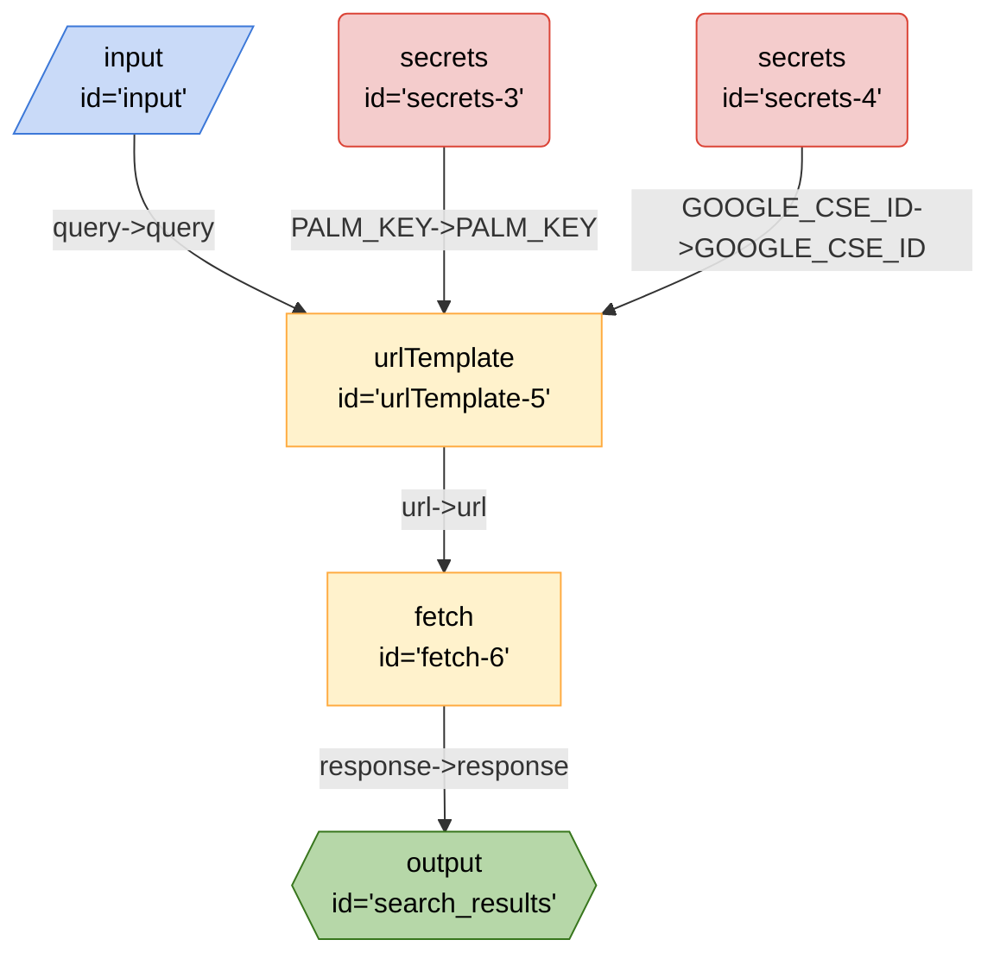

# Search Google

This recipe demonstrates how to search Google using the Google Custom Search API.

## Running the Recipe

### Inputs

- `query` - The query that you want to search for

### Secrets

This recipe requires the following secrets to be set to be exported as environment variables:

- `GOOGLE_CSE_ID` - The Google Custom Search Engine ID. You can get this from the [Google Custom Search Engine Console](https://cse.google.com/cse/all).
- `PALM_KEY` - The key for the PaLM API.

### Outputs

- `search_results` - The search results from Google in JSON format. The format is as described in the [Google Custom Search API](https://developers.google.com/custom-search/v1/reference/rest/v1/Search).

### From the CLI

```bash
breadboard run recipes/components/search-google/index.js --kit @google-labs/llm-starter -i "{\"query\":\"Testing\"}"
```

### From the UI

```bash
breadboard debug recipes/components/search-google/index.js
```

## Code


