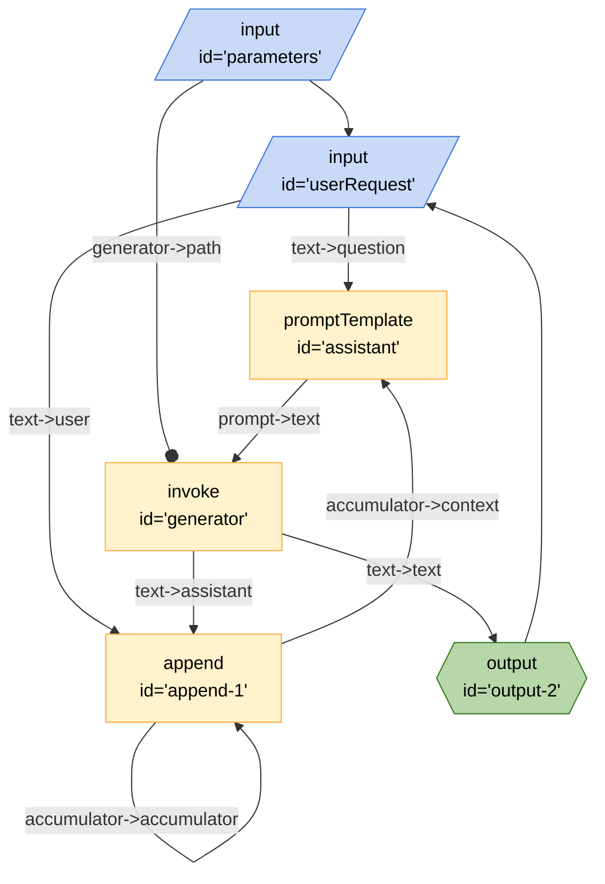

# Accumulating Context

An example of a board that implements a multi-turn experience: a very simple chat bot that accumulates context of the conversations. Tell it "I am hungry" or something like this and then give simple replies, like "bbq". It should be able to infer what you're asking for based on the conversation context. All replies are pure hallucinations, but should give you a sense of how a Breadboard API endpoint for a board with cycles looks like.

## Running the Recipe

### Inputs

- `parameters` - The URL of a graph that will respond the context of the conversation.
- `userRequest` - A string that contains the users conversation.

Depending on the Text Generator you use, you may need to provide additional inputs such as `PALM_KEY`.

### Outputs

- TBD

### From the CLI

An example using an external board to interact with PaLM

```bash
breadboard run recipes/llm-concepts/accumulating-context/index.js --kit @google-labs/core-kit --kit @google-labs/llm-starter --kit @google-labs/palm-kit
```

When prompted for the Text generator to use, enter `./packages/breadboard-web/dist/graphs/text-generator.json`. If you use this graph, you also have to set an environment variable `PALM_KEY` to the API key for PaLM.

When prompted "Type here to chat with the assistant", type anything you want like `Hello`

The Text generator listed above will then ask "The model to use for generation", enter `PaLM`

### From the UI

```bash
breadboard debug recipes/use-case/fetch-rss/index.js
```

## Mermaid


