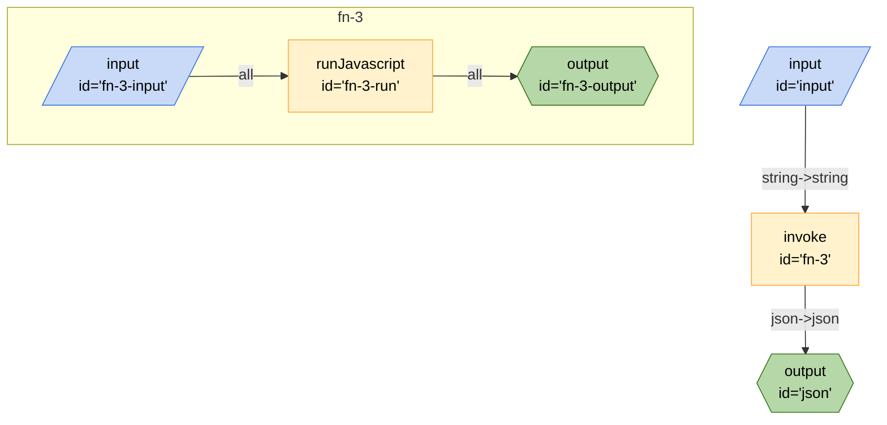

# Fetch ATOM Feed

This recipe demonstrates how to convert a string to JSON so that it can be used in a Breadboard.

## Running the Recipe

### Inputs

- `string` - The string that represents a JSON object
- `splat` - A boolean that indicates whether or not to use splatting (default: false)

### Outputs

If splat: false

- `json` - The JSON object that was represented by the string

If splat: true, the root properties of the JSON object will be available as outputs.

### From the CLI

```bash
breadboard run recipes/use-case/convert-string-to-json/index.js -i "{\"string\":\"{\\\"a\\\": [1,2,3,4]}\"}" --kit @google-labs/llm-starter --kit @google-labs/core-kit
```

The result will be on the `json` property of the output.

You can also splat the results to the output, so the root properties of the object can be accessed directly from a board.

```bash
breadboard run recipes/use-case/convert-string-to-json/index.js -i "{\"string\":\"{\\\"a\\\": [1,2,3,4]}\",\"splat\":
true}" --kit @google-labs/llm-starter --kit @google-labs/core-kit
```

### From the UI

```bash
breadboard debug recipes/use-case/convert-string-to-json/index.js
```

## Code


