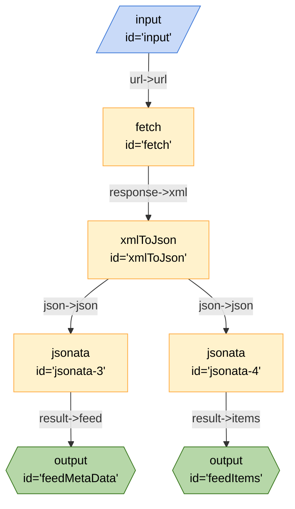

# Fetch RSS Feed

This recipe demonstrates how to fetch an RSS feed return the items and metadata.

## Running the Recipe

### Inputs

- `url` - The URL of the RSS feed

### Outputs

- `feedItems` - An array of items from the RSS feed
- `feedMetaData` - Metadata about the RSS feed

### From the CLI

```bash
breadboard run recipes/use-case/fetch-rss/index.js --kit @google-labs/llm-starter -i {\"url\":\"https://paul.kinlan.me/index.xml\"}"
```

### From the UI

```bash
breadboard debug recipes/use-case/fetch-rss/index.js
```

## Code


