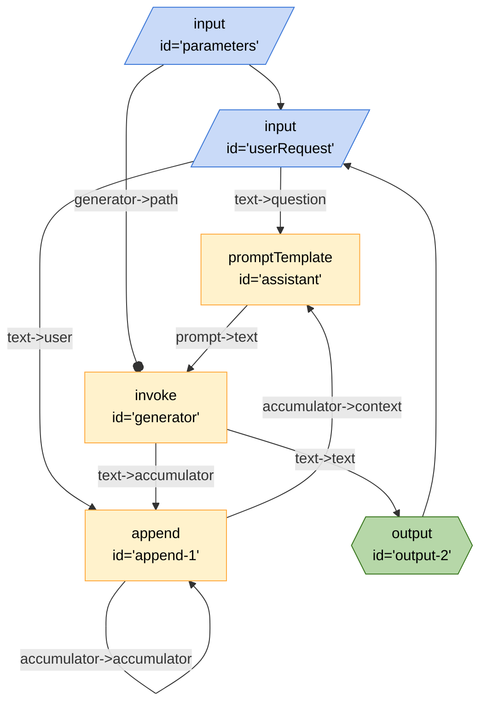

## accumulating-context.ts

```mermaid
%%{init: 'themeVariables': { 'fontFamily': 'Fira Code, monospace' }}%%
graph TD;
userRequest[/"input <br> id='userRequest'"/]:::input -- "text->question" --> assistant["promptTemplate <br> id='assistant'"]
userRequest[/"input <br> id='userRequest'"/]:::input -- "text->user" --> append1["append <br> id='append-1'"]
parameters[/"input <br> id='parameters'"/]:::input --> userRequest[/"input <br> id='userRequest'"/]:::input
parameters[/"input <br> id='parameters'"/]:::input -- "generator->path" --o generator["invoke <br> id='generator'"]
output2{{"output <br> id='output-2'"}}:::output --> userRequest[/"input <br> id='userRequest'"/]:::input
assistant["promptTemplate <br> id='assistant'"] -- "prompt->text" --> generator["invoke <br> id='generator'"]
append1["append <br> id='append-1'"] -- "accumulator->accumulator" --> append1["append <br> id='append-1'"]
append1["append <br> id='append-1'"] -- "accumulator->context" --> assistant["promptTemplate <br> id='assistant'"]
generator["invoke <br> id='generator'"] -- "text->accumulator" --> append1["append <br> id='append-1'"]
generator["invoke <br> id='generator'"] -- "text->text" --> output2{{"output <br> id='output-2'"}}:::output
classDef default stroke:#ffab40,fill:#fff2ccff,color:#000
classDef input stroke:#3c78d8,fill:#c9daf8ff,color:#000
classDef output stroke:#38761d,fill:#b6d7a8ff,color:#000
classDef passthrough stroke:#a64d79,fill:#ead1dcff,color:#000
classDef slot stroke:#a64d79,fill:#ead1dcff,color:#000
classDef config stroke:#a64d79,fill:#ead1dcff,color:#000
classDef secrets stroke:#db4437,fill:#f4cccc,color:#000
classDef slotted stroke:#a64d79
```