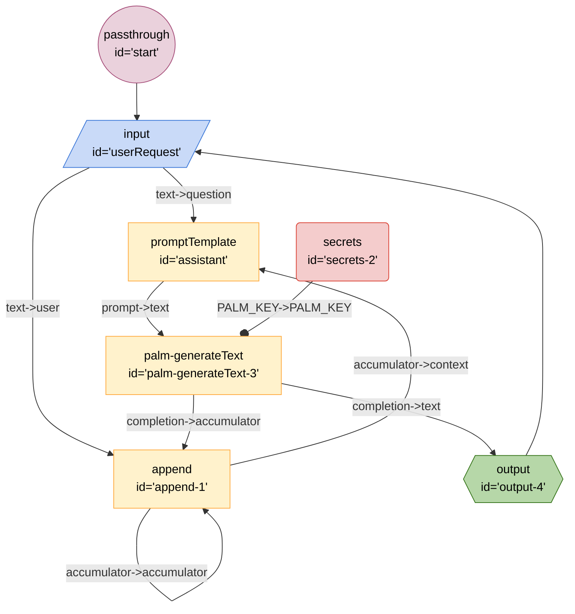

## accumulating-context.ts

```mermaid
%%{init: 'themeVariables': { 'fontFamily': 'Fira Code, monospace' }}%%
graph TD;
userRequest[/"input <br> id='userRequest'"/]:::input -- "text->question" --> assistant["promptTemplate <br> id='assistant'"]
userRequest[/"input <br> id='userRequest'"/]:::input -- "text->user" --> append1["append <br> id='append-1'"]
start(("passthrough <br> id='start'")):::passthrough --> userRequest[/"input <br> id='userRequest'"/]:::input
output4{{"output <br> id='output-4'"}}:::output --> userRequest[/"input <br> id='userRequest'"/]:::input
assistant["promptTemplate <br> id='assistant'"] -- "prompt->text" --> palmgenerateText3["palm-generateText <br> id='palm-generateText-3'"]
append1["append <br> id='append-1'"] -- "accumulator->accumulator" --> append1["append <br> id='append-1'"]
append1["append <br> id='append-1'"] -- "accumulator->context" --> assistant["promptTemplate <br> id='assistant'"]
palmgenerateText3["palm-generateText <br> id='palm-generateText-3'"] -- "completion->accumulator" --> append1["append <br> id='append-1'"]
palmgenerateText3["palm-generateText <br> id='palm-generateText-3'"] -- "completion->text" --> output4{{"output <br> id='output-4'"}}:::output
secrets2("secrets <br> id='secrets-2'"):::secrets -- "PALM_KEY->PALM_KEY" --o palmgenerateText3["palm-generateText <br> id='palm-generateText-3'"]
classDef default stroke:#ffab40,fill:#fff2ccff,color:#000
classDef input stroke:#3c78d8,fill:#c9daf8ff,color:#000
classDef output stroke:#38761d,fill:#b6d7a8ff,color:#000
classDef passthrough stroke:#a64d79,fill:#ead1dcff,color:#000
classDef slot stroke:#a64d79,fill:#ead1dcff,color:#000
classDef config stroke:#a64d79,fill:#ead1dcff,color:#000
classDef secrets stroke:#db4437,fill:#f4cccc,color:#000
classDef slotted stroke:#a64d79
```