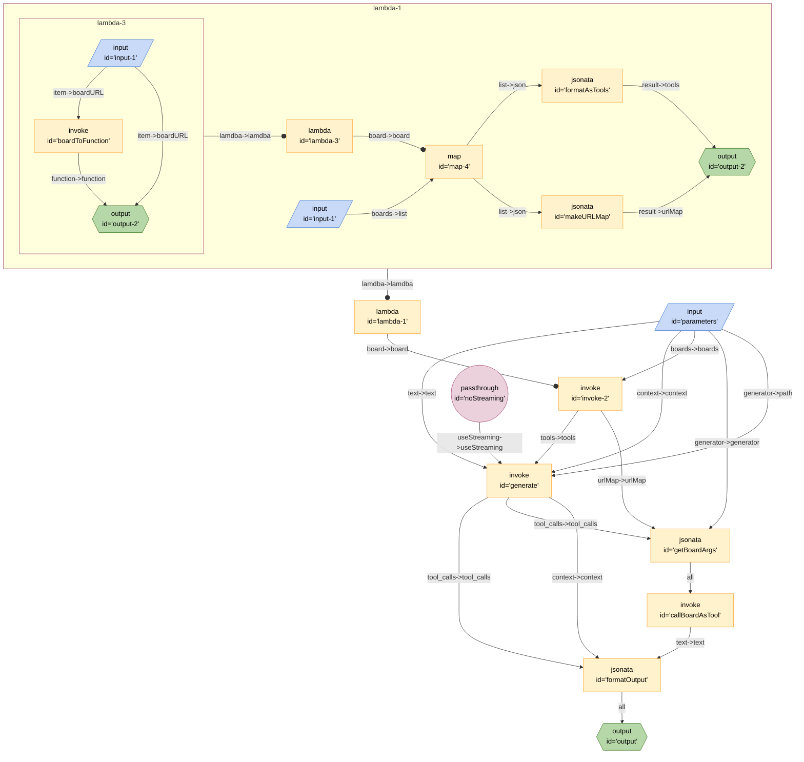

## board-caller.ts

```mermaid
%%{init: 'themeVariables': { 'fontFamily': 'Fira Code, monospace' }}%%
graph TD;
lambda1["lambda <br> id='lambda-1'"] -- "board->board" --o invoke2["invoke <br> id='invoke-2'"]
subgraph sg_lambda1 [lambda-1]
lambda1_lambda3["lambda <br> id='lambda-3'"] -- "board->board" --o lambda1_map4["map <br> id='map-4'"]
subgraph sg_lambda3 [lambda-3]
lambda1_lambda3_boardToFunction["invoke <br> id='boardToFunction'"] -- "function->function" --> lambda1_lambda3_output2{{"output <br> id='output-2'"}}:::output
lambda1_lambda3_input1[/"input <br> id='input-1'"/]:::input -- "item->boardURL" --> lambda1_lambda3_boardToFunction["invoke <br> id='boardToFunction'"]
lambda1_lambda3_input1[/"input <br> id='input-1'"/]:::input -- "item->boardURL" --> lambda1_lambda3_output2{{"output <br> id='output-2'"}}:::output
end
sg_lambda3:::slotted -- "lamdba->lamdba" --o lambda1_lambda3

lambda1_formatAsTools["jsonata <br> id='formatAsTools'"] -- "result->tools" --> lambda1_output2{{"output <br> id='output-2'"}}:::output
lambda1_map4["map <br> id='map-4'"] -- "list->json" --> lambda1_formatAsTools["jsonata <br> id='formatAsTools'"]
lambda1_makeURLMap["jsonata <br> id='makeURLMap'"] -- "result->urlMap" --> lambda1_output2{{"output <br> id='output-2'"}}:::output
lambda1_map4["map <br> id='map-4'"] -- "list->json" --> lambda1_makeURLMap["jsonata <br> id='makeURLMap'"]
lambda1_input1[/"input <br> id='input-1'"/]:::input -- "boards->list" --> lambda1_map4["map <br> id='map-4'"]
end
sg_lambda1:::slotted -- "lamdba->lamdba" --o lambda1

noStreaming(("passthrough <br> id='noStreaming'")):::passthrough -- "useStreaming->useStreaming" --> generate["invoke <br> id='generate'"]
generate["invoke <br> id='generate'"] -- "tool_calls->tool_calls" --> formatOutput["jsonata <br> id='formatOutput'"]
parameters[/"input <br> id='parameters'"/]:::input -- "text->text" --> generate["invoke <br> id='generate'"]
parameters[/"input <br> id='parameters'"/]:::input -- "context->context" --> generate["invoke <br> id='generate'"]
invoke2["invoke <br> id='invoke-2'"] -- "tools->tools" --> generate["invoke <br> id='generate'"]
invoke2["invoke <br> id='invoke-2'"] -- "urlMap->urlMap" --> getBoardArgs["jsonata <br> id='getBoardArgs'"]
parameters[/"input <br> id='parameters'"/]:::input -- "boards->boards" --> invoke2["invoke <br> id='invoke-2'"]
formatOutput["jsonata <br> id='formatOutput'"] -- all --> output{{"output <br> id='output'"}}:::output
callBoardAsTool["invoke <br> id='callBoardAsTool'"] -- "text->text" --> formatOutput["jsonata <br> id='formatOutput'"]
getBoardArgs["jsonata <br> id='getBoardArgs'"] -- all --> callBoardAsTool["invoke <br> id='callBoardAsTool'"]
parameters[/"input <br> id='parameters'"/]:::input -- "generator->generator" --> getBoardArgs["jsonata <br> id='getBoardArgs'"]
generate["invoke <br> id='generate'"] -- "tool_calls->tool_calls" --> getBoardArgs["jsonata <br> id='getBoardArgs'"]
generate["invoke <br> id='generate'"] -- "context->context" --> formatOutput["jsonata <br> id='formatOutput'"]
parameters[/"input <br> id='parameters'"/]:::input -- "generator->path" --> generate["invoke <br> id='generate'"]
classDef default stroke:#ffab40,fill:#fff2ccff,color:#000
classDef input stroke:#3c78d8,fill:#c9daf8ff,color:#000
classDef output stroke:#38761d,fill:#b6d7a8ff,color:#000
classDef passthrough stroke:#a64d79,fill:#ead1dcff,color:#000
classDef slot stroke:#a64d79,fill:#ead1dcff,color:#000
classDef config stroke:#a64d79,fill:#ead1dcff,color:#000
classDef secrets stroke:#db4437,fill:#f4cccc,color:#000
classDef slotted stroke:#a64d79
```