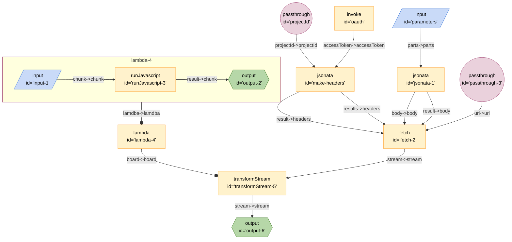

## gemini-pro-vision.ts

```mermaid
%%{init: 'themeVariables': { 'fontFamily': 'Fira Code, monospace' }}%%
graph TD;
projectId(("passthrough <br> id='projectId'")):::passthrough -- "projectId->projectId" --> makeheaders["jsonata <br> id='make-headers'"]
oauth["invoke <br> id='oauth'"] -- "accessToken->accessToken" --> makeheaders["jsonata <br> id='make-headers'"]
makeheaders["jsonata <br> id='make-headers'"] -- "result->headers" --> fetch2["fetch <br> id='fetch-2'"]
jsonata1["jsonata <br> id='jsonata-1'"] -- "body->body" --> fetch2["fetch <br> id='fetch-2'"]
passthrough3(("passthrough <br> id='passthrough-3'")):::passthrough -- "url->url" --> fetch2["fetch <br> id='fetch-2'"]
lambda4["lambda <br> id='lambda-4'"] -- "board->board" --o transformStream5["transformStream <br> id='transformStream-5'"]
subgraph sg_lambda4 [lambda-4]
lambda4_runJavascript3["runJavascript <br> id='runJavascript-3'"] -- "result->chunk" --> lambda4_output2{{"output <br> id='output-2'"}}:::output
lambda4_input1[/"input <br> id='input-1'"/]:::input -- "chunk->chunk" --> lambda4_runJavascript3["runJavascript <br> id='runJavascript-3'"]
end
sg_lambda4:::slotted -- "lamdba->lamdba" --o lambda4

makeheaders["jsonata <br> id='make-headers'"] -- "results->headers" --> fetch2["fetch <br> id='fetch-2'"]
transformStream5["transformStream <br> id='transformStream-5'"] -- "stream->stream" --> output6{{"output <br> id='output-6'"}}:::output
fetch2["fetch <br> id='fetch-2'"] -- "stream->stream" --> transformStream5["transformStream <br> id='transformStream-5'"]
jsonata1["jsonata <br> id='jsonata-1'"] -- "result->body" --> fetch2["fetch <br> id='fetch-2'"]
parameters[/"input <br> id='parameters'"/]:::input -- "parts->parts" --> jsonata1["jsonata <br> id='jsonata-1'"]
classDef default stroke:#ffab40,fill:#fff2ccff,color:#000
classDef input stroke:#3c78d8,fill:#c9daf8ff,color:#000
classDef output stroke:#38761d,fill:#b6d7a8ff,color:#000
classDef passthrough stroke:#a64d79,fill:#ead1dcff,color:#000
classDef slot stroke:#a64d79,fill:#ead1dcff,color:#000
classDef config stroke:#a64d79,fill:#ead1dcff,color:#000
classDef secrets stroke:#db4437,fill:#f4cccc,color:#000
classDef slotted stroke:#a64d79
```