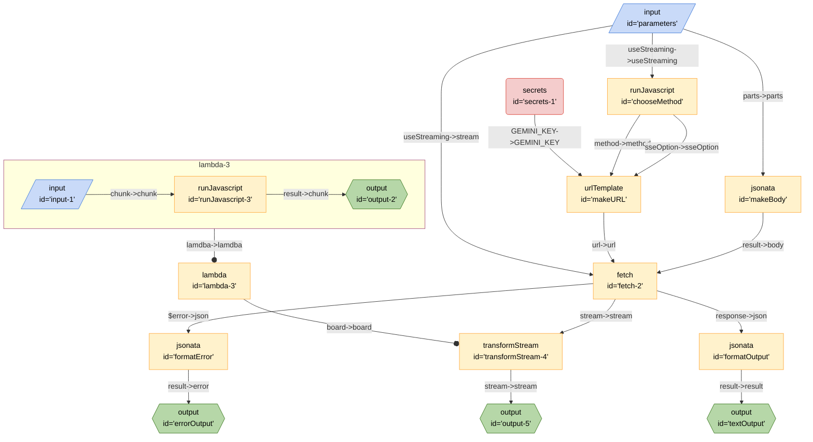

## gemini-pro-vision.ts

```mermaid
%%{init: 'themeVariables': { 'fontFamily': 'Fira Code, monospace' }}%%
graph TD;
parameters[/"input <br> id='parameters'"/]:::input -- "useStreaming->useStreaming" --> chooseMethod["runJavascript <br> id='chooseMethod'"]
secrets1("secrets <br> id='secrets-1'"):::secrets -- "GEMINI_KEY->GEMINI_KEY" --> makeURL["urlTemplate <br> id='makeURL'"]
chooseMethod["runJavascript <br> id='chooseMethod'"] -- "method->method" --> makeURL["urlTemplate <br> id='makeURL'"]
chooseMethod["runJavascript <br> id='chooseMethod'"] -- "sseOption->sseOption" --> makeURL["urlTemplate <br> id='makeURL'"]
parameters[/"input <br> id='parameters'"/]:::input -- "useStreaming->stream" --> fetch2["fetch <br> id='fetch-2'"]
makeURL["urlTemplate <br> id='makeURL'"] -- "url->url" --> fetch2["fetch <br> id='fetch-2'"]
formatError["jsonata <br> id='formatError'"] -- "result->error" --> errorOutput{{"output <br> id='errorOutput'"}}:::output
fetch2["fetch <br> id='fetch-2'"] -- "$error->json" --> formatError["jsonata <br> id='formatError'"]
lambda3["lambda <br> id='lambda-3'"] -- "board->board" --o transformStream4["transformStream <br> id='transformStream-4'"]
subgraph sg_lambda3 [lambda-3]
lambda3_runJavascript3["runJavascript <br> id='runJavascript-3'"] -- "result->chunk" --> lambda3_output2{{"output <br> id='output-2'"}}:::output
lambda3_input1[/"input <br> id='input-1'"/]:::input -- "chunk->chunk" --> lambda3_runJavascript3["runJavascript <br> id='runJavascript-3'"]
end
sg_lambda3:::slotted -- "lamdba->lamdba" --o lambda3

transformStream4["transformStream <br> id='transformStream-4'"] -- "stream->stream" --> output5{{"output <br> id='output-5'"}}:::output
fetch2["fetch <br> id='fetch-2'"] -- "stream->stream" --> transformStream4["transformStream <br> id='transformStream-4'"]
formatOutput["jsonata <br> id='formatOutput'"] -- "result->result" --> textOutput{{"output <br> id='textOutput'"}}:::output
fetch2["fetch <br> id='fetch-2'"] -- "response->json" --> formatOutput["jsonata <br> id='formatOutput'"]
makeBody["jsonata <br> id='makeBody'"] -- "result->body" --> fetch2["fetch <br> id='fetch-2'"]
parameters[/"input <br> id='parameters'"/]:::input -- "parts->parts" --> makeBody["jsonata <br> id='makeBody'"]
classDef default stroke:#ffab40,fill:#fff2ccff,color:#000
classDef input stroke:#3c78d8,fill:#c9daf8ff,color:#000
classDef output stroke:#38761d,fill:#b6d7a8ff,color:#000
classDef passthrough stroke:#a64d79,fill:#ead1dcff,color:#000
classDef slot stroke:#a64d79,fill:#ead1dcff,color:#000
classDef config stroke:#a64d79,fill:#ead1dcff,color:#000
classDef secrets stroke:#db4437,fill:#f4cccc,color:#000
classDef slotted stroke:#a64d79
```