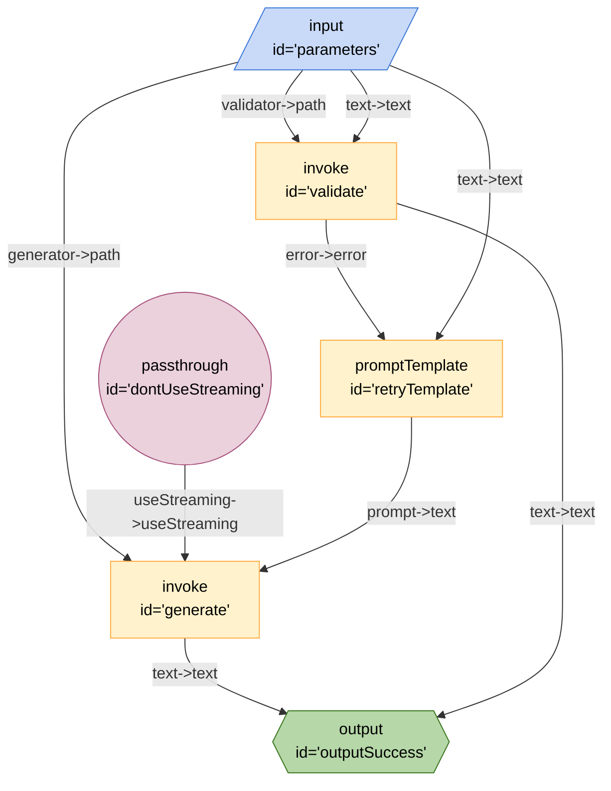

## healer.ts

```mermaid
%%{init: 'themeVariables': { 'fontFamily': 'Fira Code, monospace' }}%%
graph TD;
parameters[/"input <br> id='parameters'"/]:::input -- "validator->path" --> validate["invoke <br> id='validate'"]
parameters[/"input <br> id='parameters'"/]:::input -- "text->text" --> validate["invoke <br> id='validate'"]
parameters[/"input <br> id='parameters'"/]:::input -- "generator->path" --> generate["invoke <br> id='generate'"]
dontUseStreaming(("passthrough <br> id='dontUseStreaming'")):::passthrough -- "useStreaming->useStreaming" --> generate["invoke <br> id='generate'"]
validate["invoke <br> id='validate'"] -- "error->error" --> retryTemplate["promptTemplate <br> id='retryTemplate'"]
parameters[/"input <br> id='parameters'"/]:::input -- "text->text" --> retryTemplate["promptTemplate <br> id='retryTemplate'"]
retryTemplate["promptTemplate <br> id='retryTemplate'"] -- "prompt->text" --> generate["invoke <br> id='generate'"]
generate["invoke <br> id='generate'"] -- "text->text" --> outputSuccess{{"output <br> id='outputSuccess'"}}:::output
validate["invoke <br> id='validate'"] -- "text->text" --> outputSuccess{{"output <br> id='outputSuccess'"}}:::output
classDef default stroke:#ffab40,fill:#fff2ccff,color:#000
classDef input stroke:#3c78d8,fill:#c9daf8ff,color:#000
classDef output stroke:#38761d,fill:#b6d7a8ff,color:#000
classDef passthrough stroke:#a64d79,fill:#ead1dcff,color:#000
classDef slot stroke:#a64d79,fill:#ead1dcff,color:#000
classDef config stroke:#a64d79,fill:#ead1dcff,color:#000
classDef secrets stroke:#db4437,fill:#f4cccc,color:#000
classDef slotted stroke:#a64d79
```