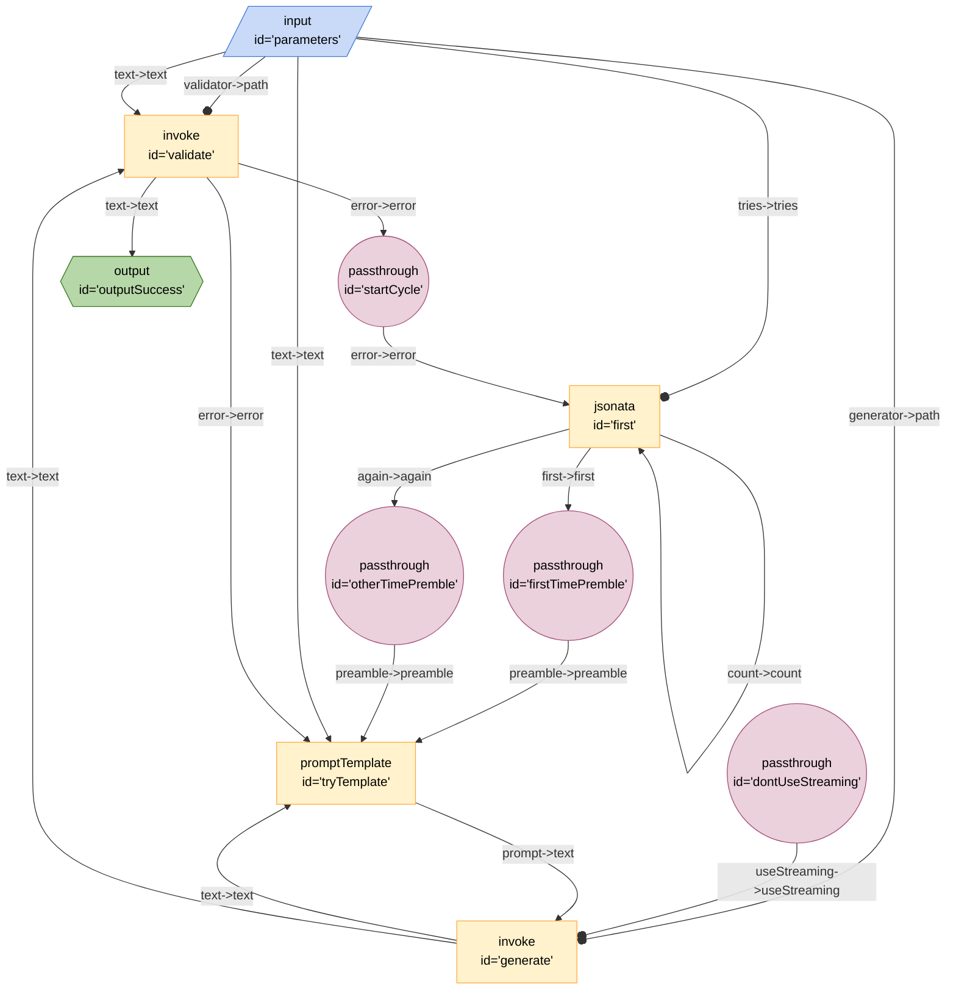

## healer.ts

```mermaid
%%{init: 'themeVariables': { 'fontFamily': 'Fira Code, monospace' }}%%
graph TD;
parameters[/"input <br> id='parameters'"/]:::input -- "validator->path" --o validate["invoke <br> id='validate'"]
parameters[/"input <br> id='parameters'"/]:::input -- "text->text" --> validate["invoke <br> id='validate'"]
parameters[/"input <br> id='parameters'"/]:::input -- "generator->path" --o generate["invoke <br> id='generate'"]
dontUseStreaming(("passthrough <br> id='dontUseStreaming'")):::passthrough -- "useStreaming->useStreaming" --o generate["invoke <br> id='generate'"]
validate["invoke <br> id='validate'"] -- "error->error" --> startCycle(("passthrough <br> id='startCycle'")):::passthrough
first["jsonata <br> id='first'"] -- "count->count" --> first["jsonata <br> id='first'"]
parameters[/"input <br> id='parameters'"/]:::input -- "tries->tries" --o first["jsonata <br> id='first'"]
startCycle(("passthrough <br> id='startCycle'")):::passthrough -- "error->error" --> first["jsonata <br> id='first'"]
first["jsonata <br> id='first'"] -- "first->first" --> firstTimePremble(("passthrough <br> id='firstTimePremble'")):::passthrough
first["jsonata <br> id='first'"] -- "again->again" --> otherTimePremble(("passthrough <br> id='otherTimePremble'")):::passthrough
firstTimePremble(("passthrough <br> id='firstTimePremble'")):::passthrough -- "preamble->preamble" --> tryTemplate["promptTemplate <br> id='tryTemplate'"]
otherTimePremble(("passthrough <br> id='otherTimePremble'")):::passthrough -- "preamble->preamble" --> tryTemplate["promptTemplate <br> id='tryTemplate'"]
parameters[/"input <br> id='parameters'"/]:::input -- "text->text" --> tryTemplate["promptTemplate <br> id='tryTemplate'"]
generate["invoke <br> id='generate'"] -- "text->text" --> tryTemplate["promptTemplate <br> id='tryTemplate'"]
validate["invoke <br> id='validate'"] -- "error->error" --> tryTemplate["promptTemplate <br> id='tryTemplate'"]
tryTemplate["promptTemplate <br> id='tryTemplate'"] -- "prompt->text" --> generate["invoke <br> id='generate'"]
generate["invoke <br> id='generate'"] -- "text->text" --> validate["invoke <br> id='validate'"]
validate["invoke <br> id='validate'"] -- "text->text" --> outputSuccess{{"output <br> id='outputSuccess'"}}:::output
classDef default stroke:#ffab40,fill:#fff2ccff,color:#000
classDef input stroke:#3c78d8,fill:#c9daf8ff,color:#000
classDef output stroke:#38761d,fill:#b6d7a8ff,color:#000
classDef passthrough stroke:#a64d79,fill:#ead1dcff,color:#000
classDef slot stroke:#a64d79,fill:#ead1dcff,color:#000
classDef config stroke:#a64d79,fill:#ead1dcff,color:#000
classDef secrets stroke:#db4437,fill:#f4cccc,color:#000
classDef slotted stroke:#a64d79
```