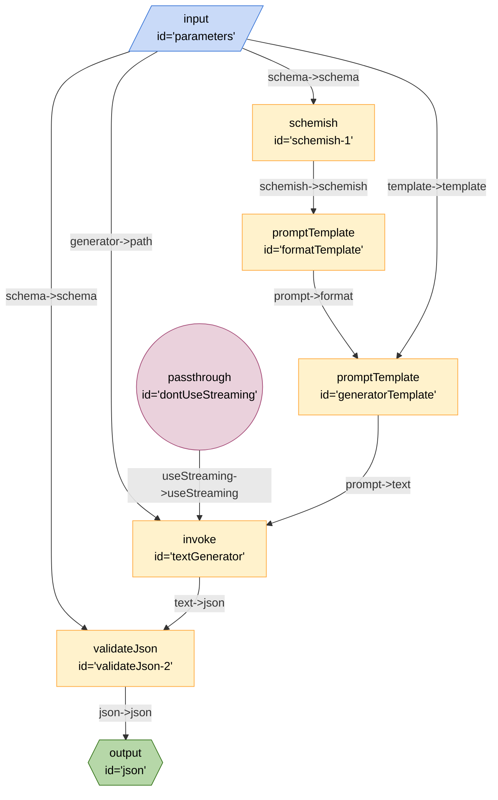

## json-generator.ts

```mermaid
%%{init: 'themeVariables': { 'fontFamily': 'Fira Code, monospace' }}%%
graph TD;
parameters[/"input <br> id='parameters'"/]:::input -- "schema->schema" --> schemish1["schemish <br> id='schemish-1'"]
schemish1["schemish <br> id='schemish-1'"] -- "schemish->schemish" --> formatTemplate["promptTemplate <br> id='formatTemplate'"]
formatTemplate["promptTemplate <br> id='formatTemplate'"] -- "prompt->format" --> generatorTemplate["promptTemplate <br> id='generatorTemplate'"]
parameters[/"input <br> id='parameters'"/]:::input -- "generator->path" --> textGenerator["invoke <br> id='textGenerator'"]
dontUseStreaming(("passthrough <br> id='dontUseStreaming'")):::passthrough -- "useStreaming->useStreaming" --> textGenerator["invoke <br> id='textGenerator'"]
parameters[/"input <br> id='parameters'"/]:::input -- "schema->schema" --> validateJson2["validateJson <br> id='validateJson-2'"]
validateJson2["validateJson <br> id='validateJson-2'"] -- "json->json" --> json{{"output <br> id='json'"}}:::output
textGenerator["invoke <br> id='textGenerator'"] -- "text->json" --> validateJson2["validateJson <br> id='validateJson-2'"]
generatorTemplate["promptTemplate <br> id='generatorTemplate'"] -- "prompt->text" --> textGenerator["invoke <br> id='textGenerator'"]
parameters[/"input <br> id='parameters'"/]:::input -- "template->template" --> generatorTemplate["promptTemplate <br> id='generatorTemplate'"]
classDef default stroke:#ffab40,fill:#fff2ccff,color:#000
classDef input stroke:#3c78d8,fill:#c9daf8ff,color:#000
classDef output stroke:#38761d,fill:#b6d7a8ff,color:#000
classDef passthrough stroke:#a64d79,fill:#ead1dcff,color:#000
classDef slot stroke:#a64d79,fill:#ead1dcff,color:#000
classDef config stroke:#a64d79,fill:#ead1dcff,color:#000
classDef secrets stroke:#db4437,fill:#f4cccc,color:#000
classDef slotted stroke:#a64d79
```