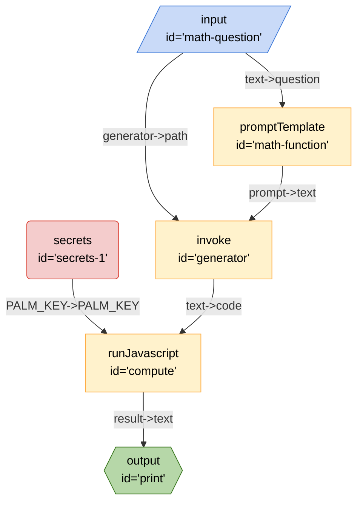

## math.ts

```mermaid
%%{init: 'themeVariables': { 'fontFamily': 'Fira Code, monospace' }}%%
graph TD;
mathquestion[/"input <br> id='math-question'"/]:::input -- "generator->path" --> generator["invoke <br> id='generator'"]
compute["runJavascript <br> id='compute'"] -- "result->text" --> print{{"output <br> id='print'"}}:::output
secrets1("secrets <br> id='secrets-1'"):::secrets -- "PALM_KEY->PALM_KEY" --> compute["runJavascript <br> id='compute'"]
generator["invoke <br> id='generator'"] -- "text->code" --> compute["runJavascript <br> id='compute'"]
mathfunction["promptTemplate <br> id='math-function'"] -- "prompt->text" --> generator["invoke <br> id='generator'"]
mathquestion[/"input <br> id='math-question'"/]:::input -- "text->question" --> mathfunction["promptTemplate <br> id='math-function'"]
classDef default stroke:#ffab40,fill:#fff2ccff,color:#000
classDef input stroke:#3c78d8,fill:#c9daf8ff,color:#000
classDef output stroke:#38761d,fill:#b6d7a8ff,color:#000
classDef passthrough stroke:#a64d79,fill:#ead1dcff,color:#000
classDef slot stroke:#a64d79,fill:#ead1dcff,color:#000
classDef config stroke:#a64d79,fill:#ead1dcff,color:#000
classDef secrets stroke:#db4437,fill:#f4cccc,color:#000
classDef slotted stroke:#a64d79
```