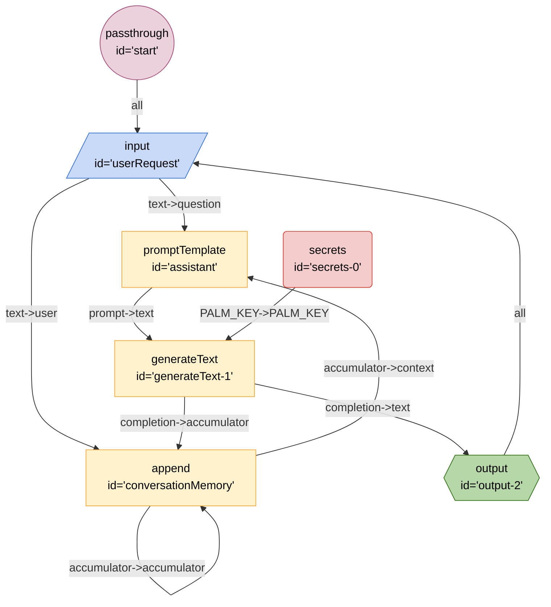

## accumulator.ts

```mermaid
%%{init: 'themeVariables': { 'fontFamily': 'Fira Code, monospace' }}%%
graph TD;
userRequest[/"input <br> id='userRequest'"/]:::input -- "text->question" --> assistant["promptTemplate <br> id='assistant'"]
userRequest[/"input <br> id='userRequest'"/]:::input -- "text->user" --> conversationMemory["append <br> id='conversationMemory'"]
start(("passthrough <br> id='start'")):::passthrough -- all --> userRequest[/"input <br> id='userRequest'"/]:::input
output2{{"output <br> id='output-2'"}}:::output -- all --> userRequest[/"input <br> id='userRequest'"/]:::input
assistant["promptTemplate <br> id='assistant'"] -- "prompt->text" --> generateText1["generateText <br> id='generateText-1'"]
conversationMemory["append <br> id='conversationMemory'"] -- "accumulator->accumulator" --> conversationMemory["append <br> id='conversationMemory'"]
conversationMemory["append <br> id='conversationMemory'"] -- "accumulator->context" --> assistant["promptTemplate <br> id='assistant'"]
generateText1["generateText <br> id='generateText-1'"] -- "completion->accumulator" --> conversationMemory["append <br> id='conversationMemory'"]
generateText1["generateText <br> id='generateText-1'"] -- "completion->text" --> output2{{"output <br> id='output-2'"}}:::output
secrets0("secrets <br> id='secrets-0'"):::secrets -- "PALM_KEY->PALM_KEY" --> generateText1["generateText <br> id='generateText-1'"]
classDef default stroke:#ffab40,fill:#fff2ccff,color:#000
classDef input stroke:#3c78d8,fill:#c9daf8ff,color:#000
classDef output stroke:#38761d,fill:#b6d7a8ff,color:#000
classDef passthrough stroke:#a64d79,fill:#ead1dcff,color:#000
classDef slot stroke:#a64d79,fill:#ead1dcff,color:#000
classDef config stroke:#a64d79,fill:#ead1dcff,color:#000
classDef secrets stroke:#db4437,fill:#f4cccc,color:#000
classDef slotted stroke:#a64d79
```